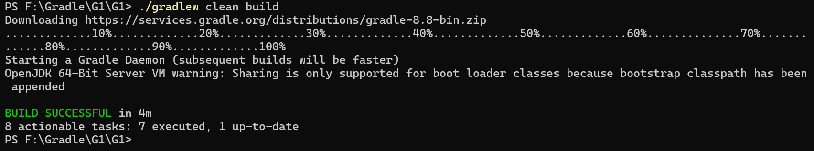

# Gradle 安装问题 debug 汇总

lin-jinwei

注意，未授权不得擅自以盈利方式转载本博客任何文章。

---

## Window 下发现gradle无法运行，需要重置gradle，如何重置？

1. 首先删除：本地系统目录用户目录下 .gradle 文件夹：
   
2. 接着重新运行下面命令即可：

   ```cmd
   ./gradlew clean build

   ```
3. 结果：

   
4. 注意：环境变量不需要删除。

## 


1
