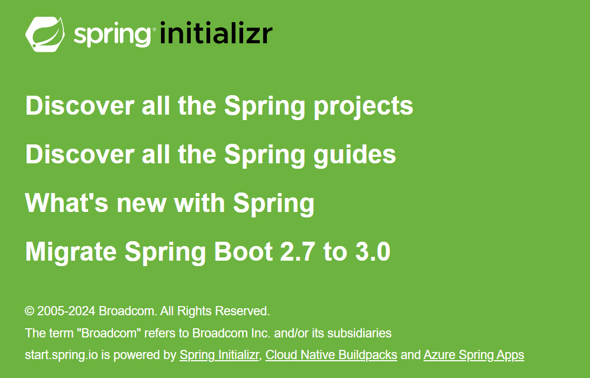
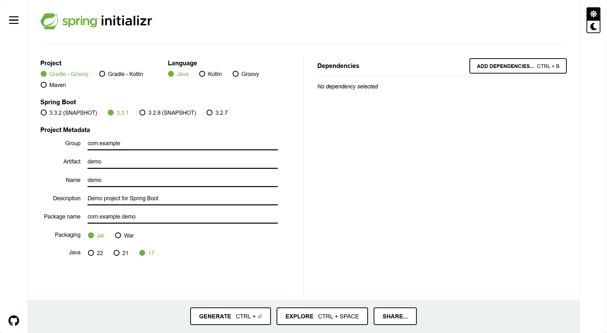
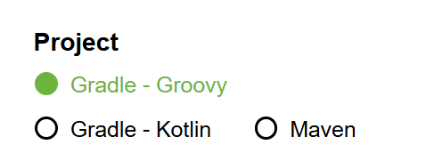
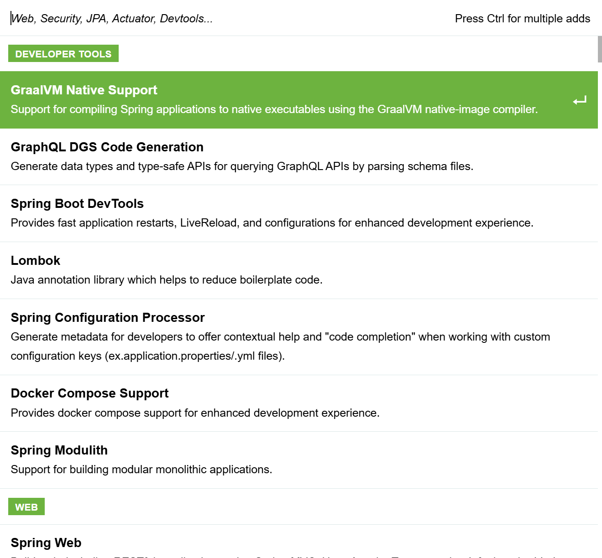
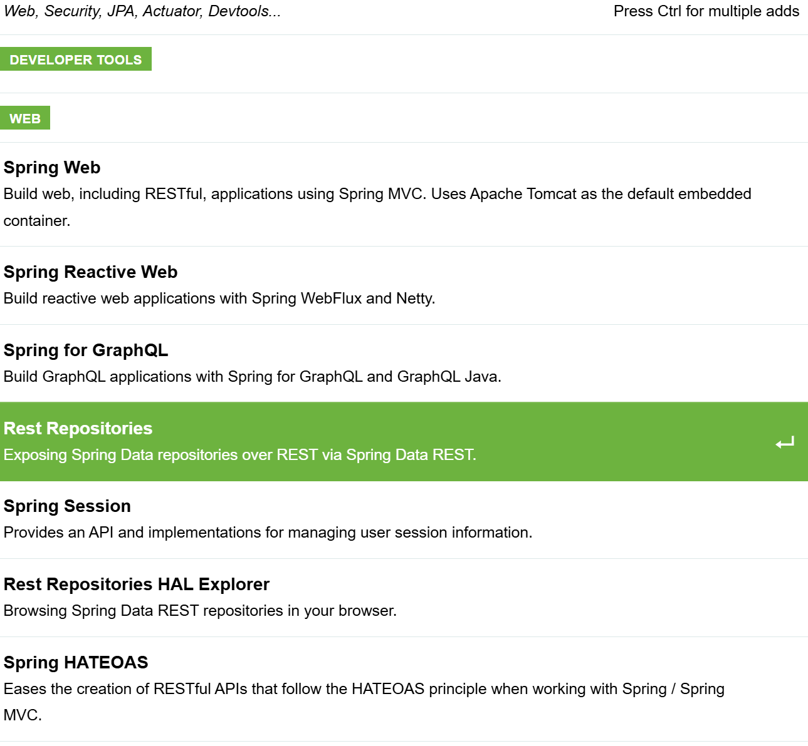
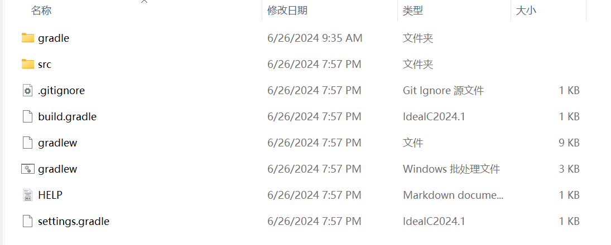
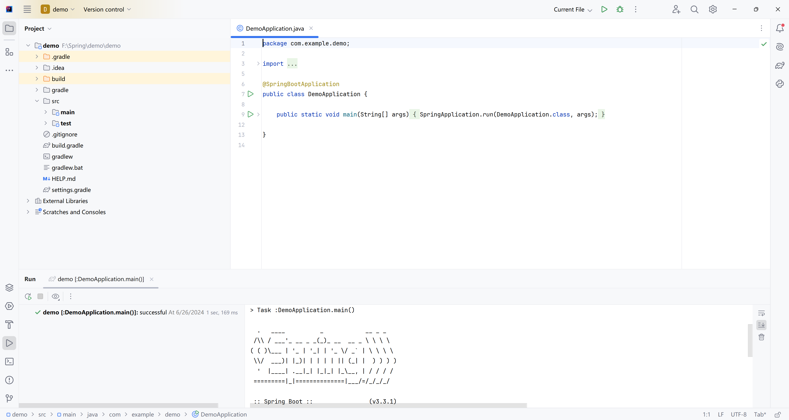
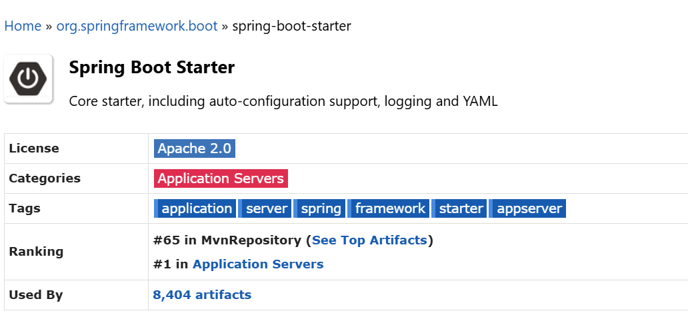
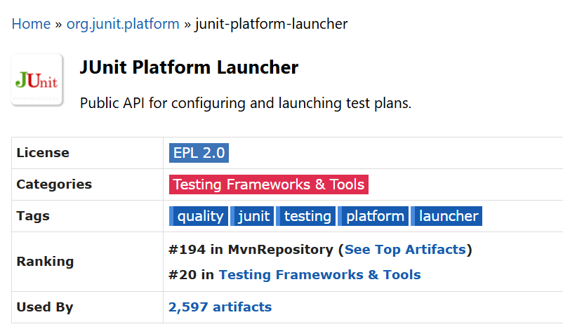

# Spring2-Spring快速上手

lin-jinwei

注意，未授权不得擅自以盈利方式转载本博客任何文章。

---

## 使用IDEA

IDEA是构建Spring项目的一个流行IDE。除了Spring官方的 [Spring Initializr](https://start.spring.io/) ，一般使用IDEA或者Eclipse。

如果使用IDEA，那么需要商用版本的IDEA才默认支持内嵌的[Spring Initializr](https://start.spring.io/)插件。社区版默认是不支持的。

但是可以通过在[Spring Initializr](https://start.spring.io/)上的网页线上配置的方式，配置项目后，将项目初始化文件下载到本地，然后在社区版中打使用[Spring Initializr](https://start.spring.io/)构建的项目。

## [Spring Initializr](https://start.spring.io/) 的最新版



## [Spring Initializr](https://start.spring.io/) 的界面



## 步骤1-选择初始化生成的项目类型



默认是 gradle-groovy项目

## 步骤2-选择项目编程语言


默认是Java语言。

## 步骤3-选择生成的SpringBoot项目版本


Spring项目主要以SpringBoot项目的形式体现。

## 步骤4-设置项目的信息


默认选择的是JDK-17。

## 依赖选择

在右上方可以选择项目的依赖项：


点开后：



可以搜索依赖和相应的jar包。

## 点击生成


## 下载->解压->打开文件


## 打开后的项目结构

!

## 使用IDEA打开


打开后如果提示JDK未设置，点击设置即可。

---

## 点击运行



## 运行控制台输出

```cmd
> Task :DemoApplication.main()

  .   ____          _            __ _ _
 /\\ / ___'_ __ _ _(_)_ __  __ _ \ \ \ \
( ( )\___ | '_ | '_| | '_ \/ _` | \ \ \ \
 \\/  ___)| |_)| | | | | || (_| |  ) ) ) )
  '  |____| .__|_| |_|_| |_\__, | / / / /
 =========|_|==============|___/=/_/_/_/

 :: Spring Boot ::                (v3.3.1)

2024-06-26T20:04:04.022+08:00  INFO 7512 --- [demo] [           main] com.example.demo.DemoApplication         : Starting DemoApplication using Java 17.0.11 with PID 7512 (F:\Spring\demo\demo\build\classes\java\main started by ydook in F:\Spring\demo\demo)
2024-06-26T20:04:04.022+08:00  INFO 7512 --- [demo] [           main] com.example.demo.DemoApplication         : No active profile set, falling back to 1 default profile: "default"
2024-06-26T20:04:04.342+08:00  INFO 7512 --- [demo] [           main] com.example.demo.DemoApplication         : Started DemoApplication in 0.509 seconds (process running for 0.677)

Deprecated Gradle features were used in this build, making it incompatible with Gradle 9.0.

You can use '--warning-mode all' to show the individual deprecation warnings and determine if they come from your own scripts or plugins.

For more on this, please refer to https://docs.gradle.org/8.8/userguide/command_line_interface.html#sec:command_line_warnings in the Gradle documentation.

BUILD SUCCESSFUL in 1s
3 actionable tasks: 1 executed, 2 up-to-date
8:04:04 PM: Execution finished ':DemoApplication.main()'.
```

## Demo主函数代码

```java

package com.example.demo;

import org.springframework.boot.SpringApplication;
import org.springframework.boot.autoconfigure.SpringBootApplication;

@SpringBootApplication
public class DemoApplication {

	public static void main(String[] args) {
		SpringApplication.run(DemoApplication.class, args);
	}

}
```

---

## 启动关键函数

```java
SpringApplication.run(DemoApplication.class, args);
```

通过上述函数启动整个Spring Demo项目。


## build.gradle 文件自动-详细配置信息分析

```java
// 引入的插件
plugins {
	id 'java'
	id 'org.springframework.boot' version '3.3.1'
	id 'io.spring.dependency-management' version '1.1.5'
}

// 项目组织名
group = 'com.example'
// 项目的版本
version = '0.0.1-SNAPSHOT'

// Java工具配置，比如JDK
java {
	toolchain {
		languageVersion = JavaLanguageVersion.of(17)
	}
}

// 设置获取依赖的仓库，远程或者本地
repositories {
	mavenCentral()  // 从远程Mavan中心仓库获取
}

// 设置项目的依赖
dependencies {
	implementation 'org.springframework.boot:spring-boot-starter'
	testImplementation 'org.springframework.boot:spring-boot-starter-test'
	testRuntimeOnly 'org.junit.platform:junit-platform-launcher'
}

// 任务的其他配置
tasks.named('test') {
	useJUnitPlatform()
}

```

可见主要依赖为：

```java
dependencies {
	implementation 'org.springframework.boot:spring-boot-starter'
	testImplementation 'org.springframework.boot:spring-boot-starter-test'
	testRuntimeOnly 'org.junit.platform:junit-platform-launcher'
}
```

获取依赖信息可以从网站：[Maven Repository: Search/Browse/Explore (mvnrepository.com)](https://mvnrepository.com/)中查询获取。





