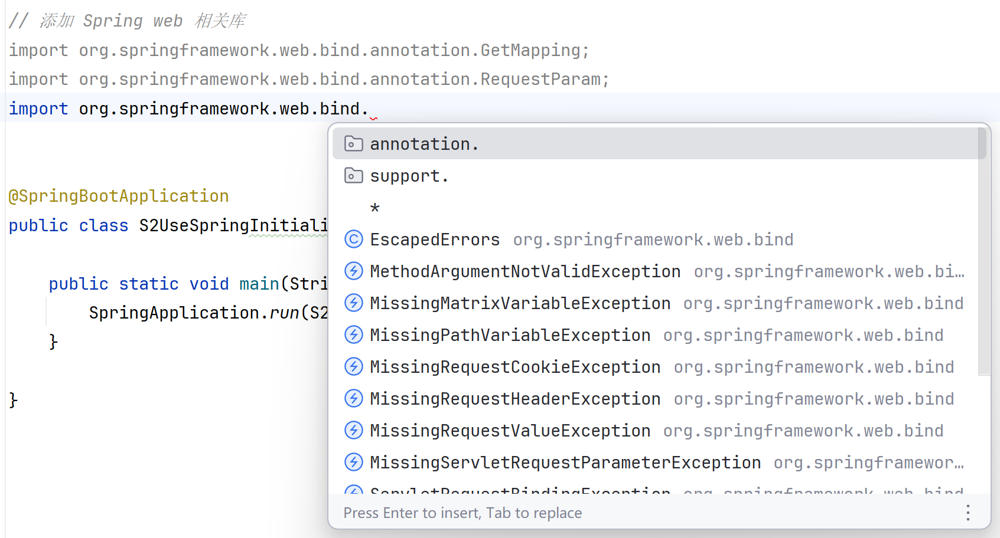
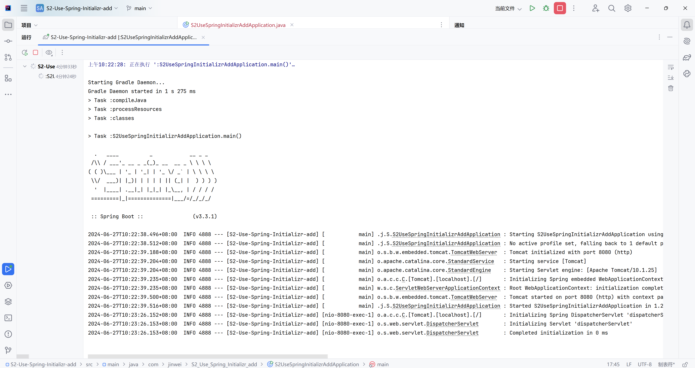
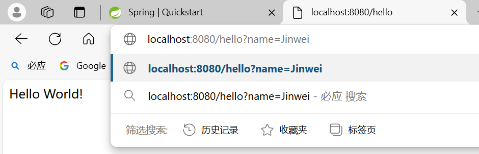

# Spring3-使用Spring Initializr-添加修改代码

lin-jinwei

注意，未授权不得擅自以盈利方式转载本博客任何文章。

---

Code: [../code/S2-Use-Spring-Initializr-add](../code/S2-Use-Spring-Initializr-add)

## 首先新建一个Spring Test项目


## 主函数内容


## 添加 Spring Web相关库



主要的Web库有三个：GetMapping-RequestParam-RestController

```java
// 添加 Spring web 相关库
import org.springframework.web.bind.annotation.GetMapping;
import org.springframework.web.bind.annotation.RequestParam;
import org.springframework.web.bind.annotation.RestController;
```

## 添加RestController注解

然后在@SpringBootApplication下方添加注解@RestController

```java
// 然后在@SpringBootApplication下方添加注解@RestController
@SpringBootApplication
@RestController
```

## 添加GetMapping映射注解

添加注解 @GetMapping("/hello") 定义访问响应的url，并在下方定义具体的相应函数

```java
// 添加注解 @GetMapping("/hello") 定义访问响应的url，并在下方定义具体的相应函数
	@GetMapping("/hello")
	public String hello(@RequestParam(value = "name", defaultValue = "World") String name) {
		return String.format("Hello %s!", name);
	}
```

## 完整的主文件代码

```java
package com.jinwei.S2_Use_Spring_Initializr_add;

import org.springframework.boot.SpringApplication;
import org.springframework.boot.autoconfigure.SpringBootApplication;

// 添加 Spring web 相关库
import org.springframework.web.bind.annotation.GetMapping;
import org.springframework.web.bind.annotation.RequestParam;
import org.springframework.web.bind.annotation.RestController;

// 然后在@SpringBootApplication下方添加注解@RestController
@SpringBootApplication
@RestController

public class S2UseSpringInitializrAddApplication {

	public static void main(String[] args) {
		SpringApplication.run(S2UseSpringInitializrAddApplication.class, args);
	}

	// 添加注解 @GetMapping("/hello") 定义访问响应的url，并在下方定义具体的相应函数
	@GetMapping("/hello")
	public String hello(@RequestParam(value = "name", defaultValue = "World") String name) {
		return String.format("Hello %s!", name);
	}
}

```

## build.gradle 代码

````java
plugins {
	id 'java'
	id 'org.springframework.boot' version '3.3.1'
	id 'io.spring.dependency-management' version '1.1.5'
}

group = 'com.jinwei'
version = '0.0.1-SNAPSHOT'

java {
	toolchain {
		languageVersion = JavaLanguageVersion.of(17)
	}
}

repositories {
	mavenCentral()
}

dependencies {
        // 引入web依赖
	implementation 'org.springframework.boot:spring-boot-starter-web'
	testImplementation 'org.springframework.boot:spring-boot-starter-test'
	testRuntimeOnly 'org.junit.platform:junit-platform-launcher'
}

tasks.named('test') {
	useJUnitPlatform()
}

```
````

---

## windows 测试

官方给出的运行代码：

```cmd
.\gradlew.bat bootRun
```

如果上述代码无法运行，则直接点击IDEA的运行按钮运行。

## 运行结果



## 运行输出结果

```cmd
上午10:22:28: 正在执行 ':S2UseSpringInitializrAddApplication.main()'…

Starting Gradle Daemon...
Gradle Daemon started in 1 s 275 ms
> Task :compileJava
> Task :processResources
> Task :classes

> Task :S2UseSpringInitializrAddApplication.main()

  .   ____          _            __ _ _
 /\\ / ___'_ __ _ _(_)_ __  __ _ \ \ \ \
( ( )\___ | '_ | '_| | '_ \/ _` | \ \ \ \
 \\/  ___)| |_)| | | | | || (_| |  ) ) ) )
  '  |____| .__|_| |_|_| |_\__, | / / / /
 =========|_|==============|___/=/_/_/_/

 :: Spring Boot ::                (v3.3.1)

2024-06-27T10:22:38.496+08:00  INFO 4888 --- [S2-Use-Spring-Initializr-add] [           main] .j.S.S2UseSpringInitializrAddApplication : Starting S2UseSpringInitializrAddApplication using Java 17.0.11 with PID 4888 (F:\Tutorial\Spring-Tutorial\code\S2-Use-Spring-Initializr-add\S2-Use-Spring-Initializr-add\build\classes\java\main started by ydook in F:\Tutorial\Spring-Tutorial\code\S2-Use-Spring-Initializr-add\S2-Use-Spring-Initializr-add)
2024-06-27T10:22:38.512+08:00  INFO 4888 --- [S2-Use-Spring-Initializr-add] [           main] .j.S.S2UseSpringInitializrAddApplication : No active profile set, falling back to 1 default profile: "default"
2024-06-27T10:22:39.188+08:00  INFO 4888 --- [S2-Use-Spring-Initializr-add] [           main] o.s.b.w.embedded.tomcat.TomcatWebServer  : Tomcat initialized with port 8080 (http)
2024-06-27T10:22:39.204+08:00  INFO 4888 --- [S2-Use-Spring-Initializr-add] [           main] o.apache.catalina.core.StandardService   : Starting service [Tomcat]
2024-06-27T10:22:39.204+08:00  INFO 4888 --- [S2-Use-Spring-Initializr-add] [           main] o.apache.catalina.core.StandardEngine    : Starting Servlet engine: [Apache Tomcat/10.1.25]
2024-06-27T10:22:39.235+08:00  INFO 4888 --- [S2-Use-Spring-Initializr-add] [           main] o.a.c.c.C.[Tomcat].[localhost].[/]       : Initializing Spring embedded WebApplicationContext
2024-06-27T10:22:39.235+08:00  INFO 4888 --- [S2-Use-Spring-Initializr-add] [           main] w.s.c.ServletWebServerApplicationContext : Root WebApplicationContext: initialization completed in 683 ms
2024-06-27T10:22:39.500+08:00  INFO 4888 --- [S2-Use-Spring-Initializr-add] [           main] o.s.b.w.embedded.tomcat.TomcatWebServer  : Tomcat started on port 8080 (http) with context path '/'
2024-06-27T10:22:39.516+08:00  INFO 4888 --- [S2-Use-Spring-Initializr-add] [           main] .j.S.S2UseSpringInitializrAddApplication : Started S2UseSpringInitializrAddApplication in 1.253 seconds (process running for 1.444)
2024-06-27T10:23:26.152+08:00  INFO 4888 --- [S2-Use-Spring-Initializr-add] [nio-8080-exec-1] o.a.c.c.C.[Tomcat].[localhost].[/]       : Initializing Spring DispatcherServlet 'dispatcherServlet'
2024-06-27T10:23:26.153+08:00  INFO 4888 --- [S2-Use-Spring-Initializr-add] [nio-8080-exec-1] o.s.web.servlet.DispatcherServlet        : Initializing Servlet 'dispatcherServlet'
2024-06-27T10:23:26.153+08:00  INFO 4888 --- [S2-Use-Spring-Initializr-add] [nio-8080-exec-1] o.s.web.servlet.DispatcherServlet        : Completed initialization in 0 ms
```

## 浏览器测试

在浏览器中，输入：http://localhost:8080/hello 即 [localhost:8080/hello](http://localhost:8080/hello) ->即可打开网页


## 添加-使用查询功能



在浏览器URL栏中输入：[http://localhost:8080/hello?name=Jinwei](http://localhost:8080/hello?name=Jinwei)

http://localhost:8080/hello?name=Jinwei

即可获得页面返回：


## MacOS/Linux 测试

官方给出的运行代码：

```cmd
./gradlew bootRun
```

## windows 测试

官方给出的运行代码：

```cmd
.\gradlew.bat bootRun
```

## windows 测试

官方给出的运行代码：

```cmd
.\gradlew.bat bootRun
```

## windows 测试

官方给出的运行代码：

```cmd
.\gradlew.bat bootRun
```

## windows 测试

官方给出的运行代码：

```cmd
.\gradlew.bat bootRun
```

## windows 测试

官方给出的运行代码：

```cmd
.\gradlew.bat bootRun


```
