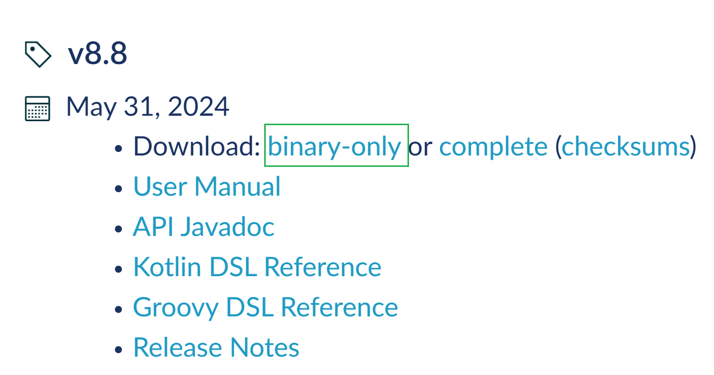
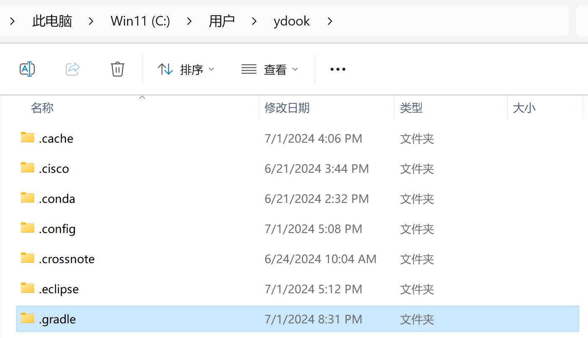

# Gradle 安装

lin-jinwei

注意，未授权不得擅自以盈利方式转载本博客任何文章。

---

## Window 下安装gradle

## 下载

官网：[Gradle Build Tool](https://gradle.org/)

下载官网：[Gradle | Installation](https://gradle.org/install/)

发行版直接下载：[Gradle | Releases](https://gradle.org/releases/)

可以直接选择最新版的二进制版本下载解压安装。

## 安装流程

### 下载->解压->设置环境变量

#### 环境变量：

系统变量->本地仓库

#### 重置安装，如果存在，需要删除：本地系统目录用户目录下 .gradle 文件夹：

---
