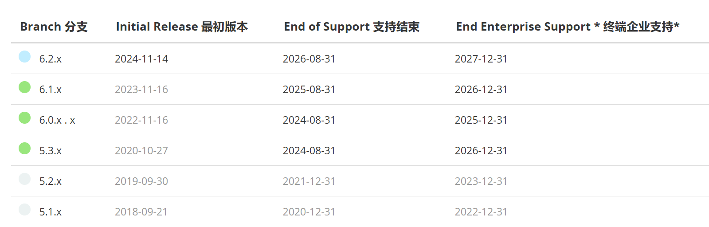
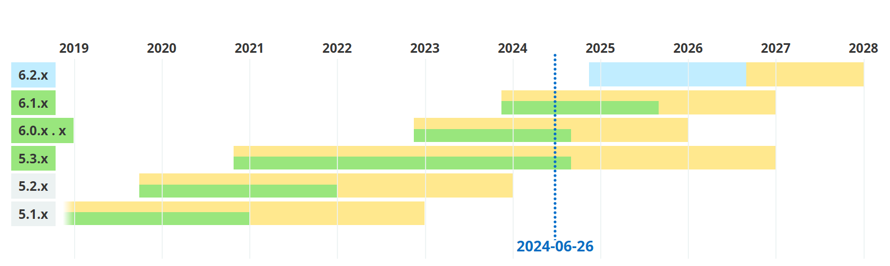

# DSW001-Spring原理入门

lin-jinwei

注意，未授权不得擅自以盈利方式转载本博客任何文章。

---

## Spring 的官网

了解Spring建议先从其官网入手。

[Spring | Home](https://spring.io/)

## Spring的特点

1. Spring框架可以快速地构建微服务；
2. Spring框架支持异步编程与非阻塞；
3. Spring框架可以很方便构建云服务；
4. Spring框架可以设计安全快速的Web应用；
5. Spring框架没有服务需求的限制；
6. Spring框架适合业务驱动的编程；
7. Spring框架可以设计自动批量执行任务。

## Spring框架版本发展

## Spring版本开发的未来规划

一直到2028年，Spring框架都被官方支持。

## Spring框架的支持

## Spring的主要特性 Features 

* [Core technologies](https://docs.spring.io/spring-framework/reference/core.html): dependency injection, events, resources, i18n, validation, data binding, type conversion, SpEL, AOP.核心技术:依赖注入、事件、资源、i18n、验证、数据绑定、类型转换、SpEL、AOP。
* [Testing](https://docs.spring.io/spring-framework/reference/testing.html#testing): mock objects, TestContext framework, Spring MVC Test, `WebTestClient`.测试:模拟对象，TestContext框架，Spring MVC测试， WebTestClient 。
* [Data Access](https://docs.spring.io/spring-framework/reference/data-access.html): transactions, DAO support, JDBC, ORM, Marshalling XML.数据访问:事务、DAO支持、JDBC、ORM、编组XML。
* [Spring MVC](https://docs.spring.io/spring-framework/reference/web.html) and [Spring WebFlux](https://docs.spring.io/spring-framework/reference/web-reactive.html) web frameworks.Spring MVC和Spring WebFlux web框架。
* [Integration](https://docs.spring.io/spring-framework/reference/integration.html): remoting, JMS, JCA, JMX, email, tasks, scheduling, cache and observability.集成:远程、JMS、JCA、JMX、电子邮件、任务、调度、缓存和可观察性。
* [Languages](https://docs.spring.io/spring-framework/reference/languages.html): Kotlin, Groovy, dynamic languages.语言:Kotlin, Groovy，动态语言。
