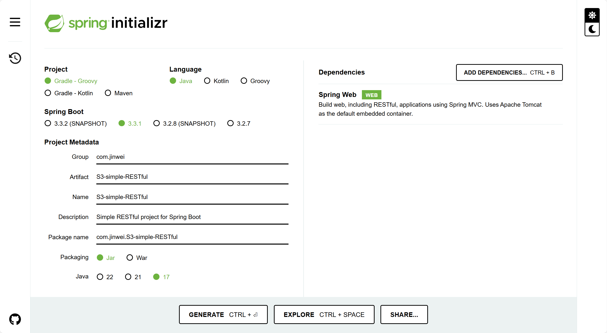
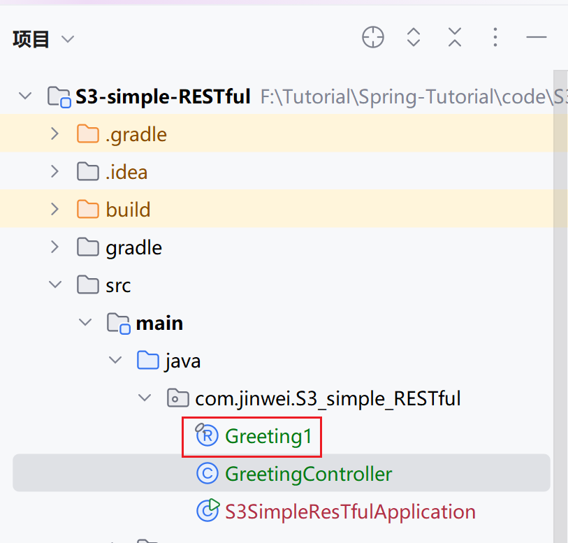
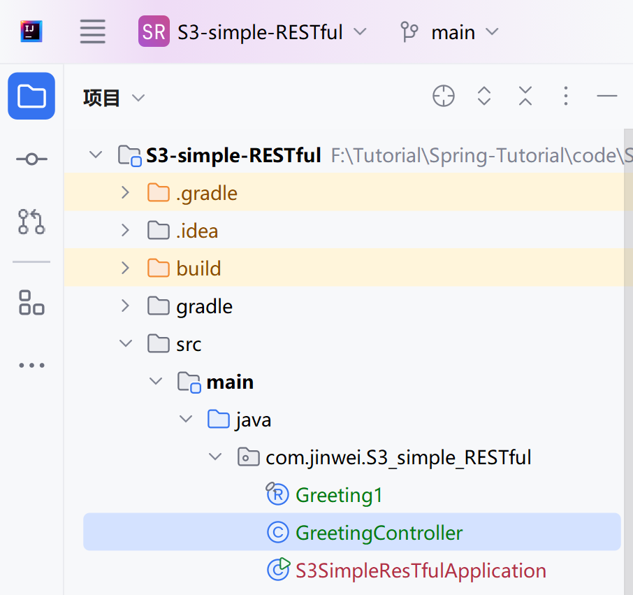
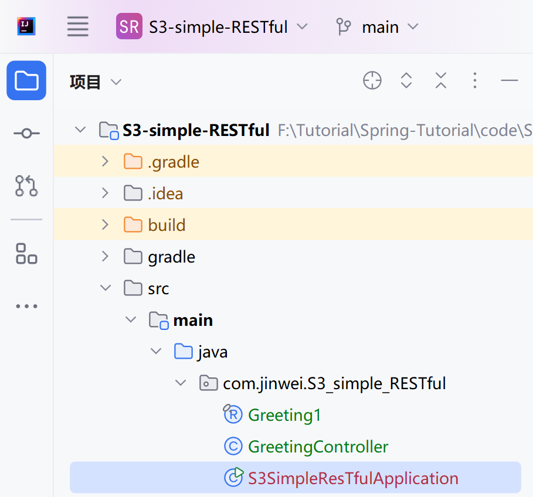
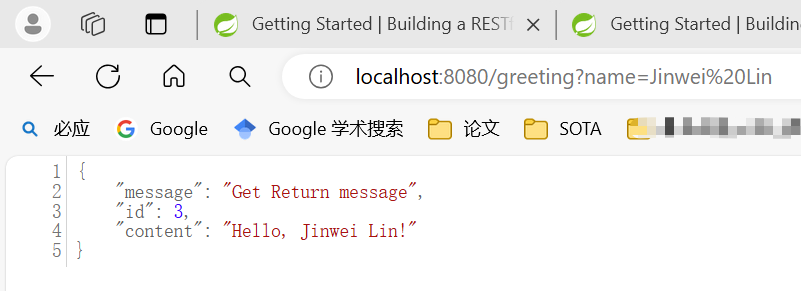

# DSW004-构建基础的 RESTful 项目

lin-jinwei

注意，未授权不得擅自以盈利方式转载本博客任何文章。

---

Code: [../code/S3-simple-RESTful](../code/S3-simple-RESTful)

## 首先新建一个Spring Test项目-添加Spring Web依赖



## 新建请求返回类



在主目录 java/com/jinwei/S3_simple_RESTful 下创建：


## Greeting1类的内容

```java
package com.jinwei.S3_simple_RESTful;

public record Greeting1(String message, long id, String content) { }

```

## 主目录下创建请求控制器类



地址为：java/com/jinwei/S3_simple_RESTful/GreetingController.java

## 请求控制器类的内容

```java
package com.jinwei.S3_simple_RESTful;

import java.util.concurrent.atomic.AtomicLong;

import org.springframework.web.bind.annotation.GetMapping;
import org.springframework.web.bind.annotation.RequestParam;
import org.springframework.web.bind.annotation.RestController;

@RestController
public class GreetingController {

    private static final String template = "Hello, %s!";
    private final AtomicLong counter = new AtomicLong();
  
    // 通过@GetMapping定义请求接口API
    @GetMapping("/greeting")
    // 通过@RequestParam定义请求需要附带的参数，以及参数的默认值
    public Greeting1 greeting(@RequestParam(value = "name", defaultValue = "World") String name) {
        final String str_message = "Get Return message";
        // 下面一行定义请求的返回内容
        return new Greeting1(str_message, counter.incrementAndGet(), String.format(template, name));
    }
}
```

## 点击IDEA运行按钮->运行

先打开IDEA自动生成的启动文件：java/com/jinwei/S3_simple_RESTful/S3SimpleResTfulApplication.java



文件内容：

```java
package com.jinwei.S3_simple_RESTful;

import org.springframework.boot.SpringApplication;
import org.springframework.boot.autoconfigure.SpringBootApplication;


@SpringBootApplication
public class S3SimpleResTfulApplication {

	public static void main(String[] args) {
		SpringApplication.run(S3SimpleResTfulApplication.class, args);
	}

}

```

无需进行别的修改，直接点击运行

## 运行结果


## 浏览器测试


附带查询请求测试：


