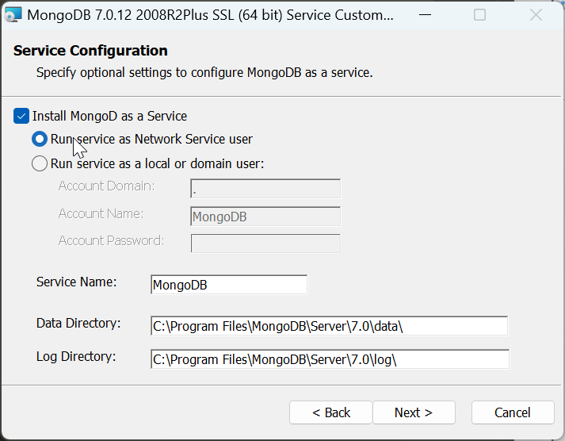

# DSW006-SpringBoot-MongoDB

lin-jinwei

注意，未授权不得擅自以盈利方式转载本博客任何文章。

---

<!-- Code: [../code/l](../code/) -->

## 首先下载 Windows-MongoDB

### MongoDB 官网：
https://www.mongodb.com/

### MongoDB 社区版下载
https://www.mongodb.com/try/download/community

下载链接：https://fastdl.mongodb.org/windows/mongodb-windows-x86_64-7.0.12-signed.msi

## 然后安装  Windows-MongoDB

如觉得下载 MongoDB较慢，可以取消勾选 Install MongoDB Compass, 可以加快安装速度。

这里建议取消勾选。后续安装也可。

---

取消勾选 Install MongoDB Compass, 安装：

安装完成：

---

### MongoDB Compass 安装完成后会自动启动

## 打开后台服务可以看到 MongoDB 已经运行

---

## 安装 MongoSH -- mongosh

新版的MongoDB不附带 mongosh：

因此要自己安装：

下载地址：https://www.mongodb.com/try/download/shell

下载完成后解压，并复制所有文件到MongoDB的安装bin目录：

添加系统变量：C:\Program Files\MongoDB\Server\7.0\bin

## 测试 mongosh

安装成功！

