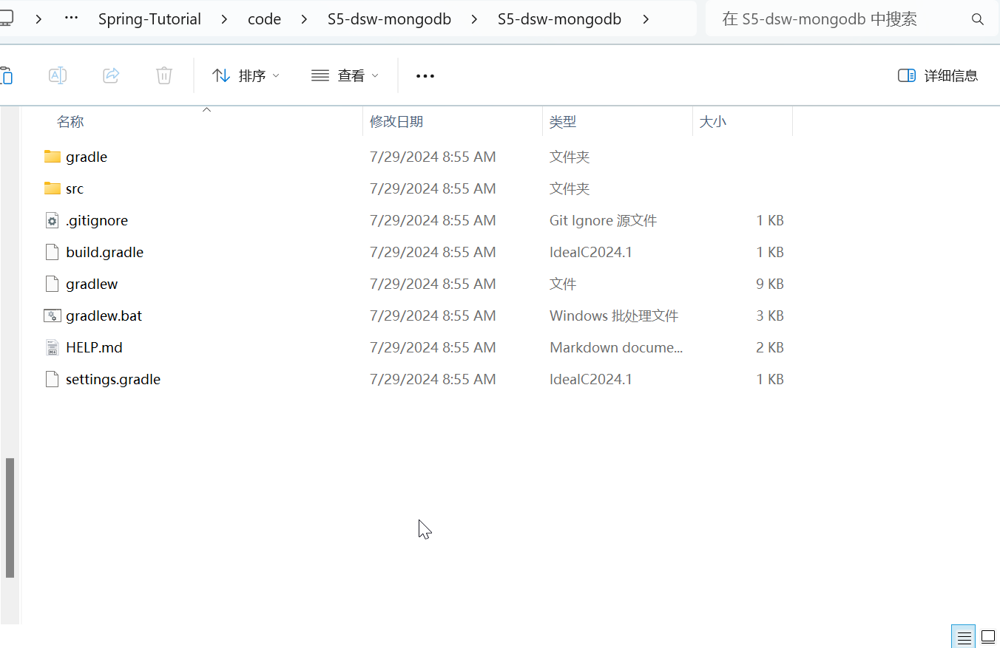
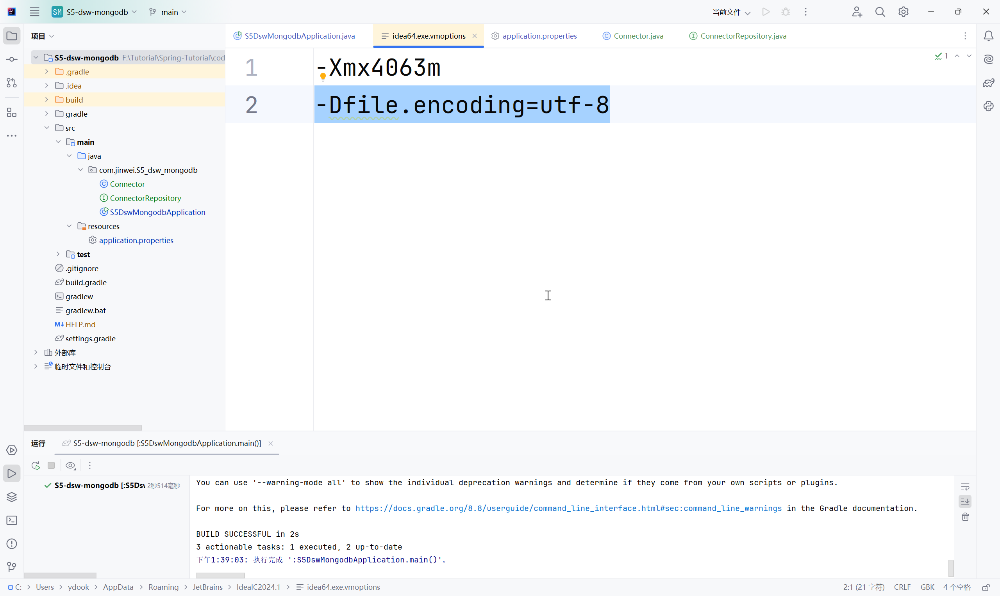

# DSW007-SpringBoot-MongoDB

lin-jinwei

注意，未授权不得擅自以盈利方式转载本博客任何文章。

---

Code: [../code/../code/S5-dsw-mongodb/](../code/S5-dsw-mongodb/)

## 使用 SpringBoot Initializr

添加依赖：


## 下载+解压并复制到工作目录



---

## 使用 IDEA打开


### 下载依赖中


### 构建成功


---

## 编写代码

### 首先，创建一个实体类：Connector

代码：com/jinwei/S5_dsw_mongodb/Connector.java

```java
package com.jinwei.S5_dsw_mongodb;
import org.springframework.data.annotation.Id;

public class Connector {

    // 定义实体类对象的ID
    @Id
    public String id;
    // 定义实体类的其他具体属性
    public String cacert;  // CA 证书字符串
    public String description;  // Connector属性描述

    public Connector() {}

    public Connector(String firstName, String lastName) {
        // 属性本地化
        this.cacert = cacert;
        this.description = description;
    }

    // 重写toString函数，定义标准的属性获取
    @Override
    public String toString() {
        return String.format(
                "Connector[id=%s, cacert='%s', description='%s']",
                id, cacert, description);
    }

}
```


### 然后，创建一个实体类对应的仓库：ConnectorRepository

代码：com/jinwei/S5_dsw_mongodb/Connector.java

```java
package com.jinwei.S5_dsw_mongodb;
import java.util.List;
import org.springframework.data.mongodb.repository.MongoRepository;


public interface ConnectorRepository extends MongoRepository<Connector, String> {

    // 定义通过 cacert 属性查找
    public Connector findByCacert(String cacert);
    // 定义通过 description 属性查找
    public List<Connector> findByDescription(String description);

}
```

注意：在定义 ConnectorRepository类的函数的时候，由于SpringBoot加速编写与命名规则的原因，属性查找的函数的命名格式应该遵守下面规则：

```bash
函数名 = findBy{属性名称}
```
注意：整个函数名必须采用标准的驼峰命名法，否则SpringBoot找不到对应的定义属性。


**SpringBoot MongoDB的优势**：在典型的Java应用程序中，在编写实体类的仓库类的时候，需要编写一个具体的实现 CustomerRepository 的类，并自己编写查询。Spring Data MongoDB之所以高效，是因为不需要创建这些方法的完整实现。Spring Data MongoDB在运行应用程序时会动态创建它们。

### 主类代码

代码：com/jinwei/S5_dsw_mongodb/S5DswMongodbApplication.java

```java
package com.jinwei.S5_dsw_mongodb;

import org.springframework.boot.SpringApplication;
import org.springframework.boot.autoconfigure.SpringBootApplication;

@SpringBootApplication
public class S5DswMongodbApplication {

	public static void main(String[] args) {
		SpringApplication.run(S5DswMongodbApplication.class, args);
	}

}

```


### 然后，修改主类代码，实现数据库测试

代码：com/jinwei/S5_dsw_mongodb/S5DswMongodbApplication.java

```java
package com.jinwei.S5_dsw_mongodb;
import org.springframework.beans.factory.annotation.Autowired;
import org.springframework.boot.CommandLineRunner;
import org.springframework.boot.SpringApplication;
import org.springframework.boot.autoconfigure.SpringBootApplication;


@SpringBootApplication
public class S5DswMongodbApplication implements CommandLineRunner {  // 主类拓展接口 CommandLineRunner

	@Autowired
	private ConnectorRepository  repository;  // 新建仓库类的对象

	public static void main(String[] args) {
		SpringApplication.run(S5DswMongodbApplication.class, args);
	}

	@Override
	public void run(String... args) throws Exception {  // 具体定义运行函数
		// 首先清空仓库类
		repository.deleteAll();

		// 新建并保存Connector对象
		repository.save(new Connector("cacert ca0001 class1 0001", "This is a connector description class1 0001"));
		repository.save(new Connector("cacert ca0001 class2 0002", "This is a connector description class1 0002"));

		// 通过findAll():打印输出仓库所有的信息
		System.out.println("库所有的信息: with findAll():");
		System.out.println("-------------------------------");
		for (Connector customer : repository.findAll()) {
			System.out.println(customer);
		}
		System.out.println();

		// 通过自定义函数:打印对应的信息
		System.out.println("找出CA证书是:cacert ca0001 class1 0001的Connector:");
		System.out.println("--------------------------------");
		System.out.println(repository.findBYcacert("cacert ca0001 class1 0001"));

		// 通过自定义函数:打印对应的信息
		System.out.println("找出描述是:This is a connector description class1 0002的Connector:");
		System.out.println("--------------------------------");
		for (Connector connector : repository.findBYdescription("This is a connector description class1 0002")) {
			System.out.println(connector);
		}

	}

}
```


---

## 编译运行

运行成功：


运行时，如果出现IDEA输出中文变乱码的情况，打开下面设置文件：


添加一行：

```bash
-Dfile.encoding=utf-8
```

即可。




具体的输出信息：

```bash
> Task :S5DswMongodbApplication.main()

  .   ____          _            __ _ _
 /\\ / ___'_ __ _ _(_)_ __  __ _ \ \ \ \
( ( )\___ | '_ | '_| | '_ \/ _` | \ \ \ \
 \\/  ___)| |_)| | | | | || (_| |  ) ) ) )
  '  |____| .__|_| |_|_| |_\__, | / / / /
 =========|_|==============|___/=/_/_/_/

 :: Spring Boot ::                (v3.3.2)

2024-07-29T13:39:02.075+08:00  INFO 31080 --- [S5-dsw-mongodb] [           main] c.j.S.S5DswMongodbApplication            : Starting S5DswMongodbApplication using Java 17.0.11 with PID 31080 (F:\Tutorial\Spring-Tutorial\code\S5-dsw-mongodb\S5-dsw-mongodb\build\classes\java\main started by ydook in F:\Tutorial\Spring-Tutorial\code\S5-dsw-mongodb\S5-dsw-mongodb)
2024-07-29T13:39:02.078+08:00  INFO 31080 --- [S5-dsw-mongodb] [           main] c.j.S.S5DswMongodbApplication            : No active profile set, falling back to 1 default profile: "default"
2024-07-29T13:39:02.385+08:00  INFO 31080 --- [S5-dsw-mongodb] [           main] .s.d.r.c.RepositoryConfigurationDelegate : Bootstrapping Spring Data MongoDB repositories in DEFAULT mode.
2024-07-29T13:39:02.423+08:00  INFO 31080 --- [S5-dsw-mongodb] [           main] .s.d.r.c.RepositoryConfigurationDelegate : Finished Spring Data repository scanning in 32 ms. Found 1 MongoDB repository interface.
2024-07-29T13:39:02.826+08:00  INFO 31080 --- [S5-dsw-mongodb] [           main] org.mongodb.driver.client                : MongoClient with metadata {"driver": {"name": "mongo-java-driver|sync|spring-boot", "version": "5.0.1"}, "os": {"type": "Windows", "name": "Windows 11", "architecture": "amd64", "version": "10.0"}, "platform": "Java/Amazon.com Inc./17.0.11+9-LTS"} created with settings MongoClientSettings{readPreference=primary, writeConcern=WriteConcern{w=null, wTimeout=null ms, journal=null}, retryWrites=true, retryReads=true, readConcern=ReadConcern{level=null}, credential=null, transportSettings=null, commandListeners=[], codecRegistry=ProvidersCodecRegistry{codecProviders=[ValueCodecProvider{}, BsonValueCodecProvider{}, DBRefCodecProvider{}, DBObjectCodecProvider{}, DocumentCodecProvider{}, CollectionCodecProvider{}, IterableCodecProvider{}, MapCodecProvider{}, GeoJsonCodecProvider{}, GridFSFileCodecProvider{}, Jsr310CodecProvider{}, JsonObjectCodecProvider{}, BsonCodecProvider{}, EnumCodecProvider{}, com.mongodb.client.model.mql.ExpressionCodecProvider@e344ad3, com.mongodb.Jep395RecordCodecProvider@de18f63, com.mongodb.KotlinCodecProvider@108bdbd8]}, loggerSettings=LoggerSettings{maxDocumentLength=1000}, clusterSettings={hosts=[localhost:27017], srvServiceName=mongodb, mode=SINGLE, requiredClusterType=UNKNOWN, requiredReplicaSetName='null', serverSelector='null', clusterListeners='[]', serverSelectionTimeout='30000 ms', localThreshold='15 ms'}, socketSettings=SocketSettings{connectTimeoutMS=10000, readTimeoutMS=0, receiveBufferSize=0, proxySettings=ProxySettings{host=null, port=null, username=null, password=null}}, heartbeatSocketSettings=SocketSettings{connectTimeoutMS=10000, readTimeoutMS=10000, receiveBufferSize=0, proxySettings=ProxySettings{host=null, port=null, username=null, password=null}}, connectionPoolSettings=ConnectionPoolSettings{maxSize=100, minSize=0, maxWaitTimeMS=120000, maxConnectionLifeTimeMS=0, maxConnectionIdleTimeMS=0, maintenanceInitialDelayMS=0, maintenanceFrequencyMS=60000, connectionPoolListeners=[], maxConnecting=2}, serverSettings=ServerSettings{heartbeatFrequencyMS=10000, minHeartbeatFrequencyMS=500, serverListeners='[]', serverMonitorListeners='[]'}, sslSettings=SslSettings{enabled=false, invalidHostNameAllowed=false, context=null}, applicationName='null', compressorList=[], uuidRepresentation=JAVA_LEGACY, serverApi=null, autoEncryptionSettings=null, dnsClient=null, inetAddressResolver=null, contextProvider=null}
2024-07-29T13:39:02.851+08:00  INFO 31080 --- [S5-dsw-mongodb] [localhost:27017] org.mongodb.driver.cluster               : Monitor thread successfully connected to server with description ServerDescription{address=localhost:27017, type=STANDALONE, state=CONNECTED, ok=true, minWireVersion=0, maxWireVersion=21, maxDocumentSize=16777216, logicalSessionTimeoutMinutes=30, roundTripTimeNanos=21694900}
2024-07-29T13:39:03.240+08:00  INFO 31080 --- [S5-dsw-mongodb] [           main] c.j.S.S5DswMongodbApplication            : Started S5DswMongodbApplication in 1.448 seconds (process running for 1.702)
库所有的信息: with findAll():
-------------------------------
Connector[id=66a72af725b3ef6972ae18e9, cacert='cacert ca0001 class1 0001', description='This is a connector description class1 0001']
Connector[id=66a72af725b3ef6972ae18ea, cacert='cacert ca0001 class2 0002', description='This is a connector description class1 0002']

找出CA证书是:cacert ca0001 class1 0001的Connector:
--------------------------------
Connector[id=66a72af725b3ef6972ae18e9, cacert='cacert ca0001 class1 0001', description='This is a connector description class1 0001']
找出描述是:This is a connector description class1 0002的Connector:
--------------------------------
Connector[id=66a72af725b3ef6972ae18ea, cacert='cacert ca0001 class2 0002', description='This is a connector description class1 0002']

Deprecated Gradle features were used in this build, making it incompatible with Gradle 9.0.

You can use '--warning-mode all' to show the individual deprecation warnings and determine if they come from your own scripts or plugins.

For more on this, please refer to https://docs.gradle.org/8.8/userguide/command_line_interface.html#sec:command_line_warnings in the Gradle documentation.

BUILD SUCCESSFUL in 2s
3 actionable tasks: 1 executed, 2 up-to-date
下午1:39:03: 执行完成 ':S5DswMongodbApplication.main()'。
```

可见，添加了 @id 标注的属性不用处理，SpringBoot会自动分配属性值。


