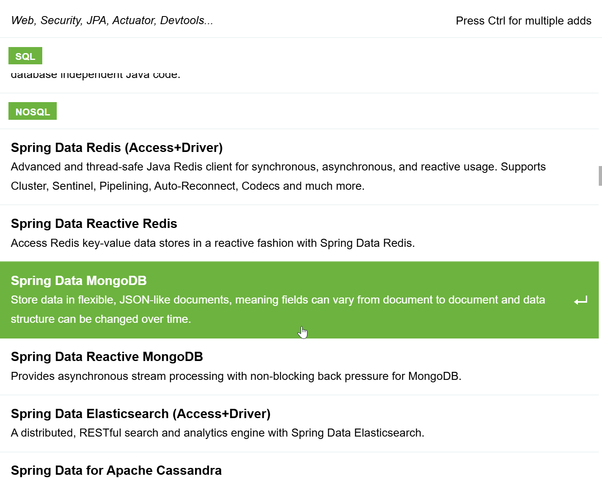
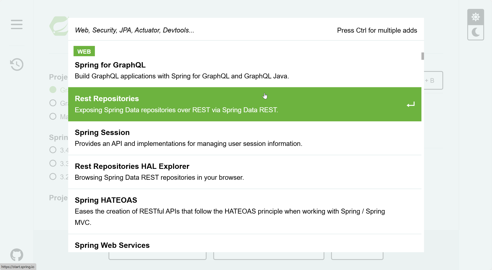
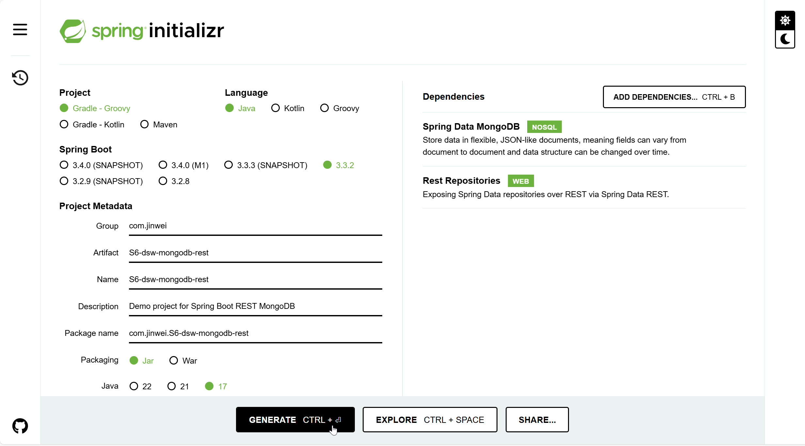
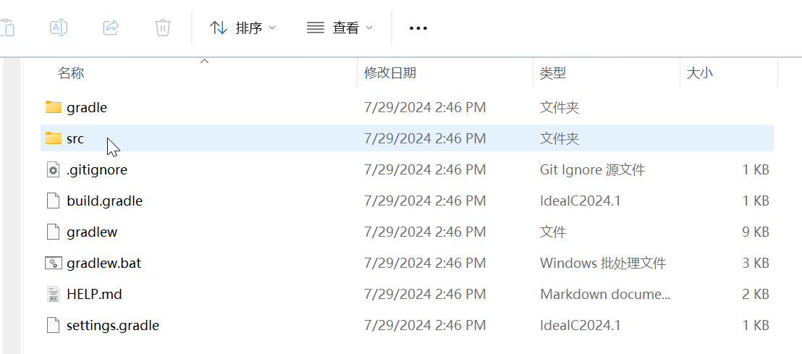
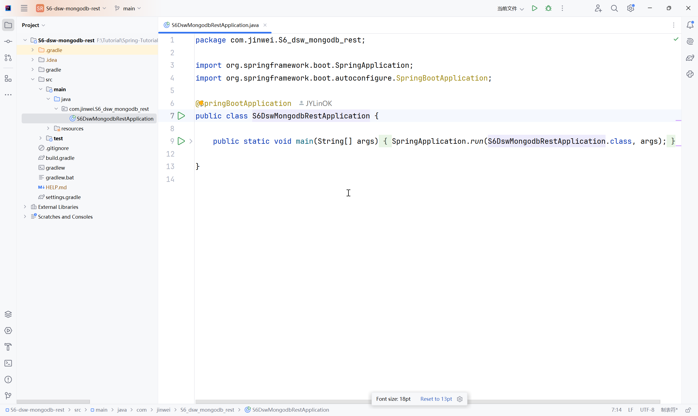
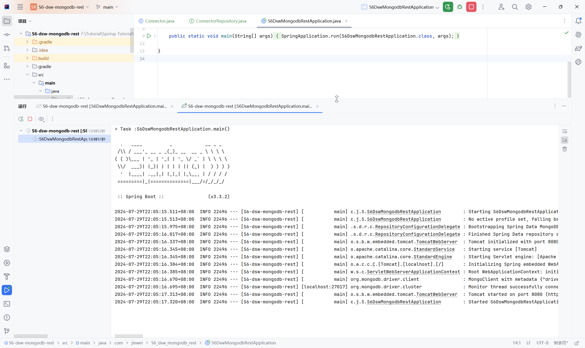

# DSW008-SpringBoot-MongoDB-REST

lin-jinwei

注意，未授权不得擅自以盈利方式转载本博客任何文章。

---

Code: [../code/S6-dsw-mongodb-rest](../code/S6-dsw-mongodb-rest)

## 使用 SpringBoot Initializr

添加依赖：






## 点击下载，解压并复制到工作目录：



## IDEA打开




---

<!-- 
超文本驱动的应用程序架构（Hypermedia As The Engine Of Application State）：一种软件架构风格，用于构建可扩展、可维护的RESTful Web服务。它强调使用超媒体链接来引导客户端与服务端的交互，使客户端无需预先知道服务端的具体实现 -->

# 创建修改代码

## 新建一个实例类：Connector

代码：com/jinwei/S6_dsw_mongodb_rest/Connector.java

```java
package com.jinwei.S6_dsw_mongodb_rest;
import org.springframework.data.annotation.Id;


public class Connector {

    @Id private String id;

    // 定义实例类需要 set-get 的各种属性
    private String cacert;
    private String description;
    private String sellDataID;
    private String buyDataID;

    // get and set: cacert
    public String getCacert() {
        return cacert;
    }

    public void setCacert(String cacert) {
        this.cacert = cacert;
    }

    // get and set: description
    public String getDescription() {
        return description;
    }

    public void setDescription(String description) {
        this.description = description;
    }

    // get and set: sellDataID
    public String getSellDataID() {
        return sellDataID;
    }

    public void setSellDataID(String sellDataID) {
        this.sellDataID = sellDataID;
    }

    // get and set: buyDataID
    public String getDuyDataID() {
        return buyDataID;
    }

    public void setDuyDataID(String buyDataID) {
        this.buyDataID = buyDataID;
    }
}
```

## 定义对应于实体类的仓库类：ConnectorRepository

### 格式：{实体类名称-驼峰命名}+Repository(后缀)

代码：com/jinwei/S6_dsw_mongodb_rest/ConnectorRepository.java

```java
package com.jinwei.S6_dsw_mongodb_rest;
import java.util.List;
import org.springframework.data.mongodb.repository.MongoRepository;
import org.springframework.data.repository.query.Param;
import org.springframework.data.rest.core.annotation.RepositoryRestResource;


@RepositoryRestResource(collectionResourceRel = "people", path = "people")
public interface ConnectorRepository extends MongoRepository<Connector, String> {

    List<Connector> findByLastName(@Param("name") String name);

}
```

## 点击主类运行

运行成功：




## build.gradle 文件

```gradle
plugins {
	id 'java'
	id 'org.springframework.boot' version '3.3.2'
	id 'io.spring.dependency-management' version '1.1.6'
}

group = 'com.jinwei'
version = '0.0.1-SNAPSHOT'

java {
	toolchain {
		languageVersion = JavaLanguageVersion.of(17)
	}
}

repositories {
	mavenCentral()
}

dependencies {
	implementation 'org.springframework.boot:spring-boot-starter-data-mongodb'
	implementation 'org.springframework.boot:spring-boot-starter-data-rest'
	testImplementation 'org.springframework.boot:spring-boot-starter-test'
	testRuntimeOnly 'org.junit.platform:junit-platform-launcher'
}

tasks.named('test') {
	useJUnitPlatform()
}
```

## 测试

```bash
C:\Users\user>curl http://localhost:8080
{
  "_links" : {
    "cadata" : {
      "href" : "http://localhost:8080/cadata{?page,size,sort*}",
      "templated" : true
    },
    "profile" : {
      "href" : "http://localhost:8080/profile"
    }
  }
}

C:\Users\user>curl http://localhost:8080/cadata
{
  "_embedded" : {
    "cadata" : [ {
      "cacert" : "cacert ca0001 class1 0001",
      "description" : "This is a connector description class1 0001",
      "sellDataID" : null,
      "duyDataID" : null,
      "_links" : {
        "self" : {
          "href" : "http://localhost:8080/cadata/66a72af725b3ef6972ae18e9"
        },
        "connector" : {
          "href" : "http://localhost:8080/cadata/66a72af725b3ef6972ae18e9"
        }
      }
    }, {
      "cacert" : "cacert ca0001 class2 0002",
      "description" : "This is a connector description class1 0002",
      "sellDataID" : null,
      "duyDataID" : null,
      "_links" : {
        "self" : {
          "href" : "http://localhost:8080/cadata/66a72af725b3ef6972ae18ea"
        },
        "connector" : {
          "href" : "http://localhost:8080/cadata/66a72af725b3ef6972ae18ea"
        }
      }
    } ]
  },
  "_links" : {
    "self" : {
      "href" : "http://localhost:8080/cadata?page=0&size=20"
    },
    "profile" : {
      "href" : "http://localhost:8080/profile/cadata"
    },
    "search" : {
      "href" : "http://localhost:8080/cadata/search"
    }
  },
  "page" : {
    "size" : 20,
    "totalElements" : 2,
    "totalPages" : 1,
    "number" : 0
  }
}
```

测试成功~！


