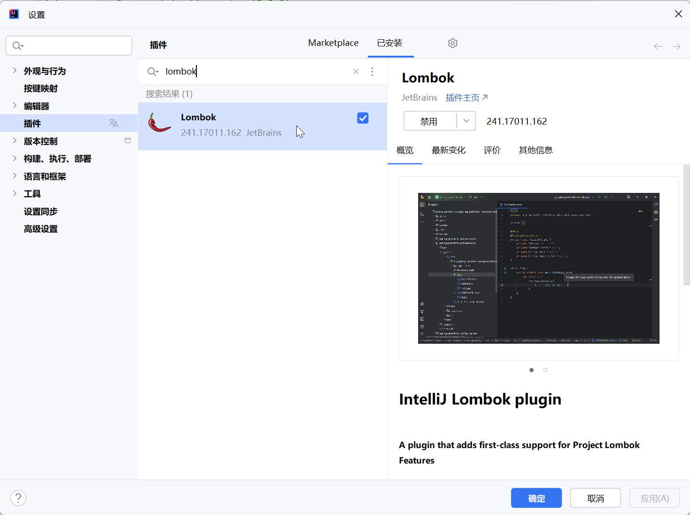

# DSW009-ProjectLombok-Lombok-下载安装配置-

lin-jinwei

注意，未授权不得擅自以盈利方式转载本博客任何文章。

---

## Lombok官网

### https://projectlombok.org/

Project Lombok is a java library that automatically plugs into your editor and build tools, spicing up your java.
Never write another getter or equals method again, with one annotation your class has a fully featured builder, Automate your logging variables, and much more.

Project Lombok是一个java库，可以自动插入到编辑器和构建工具中，为java增添趣味。永远不要再写getter或equals方法了，只要有一个注释，你的类就有一个功能齐全的构建器、自动化日志变量等等。


## 最新版下载展示

### https://projectlombok.org/download


---

## 首先 IDEA 搜索安装 Lombok插件




## 启动IDEA的注解编译器


## 引入 gradle依赖

### lombok官方引入格式-> gradle：https://projectlombok.org/setup/gradle

代码：build.gradle

格式：

```gradle
repositories {
	mavenCentral()
}

dependencies {
	compileOnly 'org.projectlombok:lombok:1.18.34'
	annotationProcessor 'org.projectlombok:lombok:1.18.34'
	
	testCompileOnly 'org.projectlombok:lombok:1.18.34'
	testAnnotationProcessor 'org.projectlombok:lombok:1.18.34'
}
```

---

## 创建实体类：Connector

代码：com/jinwei/S8_dsw_Mongotemplate_CDUR/Connector.java

```java
package com.jinwei.S8_dsw_Mongotemplate_CDUR;

import com.fasterxml.jackson.annotation.JsonFormat;
import lombok.Data;
import lombok.ToString;
import lombok.experimental.Accessors;
import org.springframework.data.mongodb.core.mapping.MongoId;
import java.util.Date;

@Data  // lombok-setter-getter-toString等自动构建
@ToString  // lombok-ToString自动构建
@Accessors(chain = true)  // 启动lombok的链式编程模式
public class Connector {

    @MongoId
    private String id; // 使用 @MongoID 注解可以更清晰的指定 _id主键
    private String description;
    private String type;
    @JsonFormat( pattern ="yyyy-MM-dd", timezone ="GMT+8")
    private Date registerDay;
    @JsonFormat( pattern ="yyyy-MM-dd", timezone ="GMT+8")
    private Date loginDay;
    private CAcert cacert;

}
```

## 链式编程：创建实体类的-属性类：Connector-CAcert

代码：com/jinwei/S8_dsw_Mongotemplate_CDUR/CAcert.java

```java
package com.jinwei.S8_dsw_Mongotemplate_CDUR;

import com.fasterxml.jackson.annotation.JsonFormat;
import lombok.Data;
import lombok.ToString;
import lombok.experimental.Accessors;
import java.util.Date;

@Data
@ToString
@Accessors(chain = true)
public class CAcert {
    private String caContent;
    private String caType;
    private String caDescription;
    @JsonFormat( pattern ="yyyy-MM-dd", timezone ="GMT+8")
    private Date caRegisterDay;
}
```

## 


