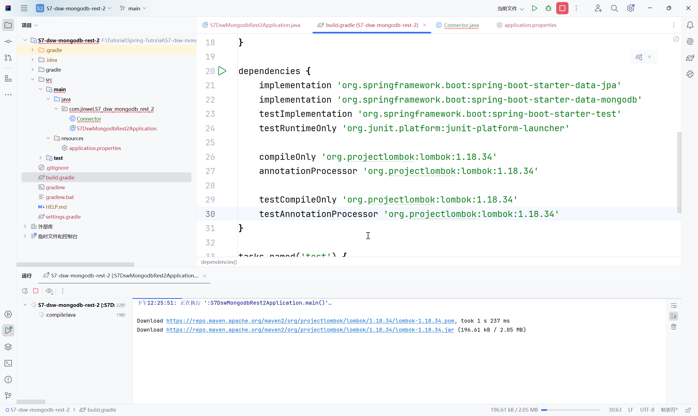
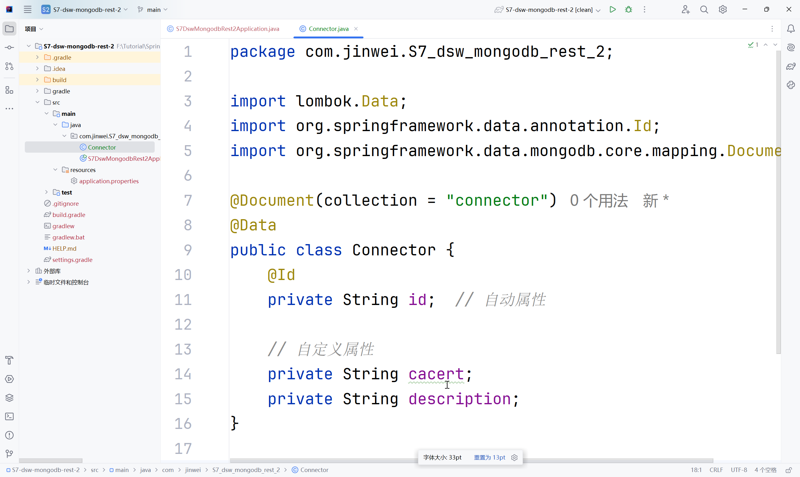

# DSW010-SpringBoot-MongoDB-REST-MongoRepository

lin-jinwei

注意，未授权不得擅自以盈利方式转载本博客任何文章。

---

Code: [../code/S6-dsw-mongodb-rest](../code/S6-dsw-mongodb-rest/)

## 引入 gradle依赖

### lombok官方引入格式-> gradle：https://projectlombok.org/setup/gradle


```gradle
repositories {
	mavenCentral()
}

dependencies {
	compileOnly 'org.projectlombok:lombok:1.18.34'
	annotationProcessor 'org.projectlombok:lombok:1.18.34'
	
	testCompileOnly 'org.projectlombok:lombok:1.18.34'
	testAnnotationProcessor 'org.projectlombok:lombok:1.18.34'
}
```

举例：
代码：build.gradle

```gradle
dependencies {
	implementation 'org.springframework.boot:spring-boot-starter-data-jpa'
	implementation 'org.springframework.boot:spring-boot-starter-data-mongodb'
	testImplementation 'org.springframework.boot:spring-boot-starter-test'
	testRuntimeOnly 'org.junit.platform:junit-platform-launcher'
	
    compileOnly 'org.projectlombok:lombok:1.18.34'
	annotationProcessor 'org.projectlombok:lombok:1.18.34'
	
	testCompileOnly 'org.projectlombok:lombok:1.18.34'
	testAnnotationProcessor 'org.projectlombok:lombok:1.18.34'
}
```

## 引入后重新进行主文件编译会出现自动下载 lombok依赖


注意：引入后需要重启，然后可以看到注解 @Data可用



---

## 创建实体类：Connector

代码：com/jinwei/S7_dsw_mongodb_rest_2/Connector.java

```java
package com.jinwei.S7_dsw_mongodb_rest_2;

import lombok.Data;
import org.springframework.data.annotation.Id;
import org.springframework.data.mongodb.core.mapping.Document;

@Document(collection = "connector")
@Data
public class Connector {
    @Id
    private String id;  // 自动赋值属性

    // 自定义属性
    private String cacert;
    private String description;
}
```

## 创建基于实体类的仓库类：ConnectorRepository

代码：com/jinwei/S7_dsw_mongodb_rest_2/ConnectorRepository.java

```java
package com.jinwei.S7_dsw_mongodb_rest_2;
import org.springframework.data.mongodb.repository.MongoRepository;
import java.util.List;

public interface ConnectorRepository extends MongoRepository<Connector, String> {
    // 自定义查询方法
    List<Connector> findByID(String id);
    List<Connector> findByCacert(String cacert);
    List<Connector> findByDescription(String description);
}
```

## 设置 IDEA-MongoDB数据库

格式：
```bash
# 直接通过IP:端口号+数据库名称设置
spring.data.mongodb.uri=mongodb://{IP:端口号}/{数据库名称}

# 账号+密码设置
spring.data.mongodb.uri=mongodb://用户:{密码}@{IP:端口号}/{数据库名称}

# 多节点{IP:端口号+数据库名称}设置
spring.data.mongodb.uri=mongodb://user:pwd@{IP1:端口号1},{IP2:端口号2}/{数据库名称}
```

## application.properties 文件配置

代码：resources/application.properties

```bash
spring.application.name=S7-dsw-mongodb-rest-2

spring.data.mongodb.uri=mongodb://127.0.0.1:27017/c_db
```

## 主类程序

```java
package com.jinwei.S7_dsw_mongodb_rest_2;

import org.springframework.boot.SpringApplication;
import org.springframework.boot.autoconfigure.SpringBootApplication;

@SpringBootApplication
public class S7DswMongodbRest2Application {

	public static void main(String[] args) {
		SpringApplication.run(S7DswMongodbRest2Application.class, args);
	}
}
```


