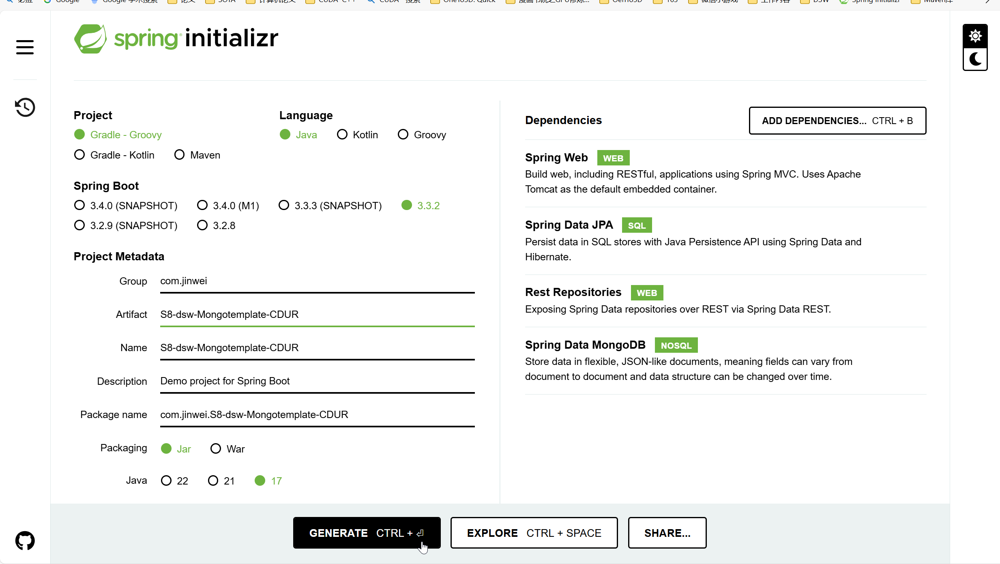

# DSW011-SpringBoot-MongoDB-REST-Mongotemplate-CDUR

lin-jinwei

注意，未授权不得擅自以盈利方式转载本博客任何文章。

---

Code: [../code/S8-dsw-Mongotemplate-CDUR](../code/S8-dsw-Mongotemplate-CDUR/)


## SpringBoot Initializr 创建项目


## 引入 gradle依赖

### 引入 lombok

代码：build.gradle
格式：
```gradle
dependencies {	
 	compileOnly 'org.projectlombok:lombok:1.18.34'
	annotationProcessor 'org.projectlombok:lombok:1.18.34'
	
	testCompileOnly 'org.projectlombok:lombok:1.18.34'
	testAnnotationProcessor 'org.projectlombok:lombok:1.18.34'
}
```

### 引入 swagger-APIs管理：https://swagger.io/

Maven官网带UI插件：
https://mvnrepository.com/artifact/org.springdoc/springdoc-openapi-starter-webmvc-ui

代码：build.gradle
格式：

https://mvnrepository.com/artifact/org.springdoc/springdoc-openapi-starter-webmvc-ui/2.6.0

```gradle
// https://mvnrepository.com/artifact/org.springdoc/springdoc-openapi-starter-webmvc-ui
implementation group: 'org.springdoc', name: 'springdoc-openapi-starter-webmvc-ui', version: '2.6.0'
```


### 整体 build.gradle文件
```gradle
plugins {
	id 'java'
	id 'org.springframework.boot' version '3.3.2'
	id 'io.spring.dependency-management' version '1.1.6'
}

group = 'com.jinwei'
version = '0.0.1-SNAPSHOT'

java {
	toolchain {
		languageVersion = JavaLanguageVersion.of(17)
	}
}

repositories {
	mavenCentral()
}

dependencies {
	implementation 'org.springframework.boot:spring-boot-starter-data-jpa'
	implementation 'org.springframework.boot:spring-boot-starter-data-mongodb'
	implementation 'org.springframework.boot:spring-boot-starter-data-rest'
	implementation 'org.springframework.boot:spring-boot-starter-web'
	testImplementation 'org.springframework.boot:spring-boot-starter-test'
	testRuntimeOnly 'org.junit.platform:junit-platform-launcher'

	compileOnly 'org.projectlombok:lombok:1.18.34'
	annotationProcessor 'org.projectlombok:lombok:1.18.34'

	testCompileOnly 'org.projectlombok:lombok:1.18.34'
	testAnnotationProcessor 'org.projectlombok:lombok:1.18.34'

	implementation group: 'org.springdoc', name: 'springdoc-openapi-starter-webmvc-ui', version: '2.6.0'
}

tasks.named('test') {
	useJUnitPlatform()
}
```

引入后新依赖后，需要重启IDEA.


## 设置 IDEA-MongoDB数据库

在：resources/application.properties：中配置

```bash
spring.application.name=S8-dsw-Mongotemplate-CDUR

# 添加
spring.data.mongodb.uri=mongodb://127.0.0.1:27017/c_db2
```

---
---

## 主类程序

```java

```

## 创建实体类：Connector

代码：com/jinwei/S8_dsw_Mongotemplate_CDUR/Connector.java

```java
package com.jinwei.S8_dsw_Mongotemplate_CDUR;

import com.fasterxml.jackson.annotation.JsonFormat;
import lombok.Data;
import lombok.ToString;
import lombok.experimental.Accessors;
import org.springframework.data.mongodb.core.mapping.MongoId;
import java.util.Date;

@Data  // ombok-自动构建-get、set、equals、hashCode、canEqual、toString等方法
@ToString  // lombok-自动构建-ToString
@Accessors(chain = true)  // lombok-链式编程
public class Connector {
    @MongoId
    private String id;  // 使用注解 MongoID可以更清晰地指定 _id主键
    private String description;
    @JsonFormat( pattern ="yyyy-MM-dd", timezone ="GMT+8")
    private Date loginDay;
    @JsonFormat( pattern ="yyyy-MM-dd", timezone ="GMT+8")
    private Date registerDay;
    // CA certification
    private CACert caCert;  // 链式编程
}
```

## 创建实体类-链式编程类：Connector-CACert

代码：com/jinwei/S8_dsw_Mongotemplate_CDUR/CACert.java

```java
package com.jinwei.S8_dsw_Mongotemplate_CDUR;

import com.fasterxml.jackson.annotation.JsonFormat;
import lombok.Data;
import lombok.ToString;
import lombok.experimental.Accessors;

import java.util.Date;

@Data  // lombok-set-get
@ToString  // lombok-tostring
@Accessors(chain = true)  // lombok-链式编程开启
public class CACert {
    private String content;
    private String description;
    
    @JsonFormat( pattern ="yyyy-MM-dd", timezone ="GMT+8")
    private Date registerDay;
}
```

## 创建服务类：Connector-CACert

代码：com/jinwei/S8_dsw_Mongotemplate_CDUR/CACert.java

```java

```


