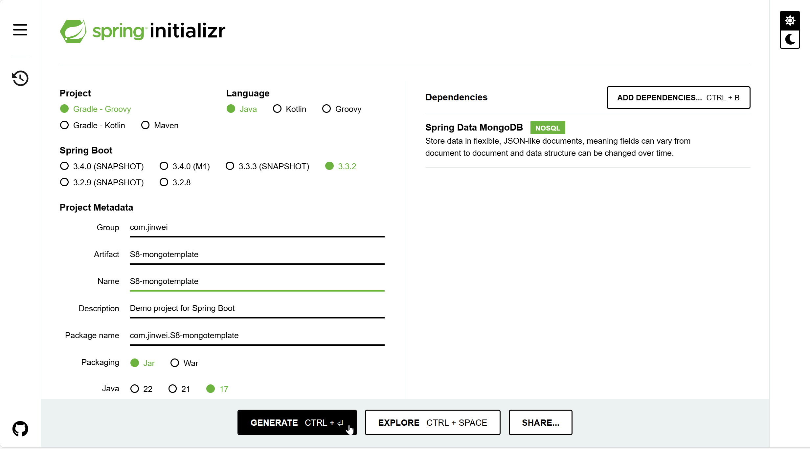

# DSW011-SpringBoot-MongoDB-REST-Mongotemplate-CDUR

lin-jinwei

注意，未授权不得擅自以盈利方式转载本博客任何文章。

---

Code: [../code/S6-dsw-mongodb-rest](../code/S6-dsw-mongodb-rest/)


## SpringBoot Initializr 创建项目


## 引入 gradle依赖

### 引入 lombok

代码：build.gradle

```gradle
dependencies {
	implementation 'org.springframework.boot:spring-boot-starter-data-mongodb'
	implementation 'org.springframework.boot:spring-boot-starter-data-rest'
	implementation 'org.springframework.boot:spring-boot-starter-web'
	testImplementation 'org.springframework.boot:spring-boot-starter-test'
	testRuntimeOnly 'org.junit.platform:junit-platform-launcher'
	
 	compileOnly 'org.projectlombok:lombok:1.18.34'
	annotationProcessor 'org.projectlombok:lombok:1.18.34'
	
	testCompileOnly 'org.projectlombok:lombok:1.18.34'
	testAnnotationProcessor 'org.projectlombok:lombok:1.18.34'
}
```

如果没有成功加载 lombok，刷新gradle或者重启IDEA即可。


### 引入 swaggerAPI管理：https://swagger.io/

Gradle官网搜索插件：
https://plugins.gradle.org/search?term=swagger



代码：build.gradle

Groovy 格式：
```gradle
plugins {
  id "io.swagger.core.v3.swagger-gradle-plugin" version "2.2.22"
}
```
或：

```gradle
buildscript {
  repositories {
    maven {
      url "https://plugins.gradle.org/m2/"
    }
  }
  dependencies {
    classpath "io.swagger.core.v3:swagger-gradle-plugin:2.2.22"
  }
}

apply plugin: "io.swagger.core.v3.swagger-gradle-plugin"
```

Maven 格式：

```gradle
repositories {
	mavenCentral()
}

dependencies {
	implementation group: 'io.swagger.core.v3', name: 'swagger-core', version: '2.2.22'
}
```

### build.gradle

代码：
```gradle
plugins {
	id 'java'
	id 'org.springframework.boot' version '3.3.2'
	id 'io.spring.dependency-management' version '1.1.6'
}

group = 'com.jinwei'
version = '0.0.1-SNAPSHOT'

java {
	toolchain {
		languageVersion = JavaLanguageVersion.of(17)
	}
}

repositories {
	mavenCentral()
}

dependencies {
	implementation 'org.springframework.boot:spring-boot-starter-data-jpa'
	implementation 'org.springframework.boot:spring-boot-starter-data-mongodb'
	implementation 'org.springframework.boot:spring-boot-starter-data-rest'
	implementation 'org.springframework.boot:spring-boot-starter-web'
	testImplementation 'org.springframework.boot:spring-boot-starter-test'
	testRuntimeOnly 'org.junit.platform:junit-platform-launcher'

	compileOnly 'org.projectlombok:lombok:1.18.34'
	annotationProcessor 'org.projectlombok:lombok:1.18.34'

	testCompileOnly 'org.projectlombok:lombok:1.18.34'
	testAnnotationProcessor 'org.projectlombok:lombok:1.18.34'

	implementation group: 'io.swagger.core.v3', name: 'swagger-core', version: '2.2.22'
}

tasks.named('test') {
	useJUnitPlatform()
}
```

## 设置 IDEA-MongoDB数据库

在：resources/application.properties：中配置

```bash
spring.application.name=S8-dsw-Mongotemplate-CDUR

# 添加
spring.data.mongodb.uri=mongodb://127.0.0.1:27017/c_db2
```

---
---

## 主类程序

```java

```

## 创建实体类：Connector

代码：