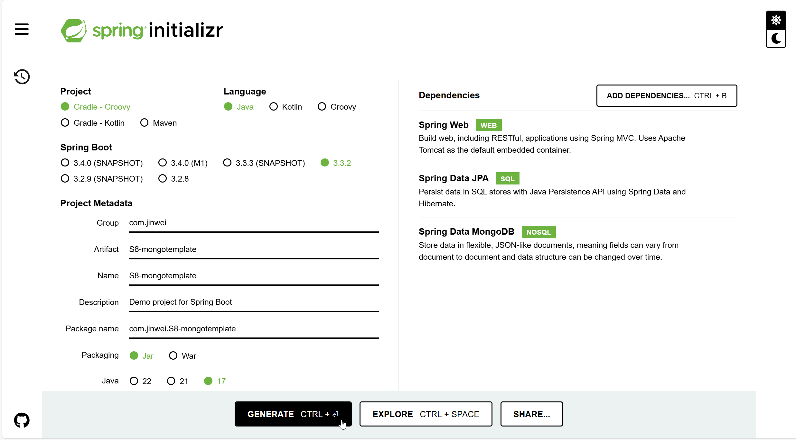

# DSW011-MongoTemplate

lin-jinwei

注意，未授权不得擅自以盈利方式转载本博客任何文章。

---

Code: [../code/S7-dsw-mongodb-rest-2/](../code/)


## SpringBoot Initializr 创建项目



## 引入 gradle依赖

### lombok
gradle：https://projectlombok.org/setup/gradle


```gradle
repositories {
	mavenCentral()
}

dependencies {
	compileOnly 'org.projectlombok:lombok:1.18.34'
	annotationProcessor 'org.projectlombok:lombok:1.18.34'
	
	testCompileOnly 'org.projectlombok:lombok:1.18.34'
	testAnnotationProcessor 'org.projectlombok:lombok:1.18.34'
}
```

### jjwt

```gradle
// https://mvnrepository.com/artifact/io.jsonwebtoken/jjwt
implementation group: 'io.jsonwebtoken', name: 'jjwt', version: '0.12.6'
implementation group: 'io.jsonwebtoken', name: 'jjwt', version: '0.12.6'
implementation group: 'io.jsonwebtoken', name: 'jjwt-api', version: '0.12.6'
runtimeOnly group: 'io.jsonwebtoken', name: 'jjwt-impl', version: '0.12.6'
runtimeOnly group: 'io.jsonwebtoken', name: 'jjwt-jackson', version: '0.12.6'
```


## 设置 IDEA-MongoDB数据库

### application.properties 文件配置

代码：resources/application.properties

```bash
spring.application.name=S7-dsw-mongodb-rest-2

spring.data.mongodb.uri=mongodb://127.0.0.1:27017/c_db
```

## 主类程序

```java

```

## 创建实体类：Connector

代码：

```java
```


