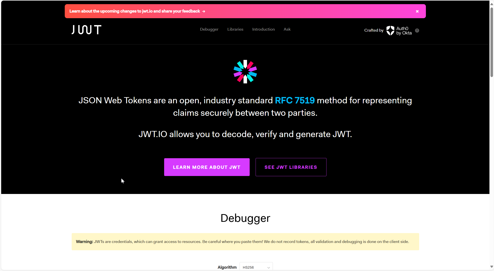

# DSW012-JWT-token-JSON配置文件读取

lin-jinwei

注意，未授权不得擅自以盈利方式转载本博客任何文章。

---

Code: [../code/](../code/)


## JWT Json-Web-Token官网：https://jwt.io/



## 使用：

### gradel引入依赖

#### JWT-必需

```gradle
implementation group: 'io.jsonwebtoken', name: 'jjwt', version: '0.12.6'
implementation group: 'io.jsonwebtoken', name: 'jjwt-api', version: '0.12.6'
runtimeOnly group: 'io.jsonwebtoken', name: 'jjwt-impl', version: '0.12.6'
runtimeOnly group: 'io.jsonwebtoken', name: 'jjwt-jackson', version: '0.12.6'
```

#### JWT-可选


```gradle
implementation group: 'com.google.code.gson', name: 'gson', version: '2.11.0'
```

### 创建配置文件: 
代码：jwt.properties

```bash
jwt.secret="12345678901234567890123456789012345678901234567890123456789012345678901234567890"
jwt.iss="ISS_qianfafang"
jwt.sub="SUBJECT_zhuti"
#jwt.aud="ADU_jieshoufang"
#jwt.exp="EXP_chaoshitime"
#jwt.nbf="NBF_starttime"
#jwt.iat="IAT_qianfatime"
#jwt.jti="JTI_onlyID"
```


### JWT工具类-JWTUtil: 
代码：com/jinwei/{项目根目录}/JWTUtil.java

```java
package com.jinwei.S8_mongotemplate;

import io.jsonwebtoken.*;
import lombok.Data;
import javax.crypto.SecretKey;
import java.util.Date;
import java.util.UUID;
import io.jsonwebtoken.Jwts;
import io.jsonwebtoken.security.Keys;
import io.jsonwebtoken.security.SecureDigestAlgorithm;
import org.springframework.beans.factory.annotation.Value;
import org.springframework.context.annotation.Configuration;
import org.springframework.context.annotation.PropertySource;
import java.time.Instant;

@Data
@PropertySource(value = { "jwt.properties" })
@Configuration
public class JWTUtil {
    // 设置token访问的过期时间-单位/分种
    private static final int MINUTE = 60;
    public static final int ACCESS_EXPIRE = 1 * MINUTE;

    // 设置秘钥的加密算法
    private final static SecureDigestAlgorithm<SecretKey, SecretKey> ALGORITHM = Jwts.SIG.HS512;
    // 生成私钥，只能在服务器端保存
    // 使用Jwts.SIG.HS256 算法需要SECRET至少32位
    // 使用Jwts.SIG.HS512 算法需要SECRET至少64位
    // 设置密钥字符串
    private static String SECRET = "SECRET";

    // 使用加密算法加密密钥字符串
    public static final SecretKey KEY = Keys.hmacShaKeyFor(SECRET.getBytes());

    // 设置jwt签发者
    private static String JWT_ISS;

    // 设置jwt主题
    private static String = "SUBJECT";

    /* 常用声明：
    iss: jwt签发者-签发方
    sub: jwt主题-面向用户
    aud: jwt接受者-接受方
    exp: jwt过期时间-过期时间必须要大于签发时间
    nbf: jwt开始启用时间-定义在什么时间之前-jwt不可用的
    iat: jwt签发时间-过期时间必须要大于签发时间
    jti: jwt唯一身份标识-主要用来作为一次性token-回避重放攻击
     */
    public static String genJWTToken(String inputStr) {
        // 生成令牌id-UUID.randomUUID()-随机
        String uuid = UUID.randomUUID().toString();
        Date exprireDate = Date.from(Instant.now().plusSeconds(ACCESS_EXPIRE));

        return Jwts.builder()
                // 设置头部信息-header
                .header()
                .add("type", "JWT")
                .add("algo", "HS512")
                .and()
                // 设置负载信息-payload
                .claim("username", inputStr)
                // 设置令牌ID
                .id(uuid)
                // 设置过期日期
                .expiration(exprireDate)
                // 设置签发时间
                .issuedAt(new Date())
                // 设置主题
                .subject(SUBJECT)
                // 设置签发者
                .issuer(JWT_ISS)
                // 设置签名
                .signWith(KEY, ALGORITHM)
                .compact();
    }

    // 解析token-claim
    public static Jws<Claims> parseClaim(String token) {
        return Jwts.parser()
                .verifyWith(KEY)  // 必须持有相同的KEY才能解析
                .build()
                .parseSignedClaims(token);
    }

    // 解析头部-Header
    public static JwsHeader parseHeader(String token) {
        return parseClaim(token).getHeader();
    }

    // 解析负载-Payload
    public static Claims parsePayload(String token) {
        return parseClaim(token).getPayload();
    }

}
```

### 更新JWT工具类-JWTUtil: 
代码：com/jinwei/{项目根目录}/JWTUtil.java

更新：添加了JSON配置参数文件的读取

```java
package com.jinwei.S8_mongotemplate;

import com.google.gson.Gson;
import io.jsonwebtoken.*;
import lombok.Data;
import javax.crypto.SecretKey;
import java.io.IOException;
import java.util.Date;
import java.util.UUID;
import io.jsonwebtoken.Jwts;
import io.jsonwebtoken.security.Keys;
import io.jsonwebtoken.security.SecureDigestAlgorithm;

import java.time.Instant;

@Data
public class JWTUtil {
    // 获取JWT配置-对象-GSON
    private static String jsonFile = "jwt-authorization.json";
    static JsonUtil jsonUtil = new JsonUtil();
    static String jsonStr;

    static {
        try {
            jsonStr = jsonUtil.readJSON(jsonFile);
        } catch (IOException e) {
            throw new RuntimeException(e);
        }
    }

    static Gson gson = new Gson();
    static JWTConfig jwtConfig = gson.fromJson(jsonStr, JWTConfig.class);

    // 设置token访问的过期时间-单位/分种
    private static final int MINUTE = 60;
    public static final int ACCESS_EXPIRE = 1 * MINUTE;

    // 设置秘钥的加密算法
    private final static SecureDigestAlgorithm<SecretKey, SecretKey> ALGORITHM = Jwts.SIG.HS512;
    // 生成私钥，只能在服务器端保存
    // 使用Jwts.SIG.HS256 算法需要SECRET至少32位
    // 使用Jwts.SIG.HS512 算法需要SECRET至少64位

    // 设置密钥字符串
    private final static String SECRET = jwtConfig.secret;
    // 使用加密算法加密密钥字符串
    public final static SecretKey KEY = Keys.hmacShaKeyFor(SECRET.getBytes());

    // 设置jwt签发者
    private final static String JWT_ISS = jwtConfig.iss;

    // 设置jwt主题
    private final static String SUBJECT = jwtConfig.subject;

    public JWTUtil() throws IOException {
    }

    /* 常用声明：
    iss: jwt签发者-签发方
    sub: jwt主题-面向用户
    aud: jwt接受者-接受方
    exp: jwt过期时间-过期时间必须要大于签发时间
    nbf: jwt开始启用时间-定义在什么时间之前-jwt不可用的
    iat: jwt签发时间-过期时间必须要大于签发时间
    jti: jwt唯一身份标识-主要用来作为一次性token-回避重放攻击
     */
    public String genJWTToken(String inputStr)  {

        // 生成令牌id-UUID.randomUUID()-随机
        String uuid = UUID.randomUUID().toString();
        Date exprireDate = Date.from(Instant.now().plusSeconds(ACCESS_EXPIRE));

        return Jwts.builder()
                // 设置头部信息-header
                .header()
                .add("type", "JWT")
                .add("algo", "HS512")
                .and()
                // 设置负载信息-payload
                .claim("username", inputStr)
                // 设置令牌ID
                .id(uuid)
                // 设置过期日期
                .expiration(exprireDate)
                // 设置签发时间
                .issuedAt(new Date())
                // 设置主题
                .subject(SUBJECT)
                // 设置签发者
                .issuer(JWT_ISS)
                // 设置签名
                .signWith(KEY, ALGORITHM)
                .compact();
    }

    // 解析token-claim
    public  Jws<Claims> parseClaim(String token) {
        return Jwts.parser()
                .verifyWith(KEY)  // 必须持有相同的KEY才能解析
                .build()
                .parseSignedClaims(token);
    }

    // 解析头部-Header
    public  JwsHeader parseHeader(String token) {
        return parseClaim(token).getHeader();
    }

    // 解析负载-Payload
    public  Claims parsePayload(String token) {
        return parseClaim(token).getPayload();
    }

}
```

## 测试主文件

```java
package com.jinwei.S8_mongotemplate;

import com.google.gson.Gson;
import org.springframework.boot.SpringApplication;
import org.springframework.boot.autoconfigure.SpringBootApplication;
import org.springframework.boot.autoconfigure.jdbc.DataSourceAutoConfiguration;

import java.util.Date;

@SpringBootApplication(exclude = DataSourceAutoConfiguration.class)
public class S8MongotemplateApplication {

	public static void main(String[] args) {
//		SpringApplication.run(S8MongotemplateApplication.class, args);

		User user = new User("user2", "123");
		String subject = new Gson().toJson(user);

		JWTUtil jwtUtil = new JWTUtil();
		String jwtoken = jwtUtil.genJWTToken(subject);

		System.out.println("jwtoken = " + jwtoken);
		System.out.println("jwtUtil.parseClaim(jwtoken) = " + jwtUtil.parseClaim(jwtoken));
		System.out.println("jwtUtil.parsePayload(jwtoken) = " + jwtUtil.parsePayload(jwtoken));

	}

}
```


