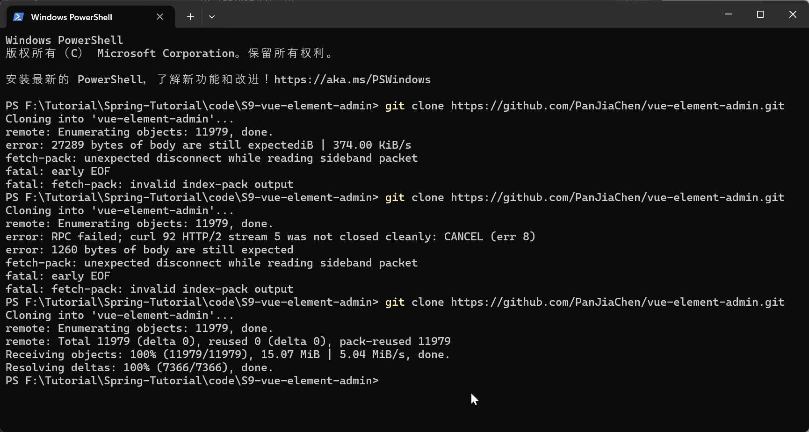
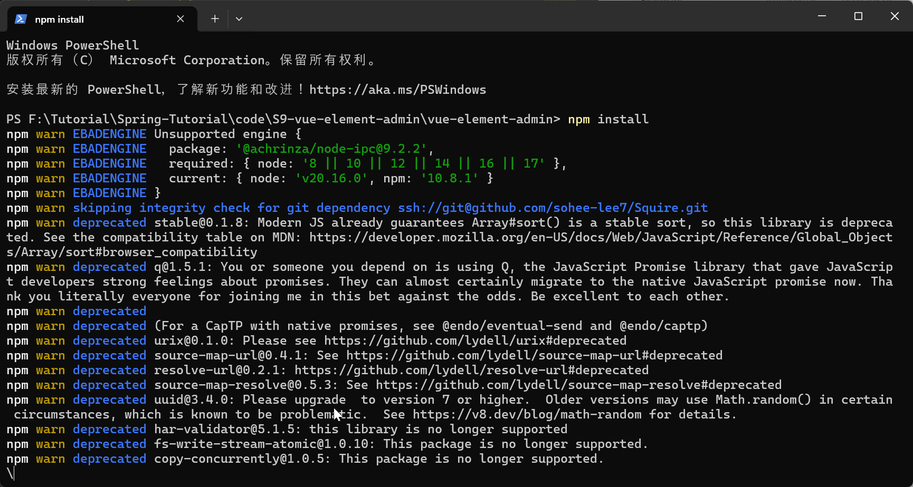

# DSW013-Element-Admin-后台控制程序-环境安装配置.md

lin-jinwei

注意，未授权不得擅自以盈利方式转载本博客任何文章。

---

Code: [../code/S9-vue-element-admin](../code/S9-vue-element-admin/)

## 首先安装node.js

中文官网: https://nodejs.org/zh-cn
官方介绍：
Node.js® 是一个免费、开源、跨平台的 JavaScript 运行时环境，它让开发人员能够创建服务器、Web 应用、命令行工具和脚本。

长期支持版下载链接：
https://nodejs.org/dist/v20.16.0/node-v20.16.0-x64.msi


### 安装过程：


一路next安装完成后，输出：
```bash
node -v
```
输出版本信息，说明安装成功！


## vue官网：
#### https://cn.vuejs.org/
官方介绍：
易学易用，性能出色，适用场景丰富的 Web 前端框架。

## vue-UI官网：
#### https://element-plus.org/zh-CN/
官方介绍：
基于 Vue 3，面向设计师和开发者的组件库。


## vue-element-admin官网：
#### https://panjiachen.github.io/vue-element-admin-site/zh/
#### GitHUb: https://panjiachen.github.io/vue-element-admin-site/zh/

官方介绍：
1. vue-element-admin 是一个后台前端解决方案，它基于 vue 和 element-ui实现。它使用了最新的前端技术栈，内置了 i18 国际化解决方案，动态路由，权限验证，提炼了典型的业务模型，提供了丰富的功能组件，它可以帮助你快速搭建企业级中后台产品原型。

2. Vue-element-admin是用于管理界面的生产就绪的前端解决方案。它基于value并使用UI Toolkit元素- UI。

3. Vue-element-admin基于最新的vue开发堆栈，它具有内置的i18n解决方案、企业应用程序的典型模板以及许多很棒的特性。可帮助构建大型且复杂的单页应用程序。

总结：
1. 可以用来设计企业级应用；
2. 设计出来的是单页面应用。

## 关系
vue-element-admin是一个开源且流行的后台管理程序，其代码开发基于开源的Vue和Element-UI（Vue-UI）。

---

## vue-element-admin：下载

### 克隆项目

```bash
git clone https://github.com/PanJiaChen/vue-element-admin.git
```




由于网络不稳定，可能需要多次尝试下载

### 下载成功后：进入项目目录

输入：
```bash
cd vue-element-admin
```


输入：
```bash
npm install
```





如果安装速度较慢，输入：
```bash
npm install --registry=https://registry.npmmirror.com
```


## 启动项目
```bash
npm run dev
```


### 允许访问：


### 浏览器访问

##### URL：http://localhost:9527


直接点击Login->登录后界面：


运行成功！

此时后台-控制台输出：


## 退出控制台

可以直接通过点击退出按钮退出：


