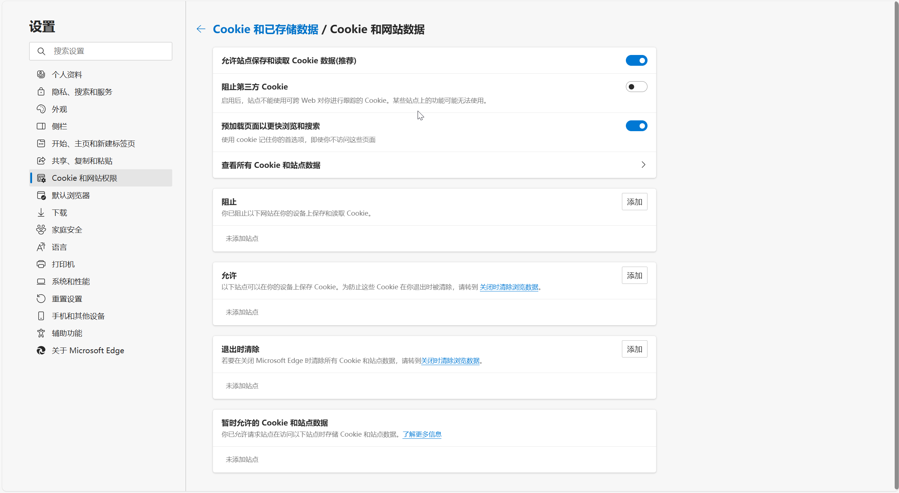
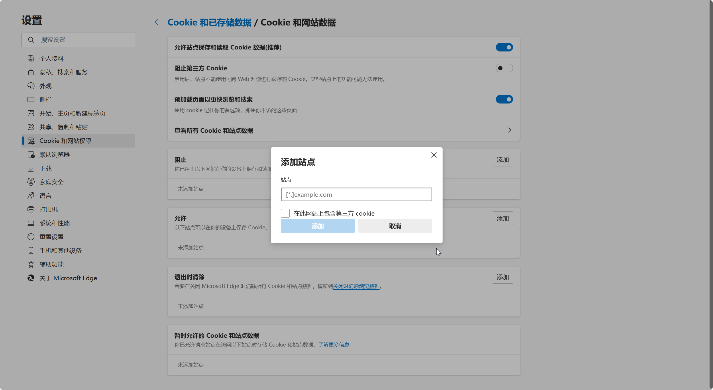
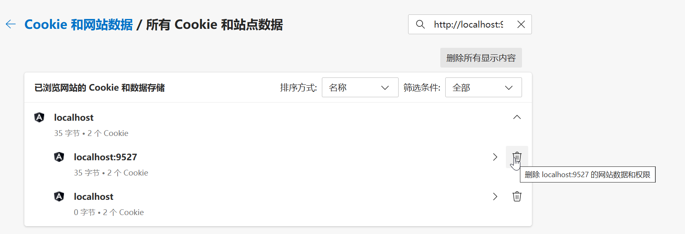
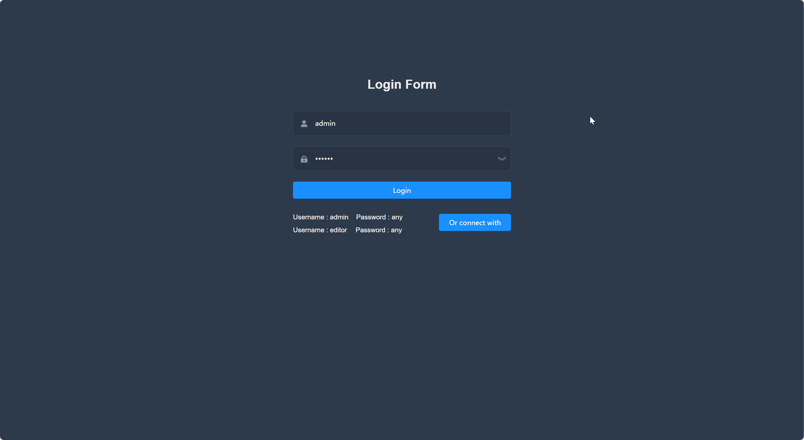
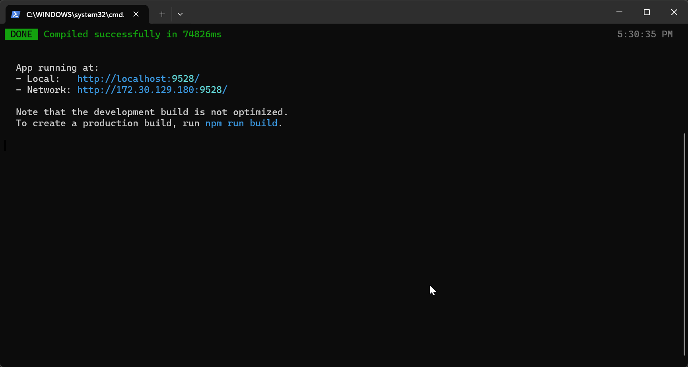
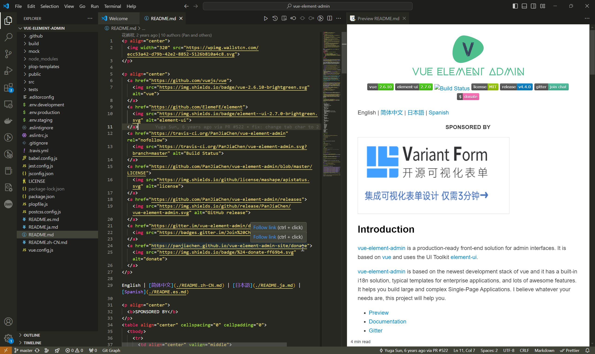
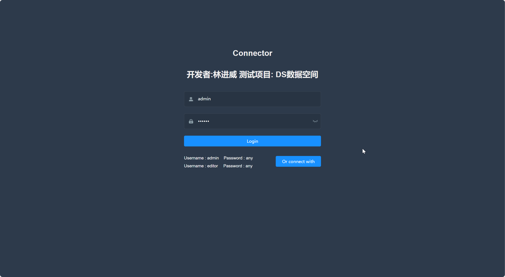
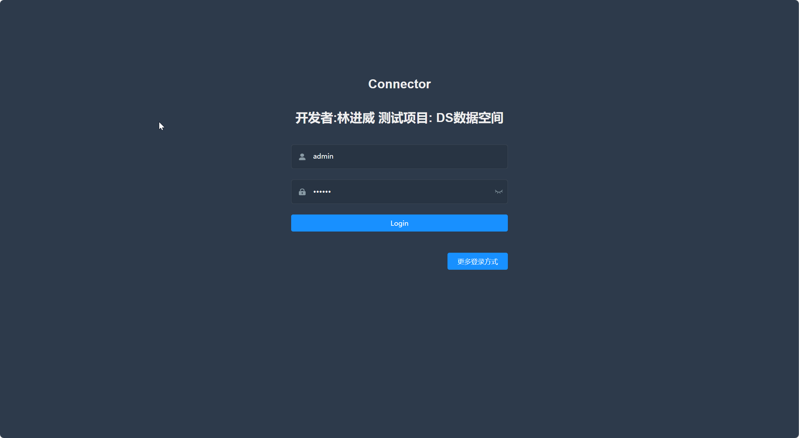
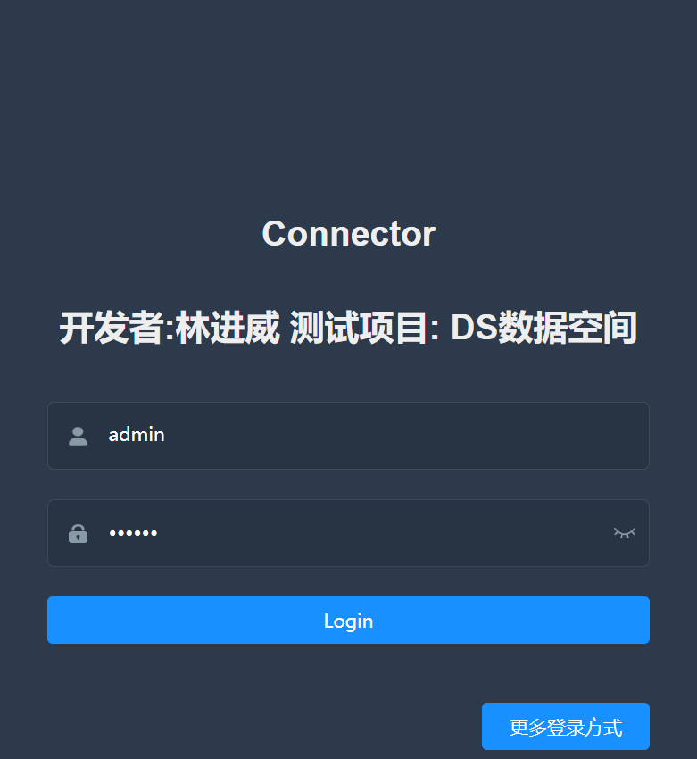
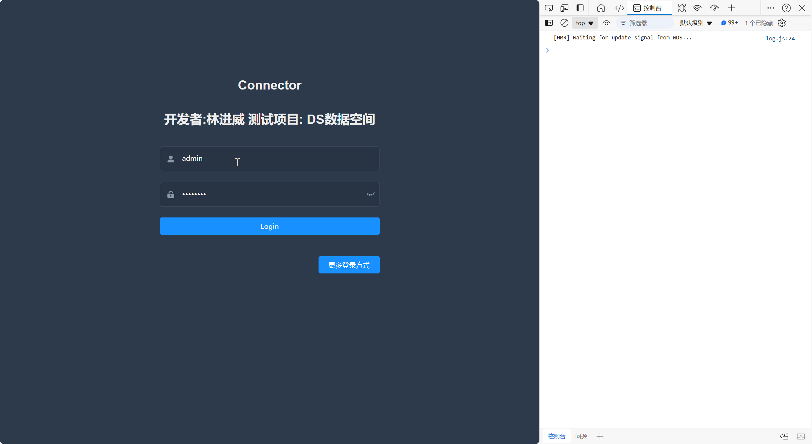

# DSW014-Element-Admin-编辑登录界面

lin-jinwei

注意，未授权不得擅自以盈利方式转载本博客任何文章。

---

Code: [../code/S10-vue-element-admin-edit](../code/S10-vue-element-admin-edit/)

## 删除 Cookie

Cookie是一种浏览器保存用户数据的文件，在Vue-admin登录后，将不再需要重新输入用户名+密码，对编辑不方便，因此删除Cookie:
Edge:


点击退出浏览器时候删除 Cookie:



输入: http://localhost:9527

```bash
http://localhost:9527
```
再删除：


## 重启vue-admin

成功再现登录界面：



后台：



---

## 编辑-VSCode-打开项目目录



## 项目分析

### 项目的整体框架结构

```bash
├── build                      # 构建相关
├── mock                       # 项目mock 模拟数据
├── plop-templates             # 基本模板
├── public                     # 静态资源
│   │── favicon.ico            # favicon图标
│   └── index.html             # html模板
├── src                        # 源代码
│   ├── api                    # 所有请求
│   ├── assets                 # 主题 字体等静态资源
│   ├── components             # 全局公用组件
│   ├── directive              # 全局指令
│   ├── filters                # 全局 filter
│   ├── icons                  # 项目所有 svg icons
│   ├── lang                   # 国际化 language
│   ├── layout                 # 全局 layout
│   ├── router                 # 路由
│   ├── store                  # 全局 store管理
│   ├── styles                 # 全局样式
│   ├── utils                  # 全局公用方法
│   ├── vendor                 # 公用vendor
│   ├── views                  # views 所有页面
│   ├── App.vue                # 入口页面
│   ├── main.js                # 入口文件 加载组件 初始化等
│   └── permission.js          # 权限管理
├── tests                      # 测试
├── .env.xxx                   # 环境变量配置
├── .eslintrc.js               # eslint 配置项
├── .babelrc                   # babel-loader 配置
├── .travis.yml                # 自动化CI配置
├── vue.config.js              # vue-cli 配置
├── postcss.config.js          # postcss 配置
└── package.json               # 项目各个依赖包的详细信息
```

## 登录界面源码

代码：src\views\login\index.vue

### 修改标题

```html
<div class="title-container">
        <h3 class="title">Connector</h3>
        <h5 class="title">开发者:林进威  测试项目: DS数据空间 </h5>
</div>
```

修改后，浏览器端的页面将会热加载-同步更新；
如果没有热加载，则F5键刷新页面：



### 除去tips

```html
<!-- <div class="tips">
  <span>Username : admin</span>
  <span>Password : any</span>
</div> -->
<!-- <div class="tips">
  <span style="margin-right:18px;">Username : editor</span>
  <span>Password : any</span>
</div> -->
```


### 优化布局-更多登录方式

```html
<br />
<br />
<br />
<el-button class="thirdparty-button" type="primary@click="showDialog=true">
  更多登录方式
</el-button>
```




### Login按钮分析




对应代码：
```html
<el-button :loading="loading" type="primary" style="width:100%;margin-bottom:30px;" @click.native.prevent="handleLogin">Login</el-button>
```

该按钮的启动函数为：handleLogin
```html
@click.native.prevent="handleLogin"
```
native：监听item内的自定义事件。即将组件变回原生DOM的一种方式表达。相当于给组件绑定对应的原生事件。
prevent：阻止默认事件动作。

对应的具体函数代码：
```js
handleLogin() {
      this.$refs.loginForm.validate(valid => {
        if (valid) {
          this.loading = true
          this.$store.dispatch('user/login', this.loginForm)
            .then(() => {
              // 此处编辑登录后的具体动作
              // this.$router.push: 实现页面跳转
              this.$router.push({ path: this.redirect || '/', query: this.otherQuery })
              this.loading = false
            })
            .catch(() => {
              this.loading = false
            })
        } else {
          console.log('error submit!!')
          return false
        }
      })
    },
```

### 添加一个字符串输入栏

代码：src\views\login\index.vue

添加组件代码：

```html
<!-- 在此添加 -->
<el-form-item prop="cacert">
  <span class="svg-container">
    <!-- 在此修改图标 -->
    <svg-icon icon-class="guide" />
  </span>
  <!-- tabindex="1" 表示元素可以被聚焦，即光标点击响应 -->
  <el-input ref="cacert" v-model="loginForm.cacertplaceholder="CA-Certification" name="cacert" type="text"
    tabindex="1" autocomplete="on" />
</el-form-item>
```


### 设置export default的默认值
设置界面初始化时候输入框内的默认值或者提示语言：

```js
export default {
  name: 'Login',
  components: { SocialSign },
  data() {
    const validateUsername = (rule, value, callback) => {
      if (!validUsername(value)) {
        callback(new Error('Please enter the correct user name'))
      } else {
        callback()
      }
    }

    // 添加-认证CA证书-初步认证
    const validateCacert = (rule, value, callback) => {
      if (!validateCacert(value)) {
        // 在此处添加-初步认证CA证书的代码
        callback(new Error('Please enter the correct CA certification'))
      } else {
        callback()
      }
    }

    const validatePassword = (rule, value, callback) => {
      if (value.length < 6) {
        callback(new Error('The password can not be less than 6 digits'))
      } else {
        callback()
      }
    }
    return {
      loginForm: {
        username: '用户名-默认值',
        cacert: 'CA证书-默认值',
        password: '登录密码-默认值',
      },
      loginRules: {
        username: [{ required: true, trigger: 'blur', validator: validateUsername }],
        cacert: [{ required: true, trigger: 'blur', validator: validateCacert }],
        password: [{ required: true, trigger: 'blur', validator: validatePassword }]
      },
      passwordType: 'password',
      capsTooltip: false,
      loading: false,
      showDialog: false,
      redirect: undefined,
      otherQuery: {}
    }
  },
```


### 编辑认证js


代码：src\utils\validate.js

新增：
```js
export function validCacert(str) {
  const valid_map = ['ca']
  return valid_map.indexOf(str.trim()) >= 0
}
```

### 编辑登录 index.vue

代码：src\views\login\index.vue
```js
import { validUsername,  validCacert} from '@/utils/validate'
```

### 修改handleLogin()函数

```js
handleLogin() {
      this.$refs.loginForm.validate(valid => {
        if (valid) {
          this.loading = true
          // 使用store存储数据
          this.$store.dispatch('user/login', this.loginForm)
            .then(() => {
              // 正式启动后的运行代码
              this.$router.push({ path: this.redirect || '/', query: this.otherQuery })
              this.loading = false
            })
            .catch(() => {
              this.loading = false
            })
        } else {
          console.log('error submit!!')
          return false
        }
      })
    },
```

### 运行：npm run dev


点击登录成功：


