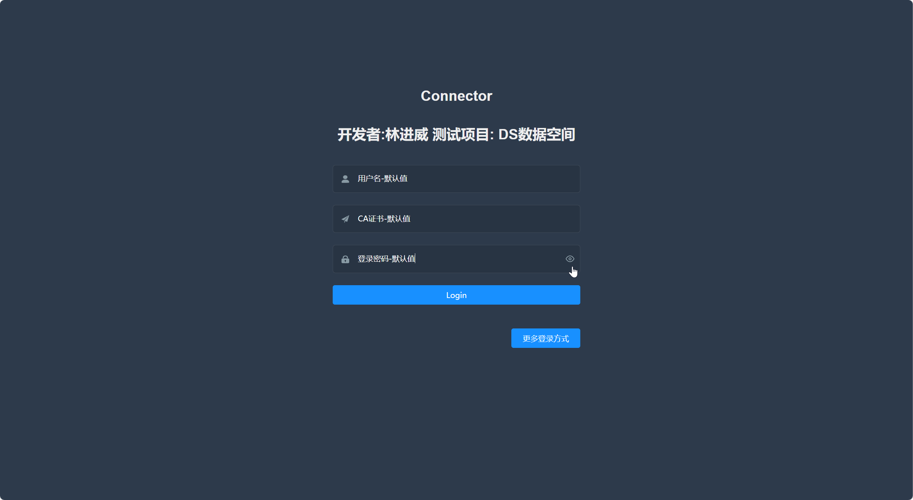

# DSW015-Element-Admin-编辑登录界面-添加CA认证

lin-jinwei

注意，未授权不得擅自以盈利方式转载本博客任何文章。

---

Code: [../code/S10-vue-element-admin-edit](../code/S10-vue-element-admin-edit/)

### 添加一个字符串输入栏

代码：src\views\login\index.vue

添加组件代码：

```html
<!-- 在此添加 -->
<el-form-item prop="cacert">
  <span class="svg-container">
    <!-- 在此修改图标 -->
    <svg-icon icon-class="guide" />
  </span>
  <!-- tabindex="1" 表示元素可以被聚焦，即光标点击响应 -->
  <el-input ref="cacert" v-model="loginForm.cacertplaceholder="CA-Certification" name="cacert" type="text"
    tabindex="1" autocomplete="on" />
</el-form-item>
```


### 设置export default的默认值
设置界面初始化时候输入框内的默认值或者提示语言：

```js
export default {
  name: 'Login',
  components: { SocialSign },
  data() {
    const validateUsername = (rule, value, callback) => {
      if (!validUsername(value)) {
        callback(new Error('Please enter the correct user name'))
      } else {
        callback()
      }
    }

    // 添加-认证CA证书-初步认证
    const validateCacert = (rule, value, callback) => {
      if (!validateCacert(value)) {
        // 在此处添加-初步认证CA证书的代码
        callback(new Error('Please enter the correct CA certification'))
      } else {
        callback()
      }
    }

    const validatePassword = (rule, value, callback) => {
      if (value.length < 6) {
        callback(new Error('The password can not be less than 6 digits'))
      } else {
        callback()
      }
    }
    return {
      loginForm: {
        username: '用户名-默认值',
        cacert: 'CA证书-默认值',
        password: '登录密码-默认值',
      },
      loginRules: {
        username: [{ required: true, trigger: 'blur', validator: validateUsername }],
        cacert: [{ required: true, trigger: 'blur', validator: validateCacert }],
        password: [{ required: true, trigger: 'blur', validator: validatePassword }]
      },
      passwordType: 'password',
      capsTooltip: false,
      loading: false,
      showDialog: false,
      redirect: undefined,
      otherQuery: {}
    }
  },
```




### 编辑认证js


代码：src\utils\validate.js

新增：
```js
export function validCacert(str) {
  const valid_map = ['ca']
  return valid_map.indexOf(str.trim()) >= 0
}
```

### 编辑登录 index.vue

代码：src\views\login\index.vue
```js
import { validUsername,  validCacert} from '@/utils/validate'
```

### 修改handleLogin()函数

```js
handleLogin() {
      this.$refs.loginForm.validate(valid => {
        if (valid) {
          this.loading = true
          // 使用store存储数据
          this.$store.dispatch('user/login', this.loginForm)
            .then(() => {
              // 正式启动后的运行代码
              this.$router.push({ path: this.redirect || '/', query: this.otherQuery })
              this.loading = false
            })
            .catch(() => {
              this.loading = false
            })
        } else {
          console.log('error submit!!')
          return false
        }
      })
    },
```

### 通过 FileReader读取本地 json数据

```js
readerData(rawFile) {
      this.loading = true
      return new Promise((resolve, reject) => {
        const reader = new FileReader()
        reader.onload = e => {
          console.log('reader.onload = e => ========================')

          // 获取读取到的文件内容+解析JSON文件
          const contents = reader.result
          console.log('contents = ' + contents)
          console.log('contents.byteLength = ' + contents.byteLength)
          const jsonData = String.fromCharCode.apply(null, new Uint8Array(contents))
          console.log('jsonData = ' + jsonData)
          console.log('typeof jsonData = ' + typeof jsonData);

          // ========================
          // 继续处理读取数据
          // ========================

          this.loading = false
          resolve()
        }
        reader.readAsArrayBuffer(rawFile)
      })
    },
```

### 父组件直接获取子组件的值-变量值

```js
// 父组件直接获取子组件的值
value = this.$refs.UploadJson.uploadForm.jsonData
```


