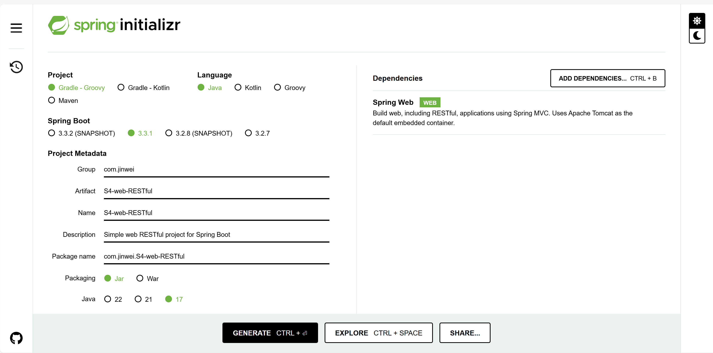
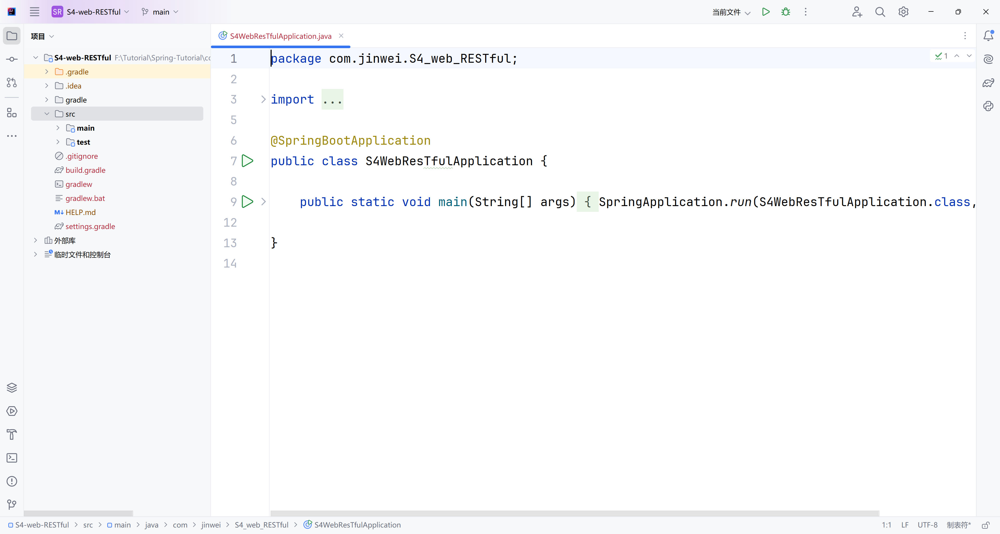
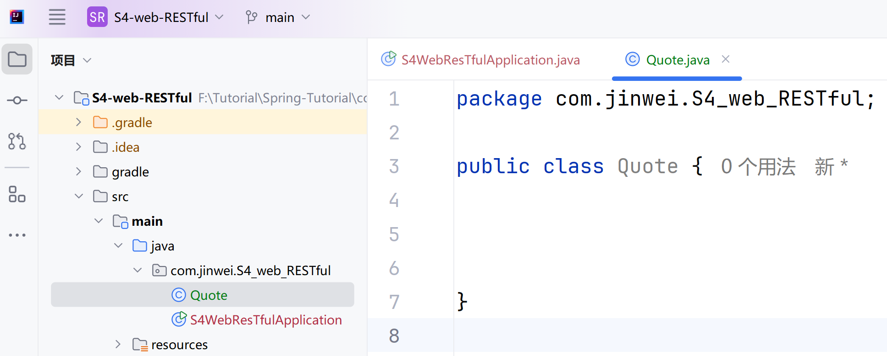

# Spring5-构建Web RESTful项目

lin-jinwei

注意，未授权不得擅自以盈利方式转载本博客任何文章。

---

Code: [../code/S4-web-RESTful](../code/S4-web-RESTful)

## 首先新建一个Spring 项目-添加Spring Web依赖



## 使用IDEA打开下载的项目



在目录下新建Java类：



代码：

```java
package com.jinwei.S4_web_RESTful;

//public class Quote {
//}

import com.fasterxml.jackson.annotation.JsonIgnoreProperties;

@JsonIgnoreProperties(ignoreUnknown = true)
public record Quote(String type, Value value) { }
```

## 补充代码


将原有自动生成代码注释，补充上述代码。

## 创建Value类

上述出现的红色警告，是因为本项目目录下没有定义对应的Valuel类，因此创建对应的Value类。


代码：

```java
package com.jinwei.S4_web_RESTful;

import com.fasterxml.jackson.annotation.JsonIgnoreProperties;

@JsonIgnoreProperties(ignoreUnknown = true)
public record Value(Long id, String quote) { }

```

## 注解：@JsonIgnoreProperties

@JsonIgnoreProperties 注解的作用是：在进行json序列化时，将 java 设计的bean中的某些属性忽略。该注解在json数据序列化或者反序列化的时候都适用。

拓展：

### 序列化与反序列化

序列化：即Serialization，是一个将对象的状态信息，转变为可以存储或传输的形式的过程，即：对象->存储序列。
反序列化：即Deserialization，顾名思义是一个将可以存储或传输的序列，转变为某个对象的**状态信息**的过程，即：存储序列->对象。

---

## 创建 RESTful Controller 控制器

为了使得整个项目满足Web RESTful项目的要求，应该对IDEA生成的默认启动类进行对应的修改。

代码：java/com/jinwei/S4_web_RESTful/ControllerTest.java

```java

package com.jinwei.S4_web_RESTful;
// 导入Spring Wen 绑定注释包
import org.springframework.web.bind.annotation.*;
// 导入ArrayList列表库
import java.util.ArrayList;
// 导入List列表库
import java.util.List;

// 注解->设置REST控制器
@RestController
// 注解->设置请求映射类
// 下面的api可以自定义，但不可以直接删除
@RequestMapping("/api")
// 控制类
public class Controller {
    // 定义静态变量 messages
    private final List<String> messages = new ArrayList<>();
  
    // 通过@GetMapping注解处理 Get请求，如果请求对应参数发生，则调用下面函数
    @GetMapping("/hello")
    public String sayHello() {
        return "Hello, Spring Boot!";
    }
  
    // 通过@GetMapping注解处理 Get请求，如果请求对应参数发生，则调用下面函数
    @GetMapping("/messages")
    public List<String> getMessages() {
        return messages;
    }
  
    // 通过@PostMapping注解处理 Post请求，如果请求对应参数发生，则调用下面函数
    @PostMapping("/messages")
    public String addMessage(@RequestBody String message) {  // 该函数用于添加message对象的内容
        messages.add(message);
        return "Message added: " + message;
    }
  
    // 通过@PutMapping注解处理 Put请求，如果请求对应参数发生，则调用下面函数
    @PutMapping("/messages/{index}")  // Put请求设置了：请求时附带变量index
    public String updateMessage(@PathVariable int index, @RequestBody String updatedMessage) {
        // 通过信息的对应索引index来获取对应的信息
        if (index < messages.size()) {  // 判断index是否对应已有信息
            messages.set(index, updatedMessage);
            return "Message updated at index " + index + ": " + updatedMessage;
        } else {
            return "Invalid index";
        }
    }
  
    // 通过@PutMapping注解处理 Delete请求，如果请求对应参数发生，则调用下面函数
    @DeleteMapping("/messages/{index}")
    public String deleteMessage(@PathVariable int index) {
        // 通过信息的对应索引index来获取对应的信息
        if (index < messages.size()) { // 判断index是否对应已有信息
            String removedMessage = messages.remove(index);
            return "Message removed at index " + index + ": " + removedMessage;
        } else {
            return "Invalid index";
        }
    }
}

```

## 创建 RESTful Controller 控制器-测试类

为了使得整个项目满足Web RESTful项目的要求，应该对IDEA生成的默认启动类进行对应的修改。

代码：java/com/jinwei/S4_web_RESTful/ControllerTest.java

```java
package com.jinwei.S4_web_RESTful;
// 导入 junit.jupiter.api.Test API测试库
import org.junit.jupiter.api.Test;
// 导入 junit.jupiter.api.Test BeforeEach 测试库
import org.junit.jupiter.api.BeforeEach;
// 导入 SpringBoot Bean 自动布线
import org.springframework.beans.factory.annotation.Autowired;
// 导入 SpringBoot 自动配置的Web服务的自动配置MockMvc
import org.springframework.boot.test.autoconfigure.web.servlet.AutoConfigureMockMvc;
// 导入 SpringBootTest测试模块
import org.springframework.boot.test.context.SpringBootTest;
// 导入 SpringBoot http数据媒体模块
import org.springframework.http.MediaType;
// 导入 SpringBoot Web服务的MockMvc配置
import org.springframework.test.web.servlet.MockMvc;
// 导入 SpringBoot Web服务的MockMvc的请求绑定
import org.springframework.test.web.servlet.request.MockMvcRequestBuilders;
// 导入 SpringBoot Web服务的MockMvc的结果匹配器
import org.springframework.test.web.servlet.result.MockMvcResultMatchers;

// 导入 Hamcrest测试匹配器对应函数
import static org.hamcrest.Matchers.hasSize;
import static org.hamcrest.Matchers.is;
//导入 SpringBoot Web服务的print，打印出测试请求的返回信息
import static org.springframework.test.web.servlet.result.MockMvcResultHandlers.print;

// 使用@SpringBootTest注解：说明是SpringBoot测试
@SpringBootTest
// 使用@AutoConfigureMockMvc注解：开始设置自动MockMvc配置
@AutoConfigureMockMvc
// 定义ControllerTest控制器测试类
public class ControllerTest {

    @Autowired  // 使用@Autowired注解定义mockMvc对象
    private MockMvc mockMvc;

    @BeforeEach  // 使用@BeforeEach注解定义开始启动的项目：开始启动处理
    public void setUp() {
        // Clear messages before each test
        // This ensures a clean state for each test
        // Alternatively, you could use a test database or mock data
        // depending on your requirements
        Controller messagesController = new Controller();  // 首先创建一个控制器对象
        messagesController.getMessages().clear();  // 清空控制器存储信息
    }

    // 下面逐个通过@Test注解定义所有需要进行的测试
    @Test
    public void testBeforeEach1() {
        System.out.println("test @Test ================> 1");
    }

    @Test
    public void testBeforeEach2() {
        System.out.println("test @Test ================> 2");
    }

    // 上述两个函数用于测试 @Test注解，下面的是正式的测试函数

    @Test
    // 测试不带参数的 Get命令-接口运行
    // MockMvc是由 org.springframework.test 包提供，实现了对Http请求的模拟，
    // 能够直接通过使用模拟网络的形式，调用Controller，测试速度快、也不依赖网络环境，
    // 同时MockMvc也提供了一套验证的工具，方便对测试结果进行验证。

    // 测试简单Get功能
    public void testSayHello() throws Exception {
        mockMvc.perform(MockMvcRequestBuilders.get("/api/hello")).andDo(print())  // 后面添加的.andDo(print())方法可以打印出测试请求的返回信息
                .andExpect(MockMvcResultMatchers.status().isOk())  // 如果返回请求状态是正常的
                .andExpect(MockMvcResultMatchers.content().string("Hello, Spring Boot!"));  // 则返回内容主体为设置的字符串

        System.out.println("------------------------------------------------->");
    }

    @Test
    // 测试Get功能
    public void testGetMessages() throws Exception {
        mockMvc.perform(MockMvcRequestBuilders.get("/api/messages")).andDo(print())
                .andExpect(MockMvcResultMatchers.status().isOk());
//                .andExpect(MockMvcResultMatchers.jsonPath("$.length()").value(0));
        System.out.println("------------------------------------------------->");
    }

    @Test
    // 测试添加功能
    public void testAddMessage() throws Exception {
        mockMvc.perform(MockMvcRequestBuilders.post("/api/messages")
                        .contentType(MediaType.APPLICATION_JSON)
                        .content("\"Test Message\"")).andDo(print())
                        .andExpect(MockMvcResultMatchers.status().isOk());
        System.out.println("------------------------------------------------->");
    }

    @Test
    // 测试更新功能
    public void testUpdateMessage() throws Exception {
        mockMvc.perform(MockMvcRequestBuilders.post("/api/messages")
                .contentType(MediaType.APPLICATION_JSON)
                .content("\"Initial Message\"")).andDo(print());

        mockMvc.perform(MockMvcRequestBuilders.put("/api/messages/0")
                        .contentType(MediaType.APPLICATION_JSON)
                        .content("\"Updated Message\"")).andDo(print()).andDo(print())
                .andExpect(MockMvcResultMatchers.status().isOk());
    }

    @Test
    // 测试删除功能
    public void testDeleteMessage() throws Exception {
        mockMvc.perform(MockMvcRequestBuilders.post("/api/messages")
                .contentType(MediaType.APPLICATION_JSON)
                .content("\"Message to Delete\"")).andDo(print());

        mockMvc.perform(MockMvcRequestBuilders.delete("/api/messages/0")).andDo(print())
                .andExpect(MockMvcResultMatchers.status().isOk());
    }
}
```

## 主文件

代码：java/com/jinwei/S4_web_RESTful/S4WebResTfulApplication.java

自动生成

```java
package com.jinwei.S4_web_RESTful;

import org.springframework.boot.SpringApplication;
import org.springframework.boot.autoconfigure.SpringBootApplication;


@SpringBootApplication
public class S4WebResTfulApplication {

	public static void main(String[] args) {
		SpringApplication.run(S4WebResTfulApplication.class, args);
	}


}

```

## 主文件测试文件

代码：java/com/jinwei/S4_web_RESTful/S4WebResTfulApplicationTests.java

自动生成

```java
package com.jinwei.S4_web_RESTful;

import org.junit.jupiter.api.Test;
import org.springframework.boot.test.context.SpringBootTest;

@SpringBootTest
class S4WebResTfulApplicationTests {

	@Test
	void contextLoads() {
	}

}

```
