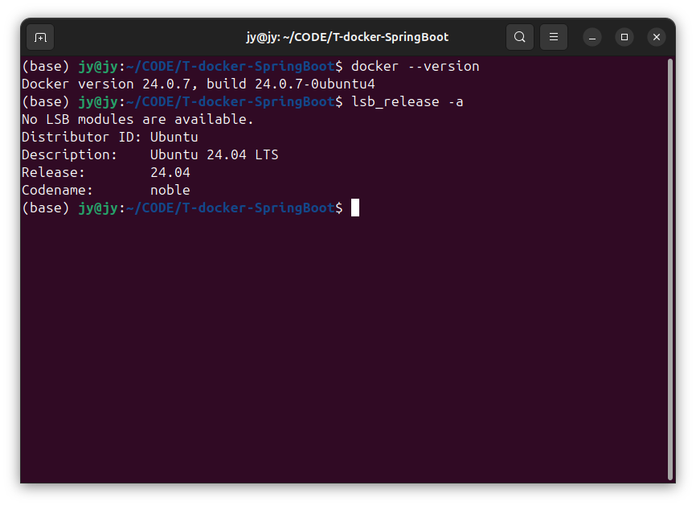
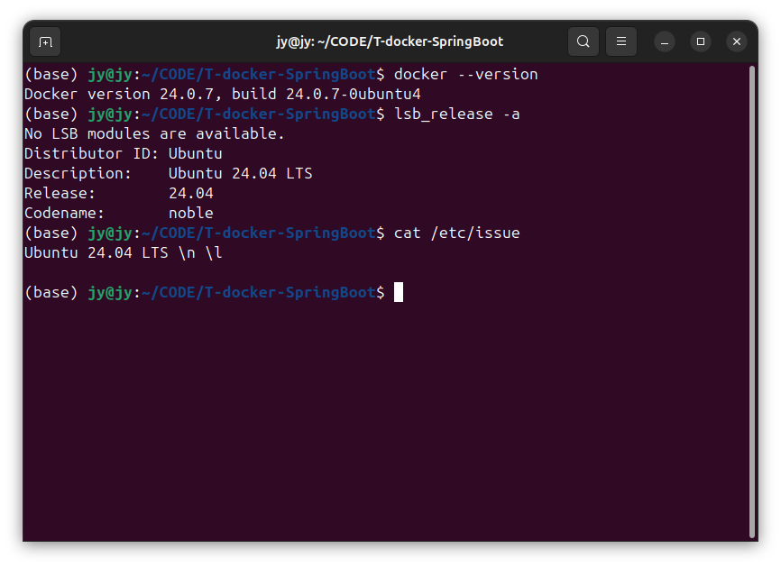
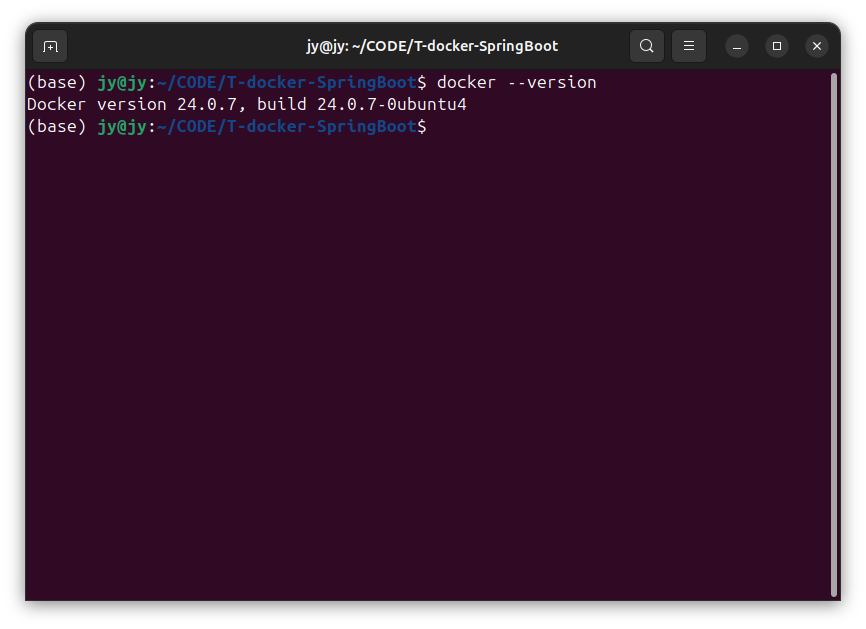

# SpringLinux001-Ubuntu与Docker

lin-jinwei

注意，未授权不得擅自以盈利方式转载本博客任何文章。

---

Code: [../code/S4-web-RESTful](../code/)


如果还没有安装Docker需要先安装Docker的

## Ubuntu安装Docker步骤
### 1. 更新软件源
```shell
sudo apt update
```

## 2. 查看Ubuntu系统版本
Ubuntu安装Docker需要64-bit的系统：20-24

使用命令：
```shell
sudo apt update
```


或者使用命令：
```shell
cat /etc/issue
```




## 检查Docker的版本

```shell
docker --version
```




