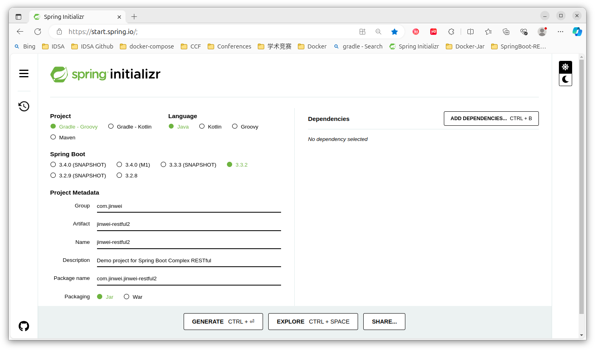
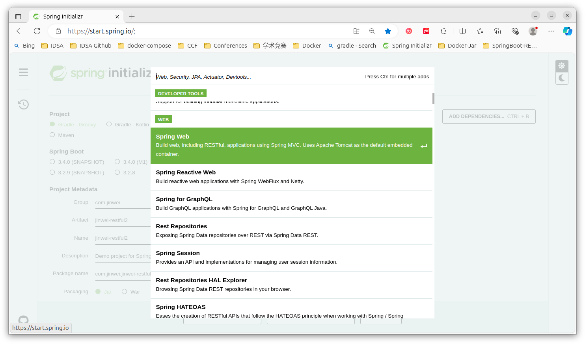
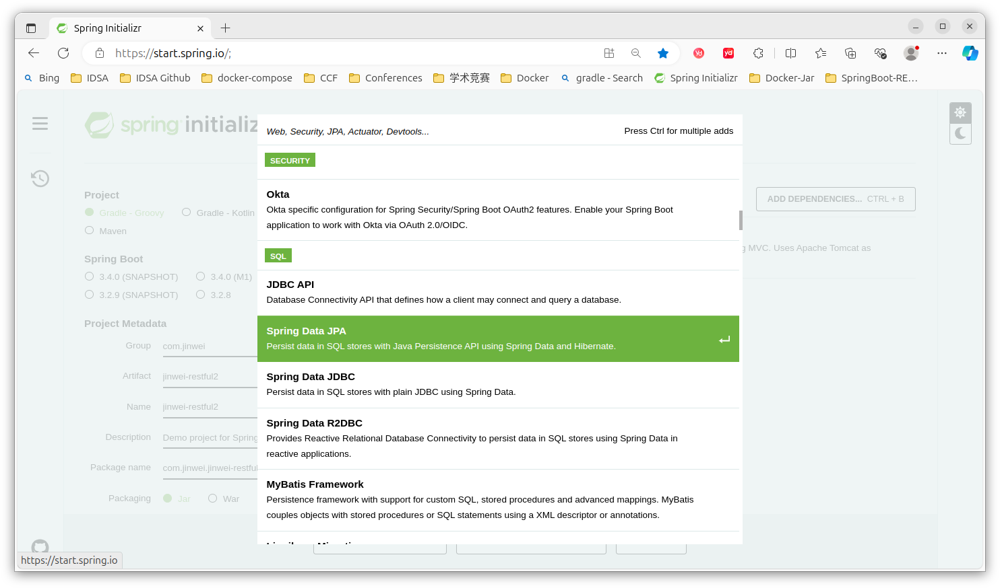
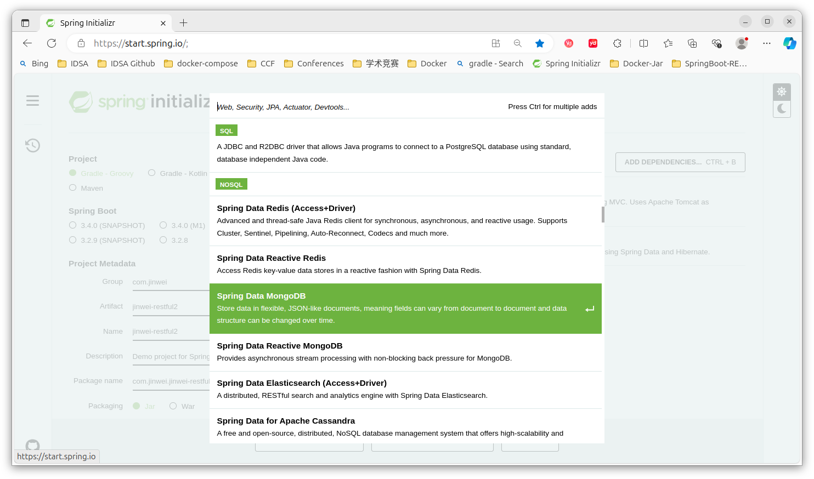
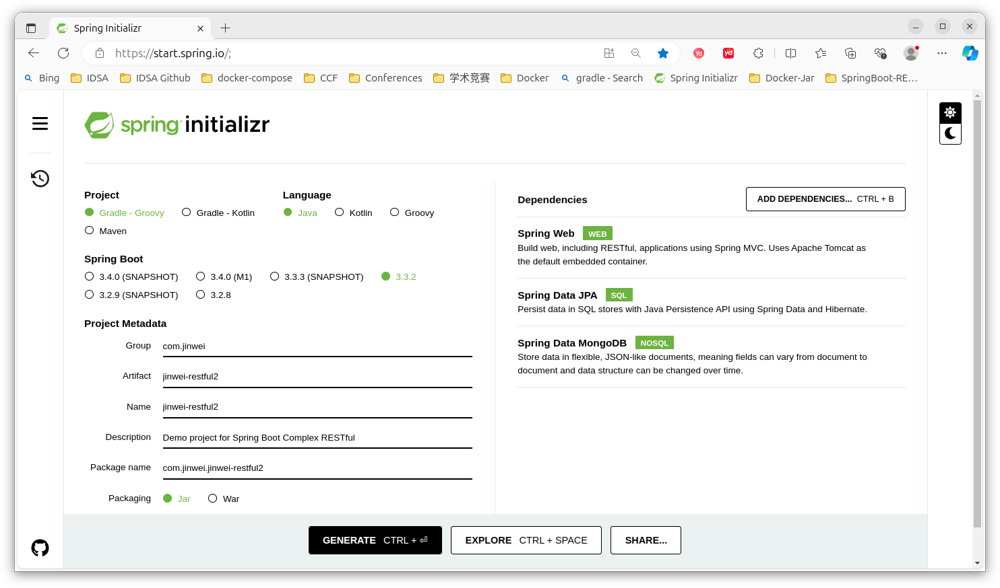
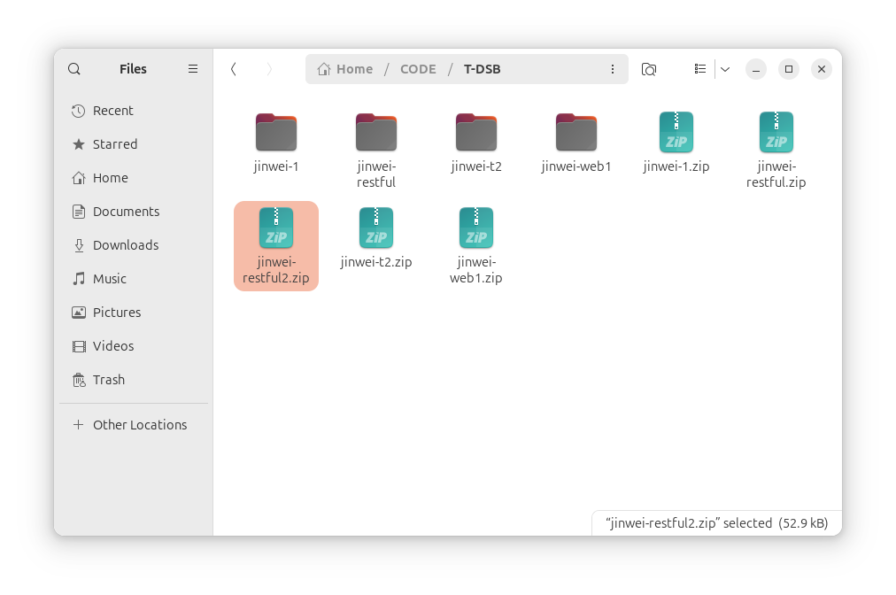
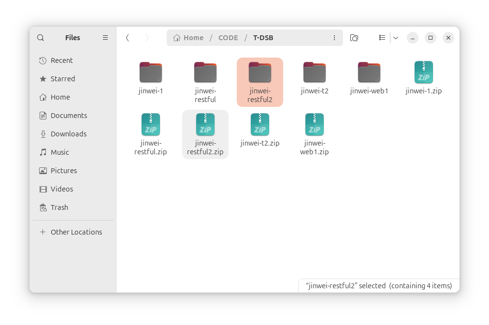
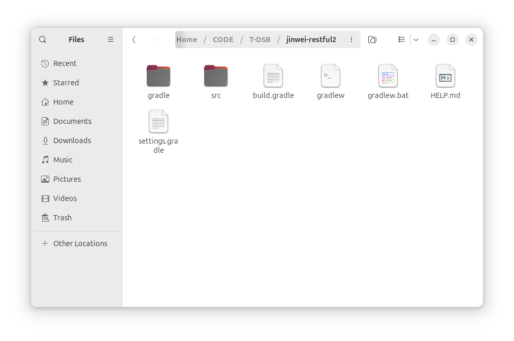
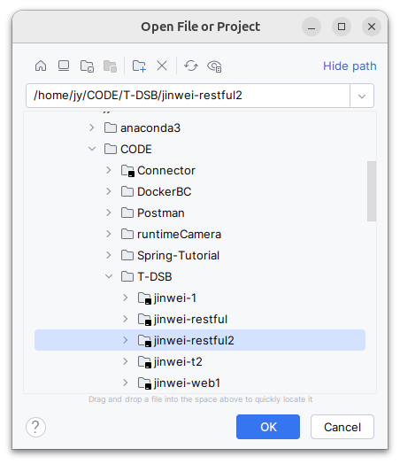
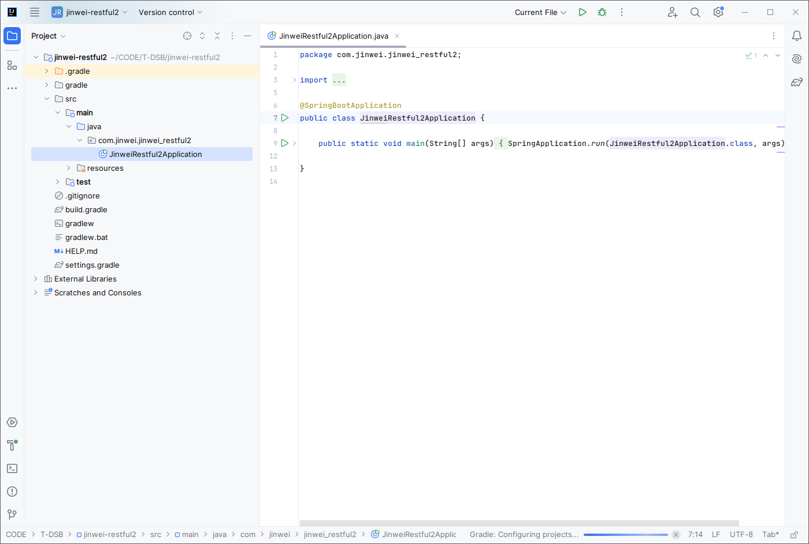

# DSB0012-IDEA-SpringBoot-Web-完整版-RESTful项目构建 
lin-jinwei, FaQianApp

注意，未授权不得擅自以盈利方式转载本博客任何文章。

---

Code: [../code](../code)

## Spring Initializr 构建项目

### 基本信息



### 引入Web依赖



### 引入SpringBoot JPA依赖



1. JPA是一种Java编程中实现数据持久化的常用方法与规范；
2. SpringBoot JPA 是对JPA的简便化优化组件方法与规范；
3. 也就是说，一般都使用SpringBoot JPA来实现 SpringBoot项目的数据库管理。


### 引入SpringBoot MengoDB依赖


### 点击构建并下载



## 将下载的项目包复制到工作目录，并解压



解压：

```bash
unzip jinwei-restful2.zip
```





## 使用IDEA打开



### 设置JDK，Gradle将自动导入相关包：




## 查看 ./build.gradle 文件

```gradle
plugins {
	id 'java'
	id 'org.springframework.boot' version '3.3.2'
	id 'io.spring.dependency-management' version '1.1.6'
}

group = 'com.jinwei'
version = '0.0.1-SNAPSHOT'

java {
	toolchain {
		languageVersion = JavaLanguageVersion.of(17)
	}
}

repositories {
	mavenCentral()
}

dependencies {
	implementation 'org.springframework.boot:spring-boot-starter-data-jpa'
	implementation 'org.springframework.boot:spring-boot-starter-data-mongodb'
	implementation 'org.springframework.boot:spring-boot-starter-web'
	testImplementation 'org.springframework.boot:spring-boot-starter-test'
	testRuntimeOnly 'org.junit.platform:junit-platform-launcher'
}

tasks.named('test') {
	useJUnitPlatform()
}
```

## 编辑代码

### 


