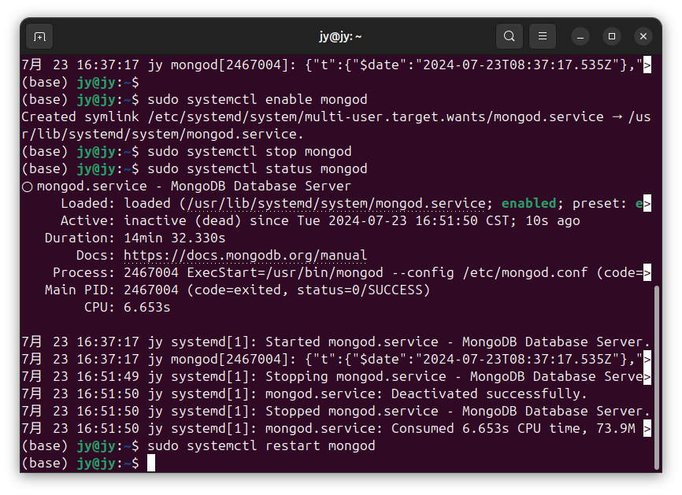

# DSB0013-IDEA-SpringBoot-Web-MongoDB的基本使用-Ubuntu
lin-jinwei, FaQianApp

注意，未授权不得擅自以盈利方式转载本博客任何文章。

---

Code: [../code](../code)


## 查看 mongodb的版本

```bash
mongod --version
```


返回：mongodb格式：

```bash
(base) jy@jy:~$ mongod --version
db version v7.0.12
Build Info: {
    "version": "7.0.12",
    "gitVersion": "b6513ce0781db6818e24619e8a461eae90bc94fc",
    "openSSLVersion": "OpenSSL 3.0.13 30 Jan 2024",
    "modules": [],
    "allocator": "tcmalloc",
    "environment": {
        "distmod": "ubuntu2204",
        "distarch": "x86_64",
        "target_arch": "x86_64"
    }
}
```

## 启动 mongodb

```bash
sudo systemctl start mongod
```


## 重启守护进程 daemon

```bash
sudo systemctl daemon-reload
```


## 检查 mongodb的运行状态

```bash
sudo systemctl status mongod
```


信息：

```bash
(base) jy@jy:~$ sudo systemctl status mongod
● mongod.service - MongoDB Database Server
     Loaded: loaded (/usr/lib/systemd/system/mongod.service; disabled; preset: >
     Active: active (running) since Tue 2024-07-23 16:37:17 CST; 2min 50s ago
       Docs: https://docs.mongodb.org/manual
   Main PID: 2467004 (mongod)
     Memory: 72.6M (peak: 73.1M)
        CPU: 1.673s
     CGroup: /system.slice/mongod.service
             └─2467004 /usr/bin/mongod --config /etc/mongod.conf

7月 23 16:37:17 jy systemd[1]: Started mongod.service - MongoDB Database Server.
7月 23 16:37:17 jy mongod[2467004]: {"t":{"$date":"2024-07-23T08:37:17.535Z"},">
lines 1-12/12 (END)
```
说明 mongodb已经在运行。

按 Q键退上述窗口。


## 设置 mongodb 开机启动

```bash
sudo systemctl enable mongod
```


## 停止 mongodb

```bash
sudo systemctl stop mongod
```


## 重启 mongodb

```bash
sudo systemctl restart mongod
```



## 进入 mongdb会话控制

```bash
mongosh
```


