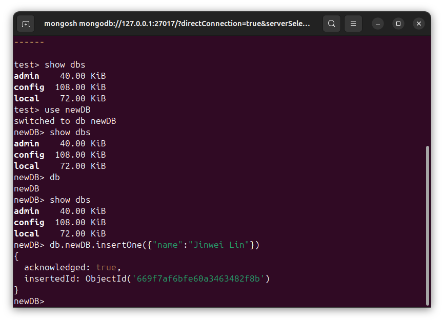
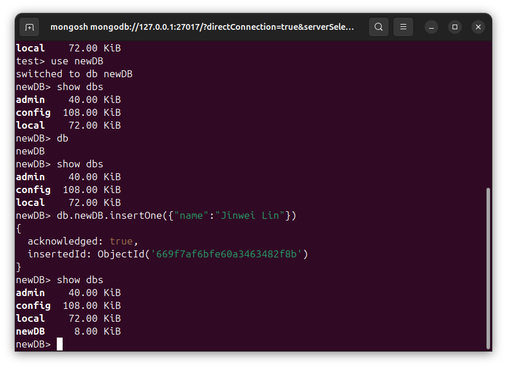

# DSB0014-MongoDB的数据库的增删改查-Ubuntu
lin-jinwei, FaQianApp

注意，未授权不得擅自以盈利方式转载本博客任何文章。

---

Code: [../code](../code)

## mongodbsh

一般安装完成 mongodb后都有 mongodbsh附带安装完成，如果没有可以通过下面命令下载安装：

```bash
sudo apt update
```

```bash
sudo apt install mongodb-shell
```
## 进入 mongodbsh

直接输入：
```bash
mongodbsh
```
即可随时进入。


## 显示所有创建的非空数据库 show dbs

```bash
show dbs
```


## 显示所有数据库 db

```bash
db
```


## 使用或创建数据库 use

```bash
use {数据库名称}
```

如果数据库存在则使用，不存在则先创建后使用。


创建后的数据库为空的，使用 show dbs命令显示不出来：


## 往数据库添加数据

格式：
```mongodb
db.{新建数据库名}.insertOne(json格式数据)
```

实测命令：
```mongodb
db.newDB.insertOne({"name":"Jinwei Lin"})
```



继续使用展示命令，发现新建数据库已经被收录：

```bash
show dbs
```


## 删除数据库

步骤：
1. 进入该数据库；
2. 运行删除命令：
```bash
db.dropDatabase()
```


删除后重新进入 mongodb可以发现被删除数据库已经不存在：


---


