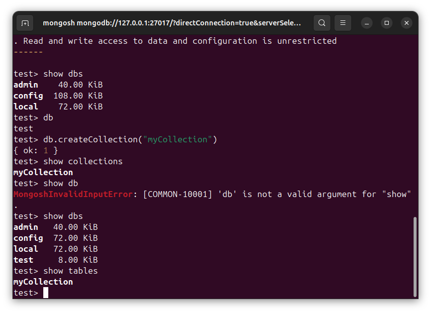

# DSB0015-MongoDB的数据-集合-Ubuntu
lin-jinwei, FaQianApp

注意，未授权不得擅自以盈利方式转载本博客任何文章。

---

Code: [../code](../code)

## Monogodb 的文档

Mongodb中，文档是最基础的数据存储形式，类似于关系型数据库中的表中的行。

## Mongodb 的集合

1. Mongodb中，并没有关系型数据库中的表的概念，跟表最接近的概念就是集合。一个集合是多个文档的容器，也即一个集合将多个文档收集在一起。

2. 不同的是，关系型数据库中的一个表中虽然有很多行，但是同一个表中的各个行的格式都是一样的。而非关系型数据库 MongoDB中，一个集合中可以有多种数据格式不同的文档。这也是Mongodb非关系型的最直接体现之一。

3. MongoDB中，要使用和编辑文档，一般先要有集合，用来装文档，后才创建或者插入文档。也即先建集合后建文档。

4. MongoDB中，如果不想创建集合而直接创建文档也是支持的，mongdb会直接为创建的文档自动创建一个集合。

## 创建集合

数据格式：

```mongodb
db.createCollection("{集合对象名称}", {集合数据格式});
```
其中，在创建集合的时候，集合数据格式可以省略。以便快速创建。

完整数据格式：

```mongodb
db.createCollection("{集合对象名称}", {
  capped: {true or false},
  size: {集合的最大容量，以字节为单位},
  max: {集合的最大文档数，用整数表达},
  validator: { $jsonSchema: {
    bsonType: {文档对象名称},
    required: {[文档对象的字段集合]},
    properties: {
      {文档对象的字段1}: {
        bsonType: {文档对象的字段1的数据类型},
        description: {文档对象的字段1的内容描述}
      },
      {文档对象的字段2}: {
        bsonType: {文档对象的字段1的数据类型},
        description: {文档对象的字段1的内容描述}
        pattern: {可选：正则表达式匹配内容},
      }，....
    }
  }},
  validationLevel: {文档验证的严格程度：off/strict(默认)/moderate},
  validationAction: {文档验证失败时执行的操作：error/warn},
  storageEngine: {
    {为本集合设置存储引擎配置细节}
  },
  collation: {为集合设置默认的排序顺序}
});
```

举例：
```mongodb
db.createCollection("myCollection", {
  capped: true,
  size: 10240000,
  max: 500000,
  validator: { $jsonSchema: {
    bsonType: "connector",
    required: ["id", "cert"],
    properties: {
      id: {
        bsonType: "string",
        description: "connector的id令牌"
      },
      cert: {
        bsonType: "string",
        description: "connector的id令牌"
      }
    }
  }},
  validationLevel: "strict",
  validationAction: "error",
  storageEngine: {
    wiredTiger: { configString: "block_compressor=zstd" }
  },
  collation: { locale: "en", strength: 2 }
});
```

## 创建集合实例

一般直接使用集合名创建即可。

举例：
```mongodb
db.createCollection("myCollection")
```


## 展示 mongodb的所有集合

```mongodb
show collections
```


也可以使用下面命令：

```mongodb
show tables
```



### 


