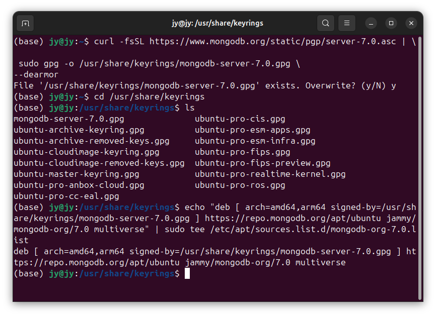

# DSB0012-IDEA-SpringBoot-Web-完整版-RESTful项目构建 
lin-jinwei, FaQianApp

注意，未授权不得擅自以盈利方式转载本博客任何文章。

---

Code: [../code](../code)

## MongoDB 社区版官网

https://www.mongodb.com/products/self-managed/community-edition


## 下拉选择下载


## 将下载的安装包复制到自己设置的Mongodb工作目录


## 首先按照包转换工具 alien

```bash
sudo apt install alien
```
## 使用 alien 转化 rpm包
```bash
sudo alien mongodb-org-server-7.0.12-1.amzn2.x86_64.rpm
```


## 安装 deb
```bash
sudo dpkg -i mongodb-org-server_7.0.12-2_amd64.deb
```


---

## 命令行安装

参考：https://www.mongodb.com/zh-cn/docs/manual/tutorial/install-mongodb-on-ubuntu/

### 首先检查是都安装了mongodb
Ubuntu默认安装的Mongodb与官方版本不一样，如果已经安装，可以要删除原有的重新安装。也可以保留。


### 安装 nupg 和 curl
命令：
```bash
sudo apt-get install gnupg curl
```


### 按需要导入Mongodb的公共GPG密钥
这一步骤可选。

命令：
```bash
curl -fsSL https://www.mongodb.org/static/pgp/server-7.0.asc | \
sudo gpg -o /usr/share/keyrings/mongodb-server-7.0.gpg --dearmor
```


### 下载安装依赖项
命令：
```bash
sudo apt-get install curl apt-transport-https software-properties-common gnupg2 -y
```


#### 安装 libssl软件包
命令：
```bash
wget http://archive.ubuntu.com/ubuntu/pool/main/o/openssl/libssl1.1_1.1.1f-1ubuntu2_amd64.deb
dpkg -i libssl1.1_1.1.1f-1ubuntu2_amd64.deb
```

### 创建列表文件

命令：
```bash
echo "deb [ arch=amd64,arm64 signed-by=/usr/share/keyrings/mongodb-server-7.0.gpg ] https://repo.mongodb.org/apt/ubuntu jammy/mongodb-org/7.0 multiverse" | sudo tee /etc/apt/sources.list.d/mongodb-org-7.0.list
```


### 更新本地软件包

命令：
```bash
sudo apt-get update
```


### 命令按照最新版的稳定版本 Mongodb

命令：
```bash
sudo apt-get install -y mongodb-org
```

---

## Ubuntu 24.04 安装 MongoDB


### 安装 gnupg和curl

```bash
sudo apt-get install gnupg curl
```


### 安装 MongoDB GPG key 

```bash
curl -fsSL https://www.mongodb.org/static/pgp/server-7.0.asc | \
 sudo gpg -o /usr/share/keyrings/mongodb-server-7.0.gpg \
--dearmor
```


### 查看 MongoDB GPG key 是否安装成功

```bash
cd /usr/share/keyrings
```

```bash
ls
```


### 创建安装源

```bash
echo "deb [ arch=amd64,arm64 signed-by=/usr/share/keyrings/mongodb-server-7.0.gpg ] https://repo.mongodb.org/apt/ubuntu jammy/mongodb-org/7.0 multiverse" | sudo tee /etc/apt/sources.list.d/mongodb-org-7.0.list
```


### 更新当前安装源：

```bash
sudo apt update 
```

### 安装 mongoDB

```bash
sudo apt install -y mongodb-org
```


### 安装完成


