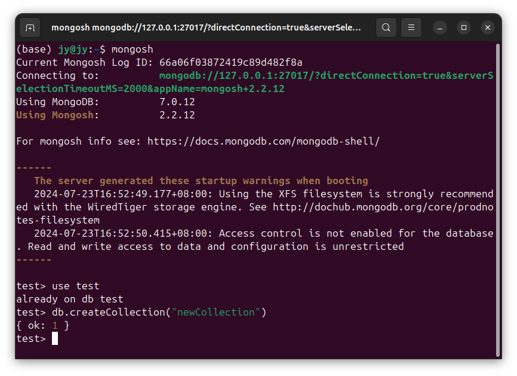
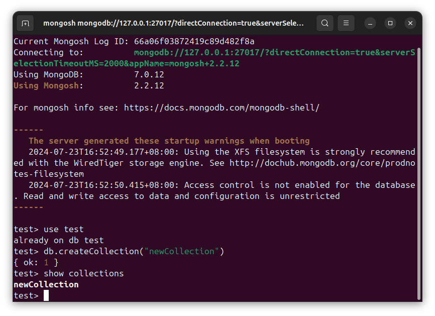

# DSB0016-MongoDB的数据-集合-增-增加新集合-Ubuntu
lin-jinwei, FaQianApp

注意，未授权不得擅自以盈利方式转载本博客任何文章。

---

Code: [../code](../code)

### 首先进入集合所在的数据库

进入数据库交互：

格式：
```mongodb
mongosh
```


格式：
```mongodb
use {数据库名称}
```

举例：
```mongodb
use test
```


## 增加集合

先查看现有集合：



添加新集合：

格式：
```mongodb
db.createCollection("{新增集合名称}")
```

举例：
```mongodb
db.createCollection("newCollection")
```


再次查看现有集合：

```mongodb
show collections
```



新增-创建新集合成功！
