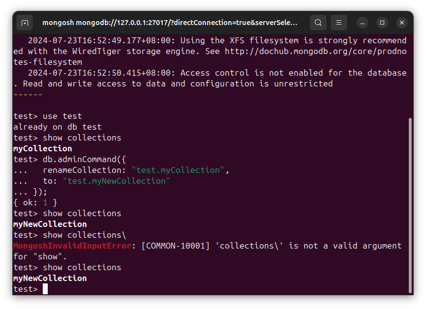
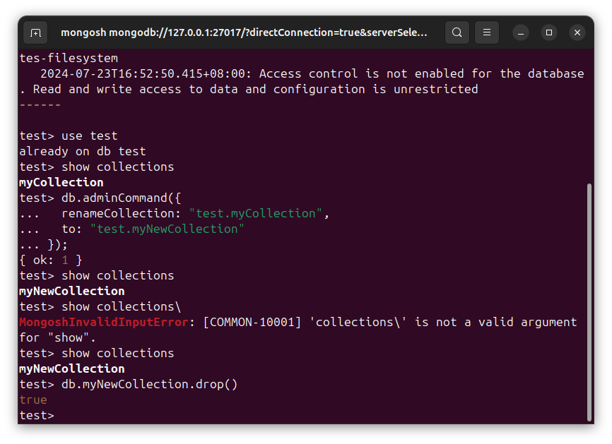
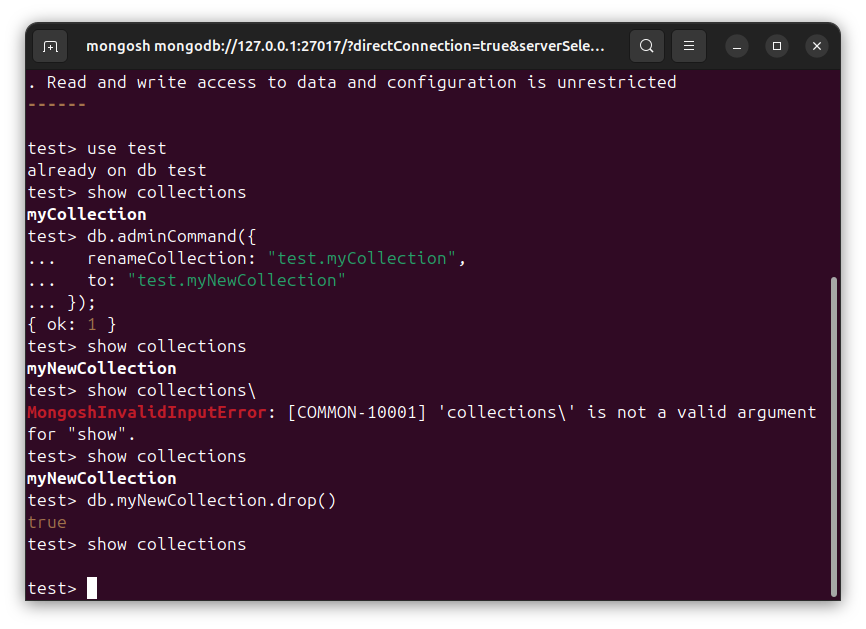

# DSB0017-MongoDB的数据-集合-删-删除集合-Ubuntu
lin-jinwei, FaQianApp

注意，未授权不得擅自以盈利方式转载本博客任何文章。

---

Code: [../code](../code)

## 删除集合操作不可逆

删除集合需要注意备份。

## 查看已有集合

```mongodb
show collections
```


## 删除集合

格式：
```mongodb
db.{集合名称}.drop()
```

举例：
```mongodb
db.myNewCollection.drop()
```



删除后再展示所有集合：



删除集合成功！


