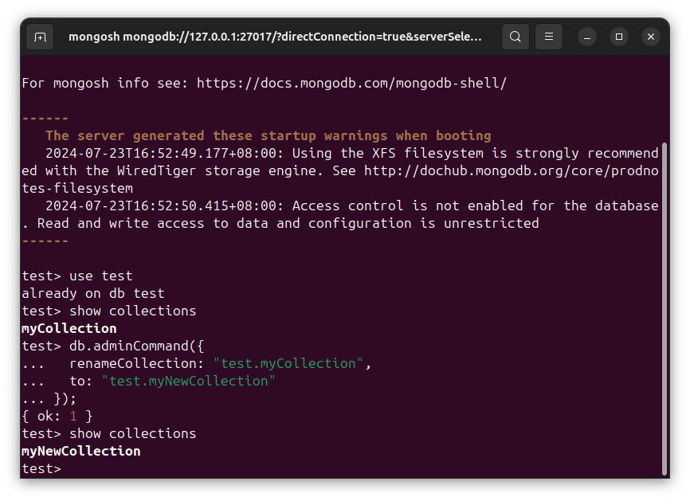

# DSB0018-MongoDB的数据-集合-改-更新集合-Ubuntu
lin-jinwei, FaQianApp

注意，未授权不得擅自以盈利方式转载本博客任何文章。

---

Code: [../code](../code)

### 首先进入集合所在的数据库

进入数据库交互：

格式：
```mongodb
mongosh
```


格式：
```mongodb
use {数据库名称}
```

举例：
```mongodb
use test
```


## 更改集合名称

格式：
```mongodb
db.adminCommand({ 
  renameCollection: "{数据库名}.{旧的集合名}", 
  to: "{数据库名}.{新的集合名}" 
});
```

举例：
```mongodb
db.adminCommand({ 
  renameCollection: "test.myCollection", 
  to: "test.myNewCollection" 
});
```


更改集合名称成功！

再次展示现有集合：

```mongodb
show tables
```
or

```mongodb
show collections
```


