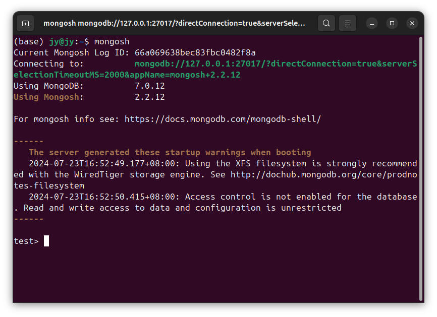

# DSB0019-MongoDB的数据-集合-查-查询集合-Ubuntu
lin-jinwei, FaQianApp

注意，未授权不得擅自以盈利方式转载本博客任何文章。

---

Code: [../code](../code)

### 首先进入集合所在的数据库

进入数据库交互：

格式：
```mongodb
mongosh
```



格式：
```mongodb
use {数据库名称}
```

举例：
```mongodb
use test
```


## 查询集合

### 查询所有集合

格式：
```mongodb
show collections
```

Or:

格式：
```mongodb
show tables
```


## 查询某个集合是否存在

格式：
```mongodb
db.collection.find()
```

具体格式：
```mongodb
db.collection.find( <query>, <projection>, <options> )
```

find() 方法接受以下参数 参数:

Parameter 参数

query 查询: document 文档类型：
Optional. Specifies selection filter using query operators. To return all documents in a collection, omit this parameter or pass an empty document ({}).
可选的。使用查询指定选择筛选器 操作符。归还所有 集合中的文档，省略此参数或传递参数 空文档( {} )。

projection 投影
document 文档
Optional. Specifies the fields to return in the documents that match the query filter. To return all fields in the matching documents, omit this parameter. For details, see Projection.
可选的。属性匹配的文档中要返回的字段 查询过滤器。若要返回匹配文档中的所有字段，请省略该字段 参数。具体请参见投影。

options 选项
document 文档
Optional. Specifies additional options for the query. These options modify query behavior and how results are returned. For details, see Options.
可选的。指定查询的其他选项。这些选项 修改查询行为和返回结果的方式。的细节, 看到选项。

## 高级用法

具体的方法和描述


方法名	描述
```mongodb
db.collection.aggregate()           集合聚合，主要用于处理数据(诸如统计平均值,求和等)，并返回计算后的数据结果
db.collection.bulkWrite()           将数据按批量写入集合
db.collection.createIndex()         创建一个集合的索引
db.collection.count()               返回集合总数，或者返回匹配查询的结果集总数
db.collection.deleteOne()           删除集合中的选定的一个文档
db.collection.deleteMany()          删除集合中的选定的多个文档
db.collection.dataSize()            返回集合的数据大小
db.collection.distinct()            搜索并返回具有指定字段不同值的文档（同时去除指定字段的重复数据）
db.collection.dropIndex()           删除集合中的指定的索引
db.collection.dropIndexes()         删除集合中的所有索引
db.collection.drop()                删除当前数据库中的collectio指定集合
db.collection.explain()	            查询并返回各种方法的查询执行信息
db.collection.findOne()	            查询集合的单条数据
db.collection.findOneAndUpdate()    查询集合的单条数据并更新
db.collection.findOneAndDelete()    查询集合的单条数据并删除
db.collection.findOneAndReplace()   查询集合的单条数据并替换
db.collection.find()                查询集合对应参数并返回。无参数则查询所有，并返回一个游标对象
db.collection.findAndModify()       查询集合并执行对应修改
db.collection.getIndexes()          返回当前集合对应的所有索引数组
db.collection.group()               实现简单的数据聚合
db.collection.isCapped()            判断集合是否为定容量集合
db.collection.insert()              在当前集合插入一条或多条文档数据
db.collection.insertMany()          在当前集合插入多条文档数据
db.collection.insertOne()           在当前集合插入一条文档数据
db.collection.reIndex()             重建当前集合对应的所有索引
db.collection.renameCollection()    重新命名当前集合的名称
db.collection.replaceOne()          替换集合中的一个文档数据
db.collection.remove()              从当前集合删除特定的数据
db.collection.save()                保存当前集合已插入数据并更新
db.collection.stats()               返回当前集合的状态信息
db.collection.storageSize()         返回当前集合已使用的空间大小
db.collection.totalSize()           返回当前集合的总共所占用空间，包括所有文件和所有索引占的空间
db.collection.totalIndexSize()      返回当前集合所有的索引所占空间大小
db.collection.updateMany()          修改集合中的多条文档数据
db.collection.update()              修改集合中的文档数据
db.collection.updateOne()           修改集合中的一条文档数据
db.collection.validate()            执行对当前集合验证操作
```
