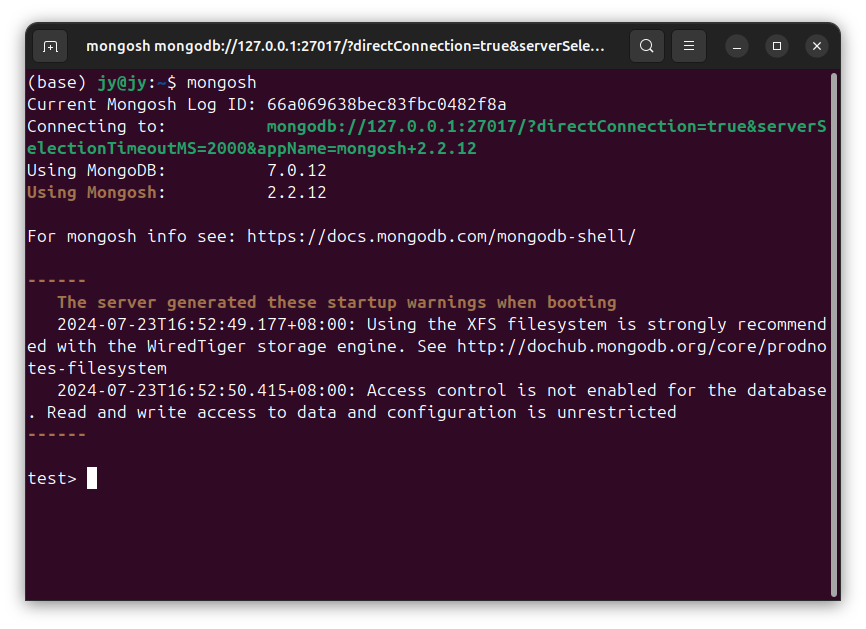
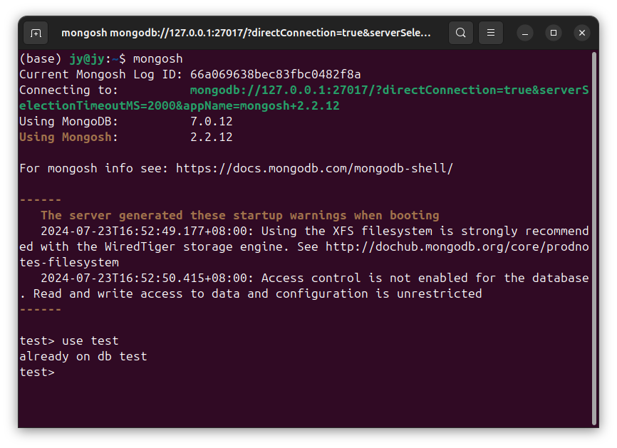
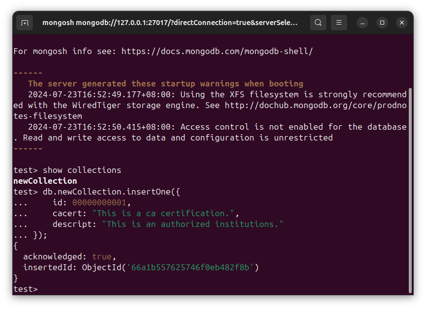
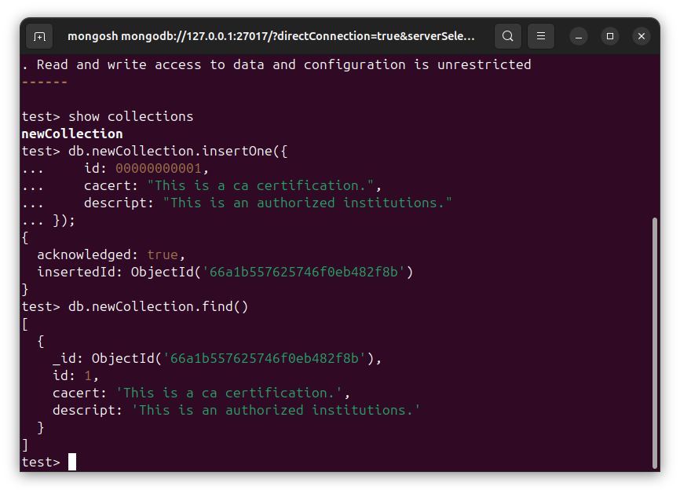
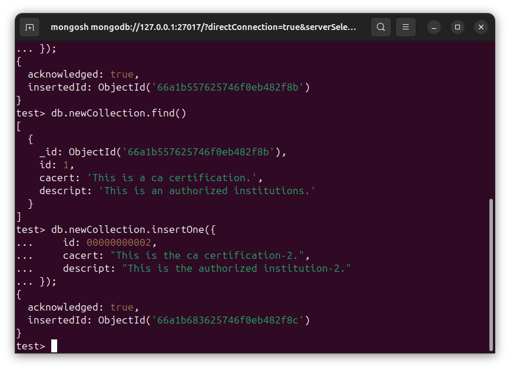
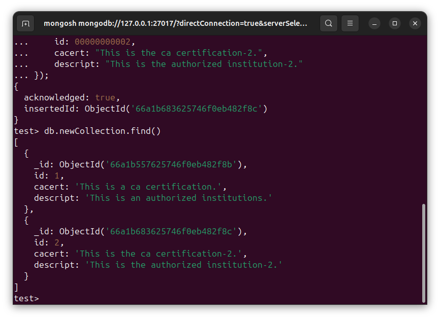
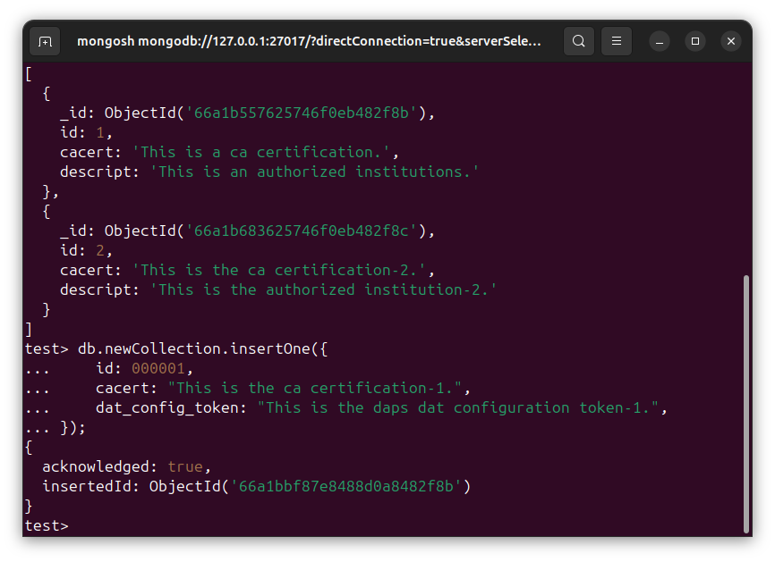
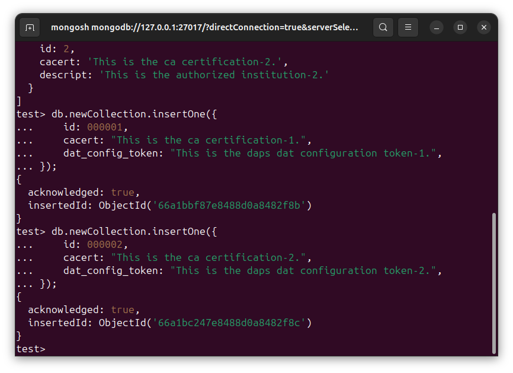
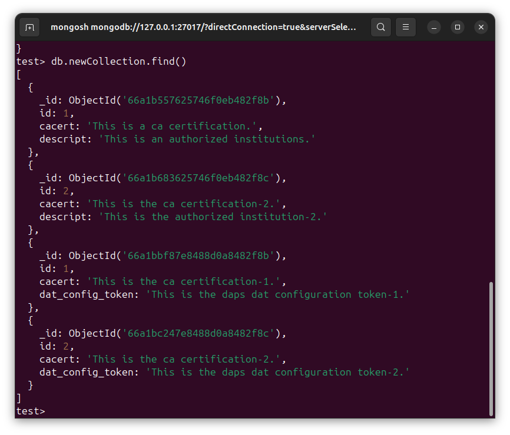

# DSB0020-MongoDB的数据-文档-增-增加新文档-Ubuntu
lin-jinwei, FaQianApp

注意，未授权不得擅自以盈利方式转载本博客任何文章。

---

Code: [../code](../code)

### 首先进入集合所在的数据库

进入数据库交互：

格式：
```mongodb
mongosh
```



格式：
```mongodb
use {数据库名称}
```

举例：
```mongodb
use test
```



## 增加文档

### 增加单个文档

格式：
```mongodb
db.{集合名称}.insertOne({json格式的文档});
```

举例：
```mongodb
db.newCollection.insertOne({
    id: 00000000001,
    cacert: "This is a ca certification.",
    descript: "This is an authorized institutions."
});
```



新增-创建新文档成功！

#### 查询文档

命令：
```mongogdb
db.newCollection.find()
```
该命令返回集合 newCollection中的所有文档：



#### 继续增加单个文档


输入：
```mongodb
db.newCollection.insertOne({
    id: 00000000002,
    cacert: "This is the ca certification-2.",
    descript: "This is the authorized institution-2."
});
```

增加单个文档成功：



#### 查询文档

输入：
```mongogdb
db.newCollection.find()
```

该命令返回集合 newCollection中的所有文档：




#### 继续增加单个文档


输入：
```mongodb
db.newCollection.insertOne({
    id: 000001,
    cacert: "This is the ca certification-1.",
    dat_config_token: "This is the daps dat configuration token-1.",
});
```



输入：
```mongodb
db.newCollection.insertOne({
    id: 000002,
    cacert: "This is the ca certification-2.",
    dat_config_token: "This is the daps dat configuration token-2.",
});
```



#### 查询文档

输入：
```mongogdb
db.newCollection.find()
```

该命令返回集合 newCollection中的所有文档：



可见，id字段-数字前面的0-自动忽略。
