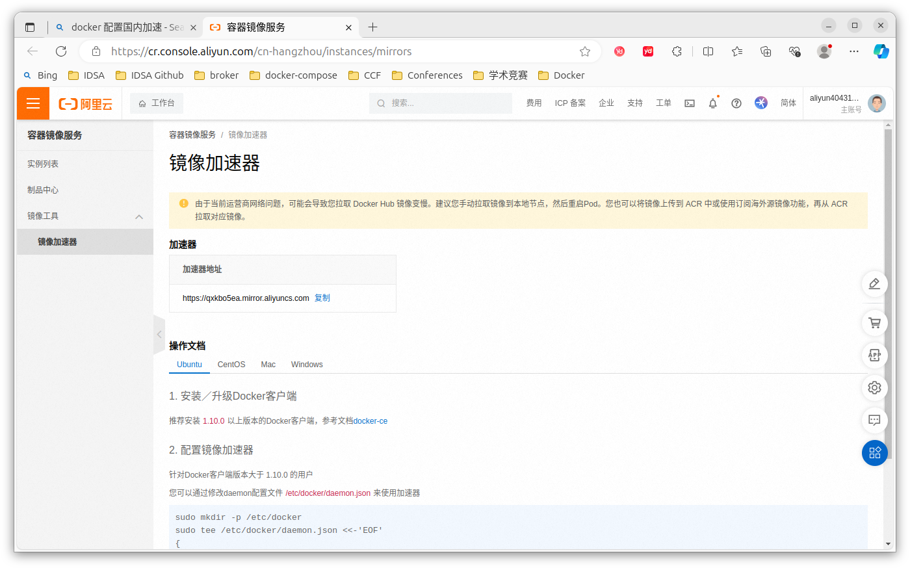
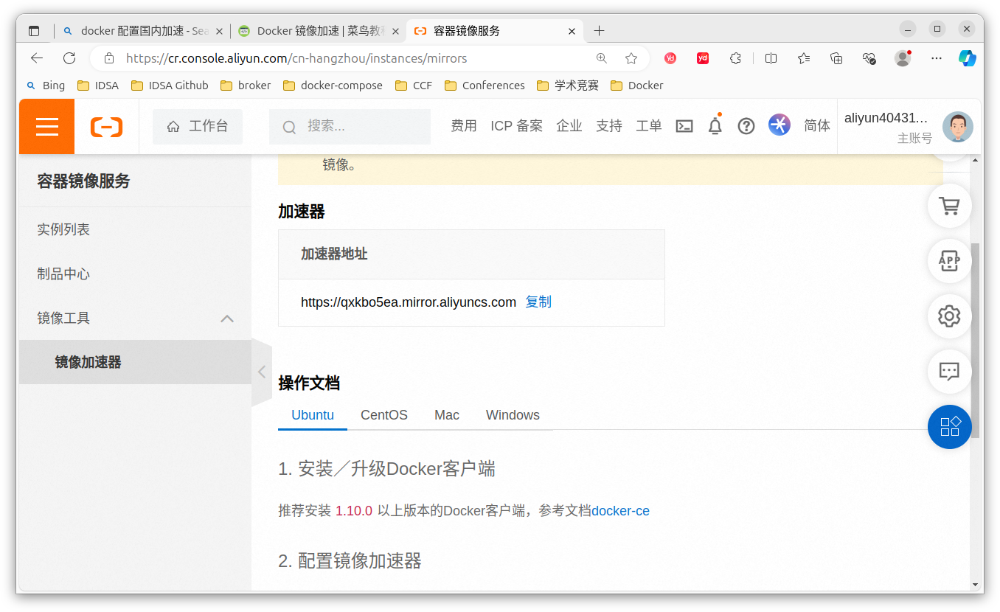
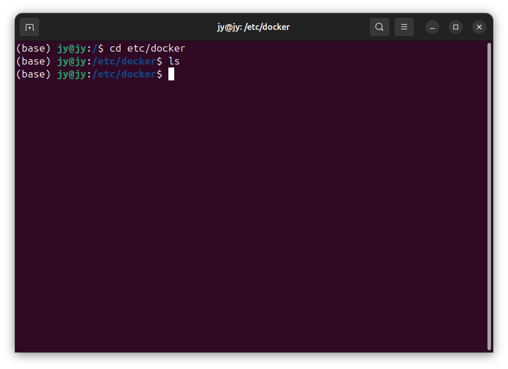
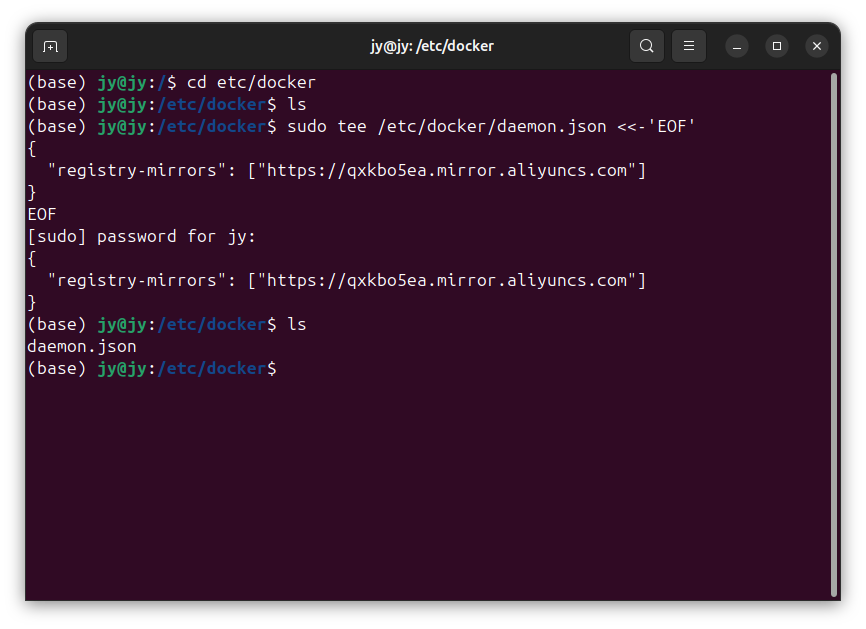
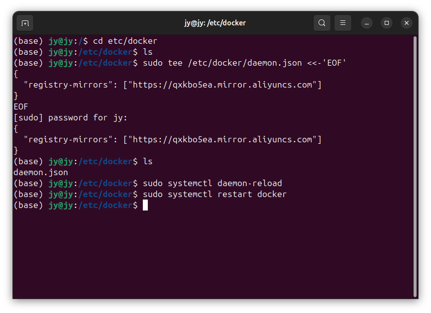

# Docker003-Docker配置镜像源与加速

lin-jinwei, FaQianApp

注意，未授权不得擅自以盈利方式转载本博客任何文章。

---

通过这一教程可以快速了解Docker的加速拉取与镜像源的配置。

# 加速专属地址

国内各大平台提供了Docker的镜像拉取的加速地址。个人用户通过注册获取，最终获取的加速地址都是专属的。


## 阿里云

1. 先注册阿里云账号；
2. 直接点击访问： [https://cr.console.aliyun.com/cn-hangzhou/instances/mirrors](https://cr.console.aliyun.com/cn-hangzhou/instances/mirrors)



将加速器地址直接复制：


格式为：
```docker
https://[专属字符串ID].mirror.aliyuncs.com
```

## 阿里云配置

如果安装的docker版本大于1.10.0，则修改文件：/etc/docker/daemon.json

如果打开没有文件，则新建：


输入命令创建：



输入命令加载与重启Docker：


具体命令：
```docker
sudo mkdir -p /etc/docker
sudo tee /etc/docker/daemon.json <<-'EOF'
{
  "registry-mirrors": ["https://[专属字符串ID].mirror.aliyuncs.com"]
}
EOF
sudo systemctl daemon-reload
sudo systemctl restart docker
```


