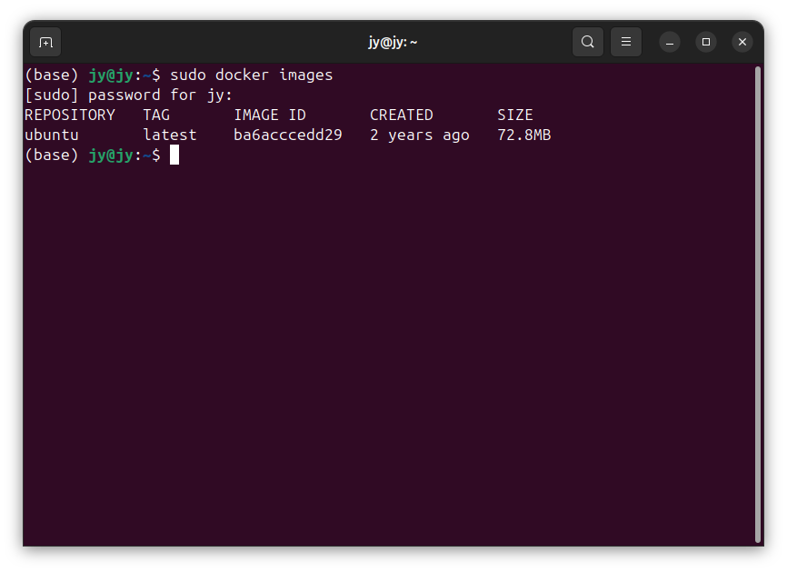
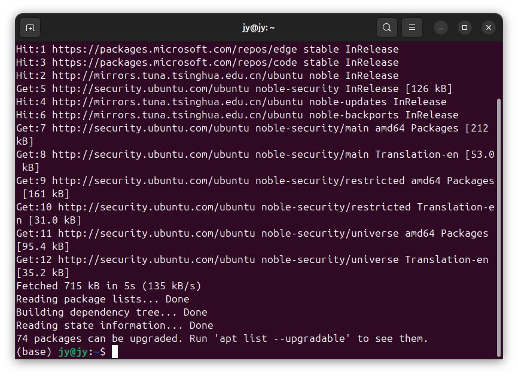
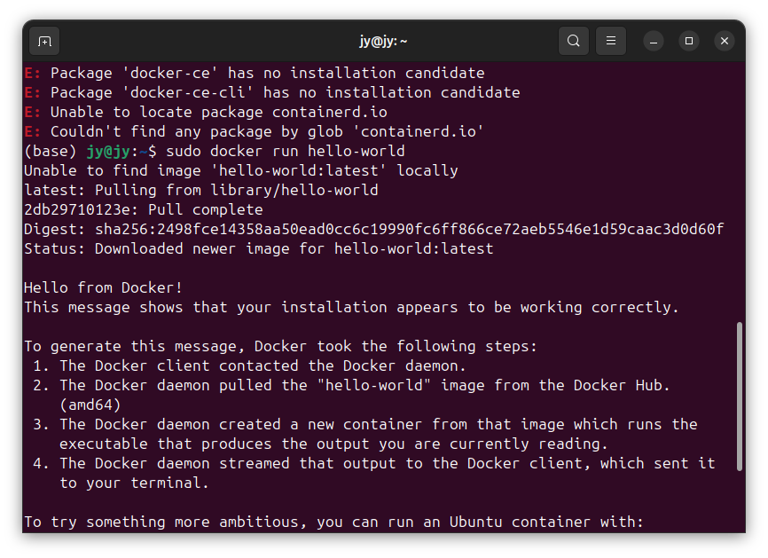

# DockerSpring003-Docker配置镜像源与加速

lin-jinwei, FaQianApp

注意，未授权不得擅自以盈利方式转载本博客任何文章。

---

在Ubutnu或者Linux环境下进行Docker+SpringBoot项目设计，所有要进行环境配置。


## 查看Docker当前所有镜像

命令：
```docker
sudo docker images
```


## 安装或者更新最新版 Docker

命令：
```docker
sudo apt update 
```


```docker
sudo apt install docker-ce docker-ce-cli containerd.io
```
上述命令如果无法运行可以忽略。

## Docker Hello-world
命令：
```docker
sudo docker run hello-world
```
用于测试Docker是否可用。


  


