# DockerSpringBoot002-Ubuntu安装IDEA

lin-jinwei, FaQianApp

注意，未授权不得擅自以盈利方式转载本博客任何文章。

---

安装IDEA可以方便Java项目或者Java-SpringBoot项目的编写，测试与打包。


## 1. 命令安装：

安装社区版：

```bash
$ sudo snap install intellij-idea-community --classic
```

由于网络问题，该安装方式不太稳定：
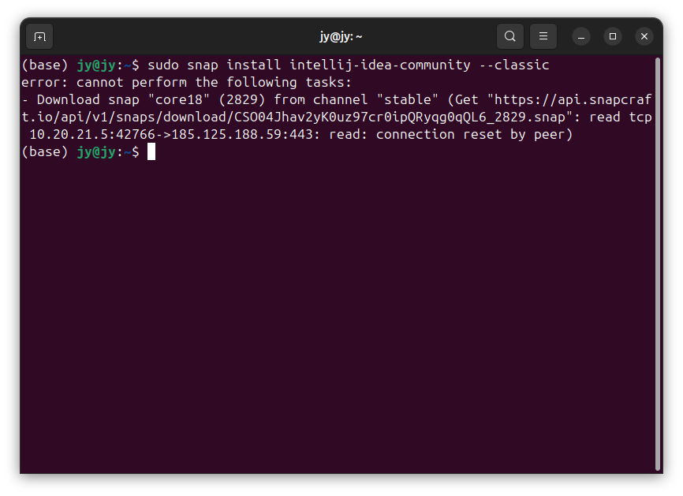

## 2. Ubuntu应用商店安装：

打开应用商店：
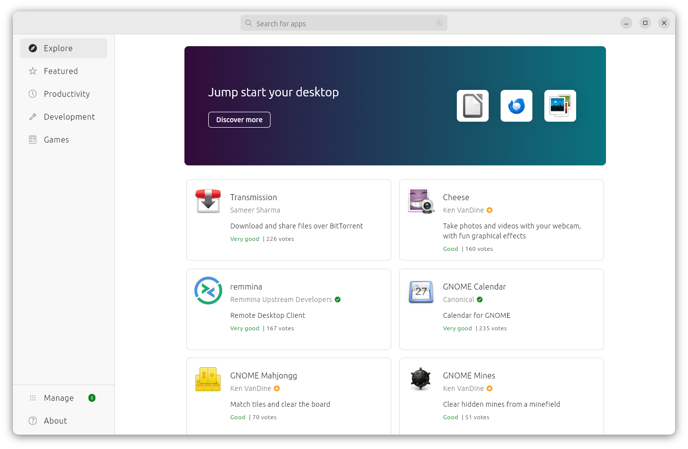

搜索 IntelliJ：
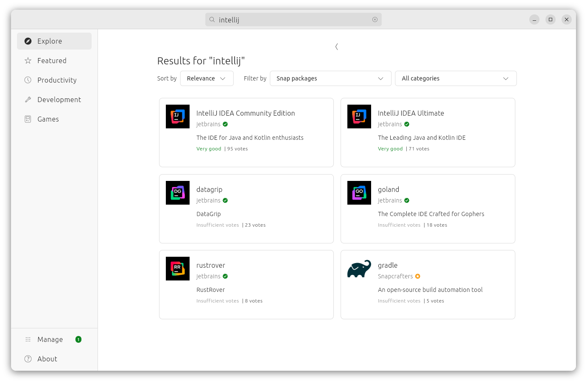

点击安装：
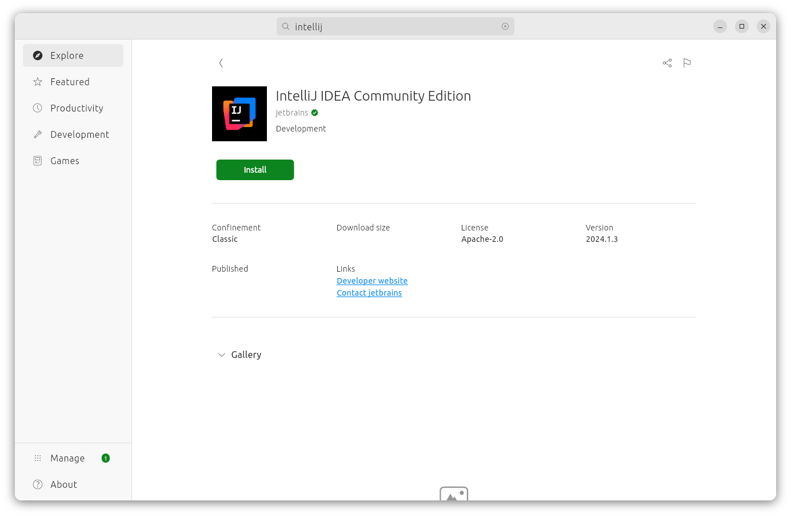

安装中：
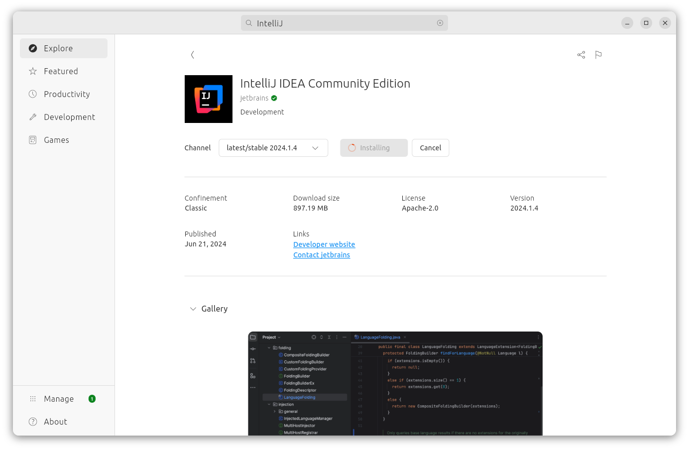

由于网络问题，可能安装不成功。


## 3. 使用下载文件安装

网站：https://www.jetbrains.com.cn/en-us/idea/download/?section=linux


### 直接点击下载 .tar.gz 文件。

下载后，在文件目录下，使用下面命令解压：

```bash
tar -zxvf 文件名.tar.gz 
```

实测命令:

```bash
tar -zxvf ideaIC-2024.1.4.tar.gz 
```

解压之后可以打开对应文件目录：
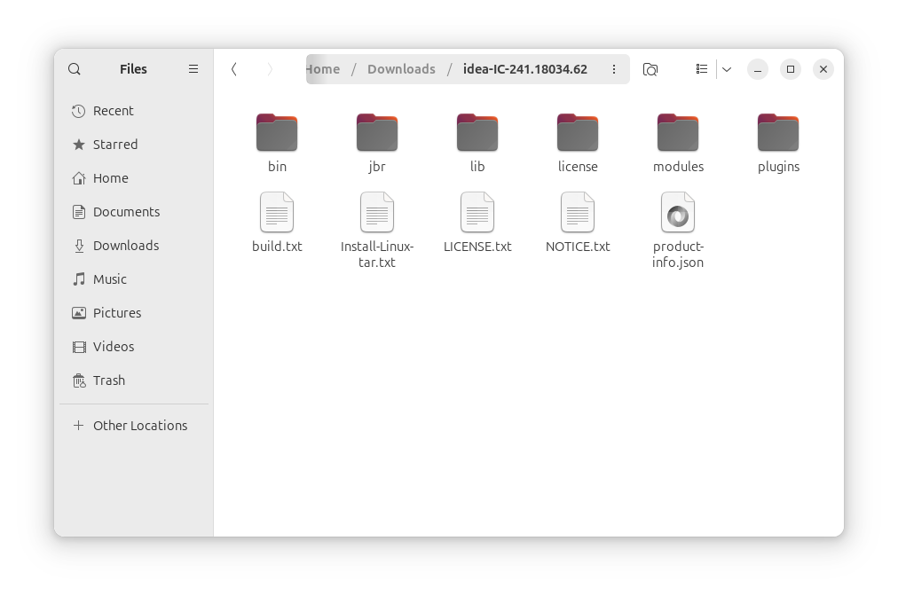

### 将解压目录复制到工作存放目录

工作存放目录可以自定义，一般设为: opt目录

命令：
```bash
sudo mv idea-IC-241.18034.62 /[工作存放目录]/idea-IC-241.18034.62
```

实测命令：
```bash
sudo mv idea-IC-241.18034.62 /opt/idea-IC-241.18034.62
```

### 打开对应存放目录，可以看见对应复制目录

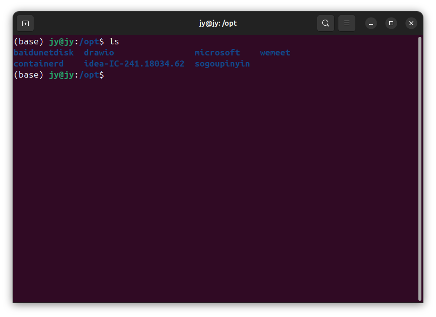

命令：
```bash
cd idea-IC-241.18034.62/
```

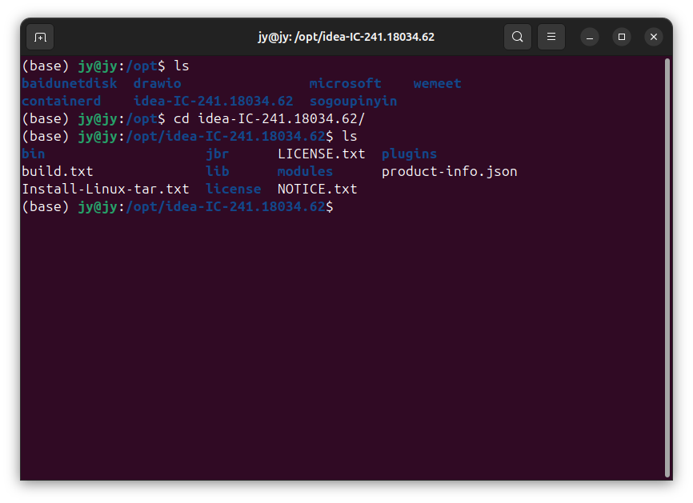

进入 bin 主目录：
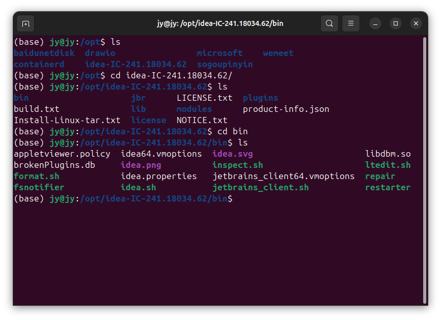

## 运行sh安装命令

命令：
```bash
./idea.sh
```

### 根据UI提示安装
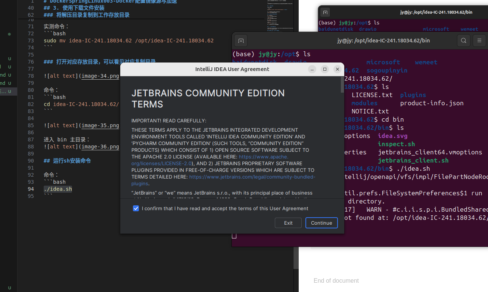

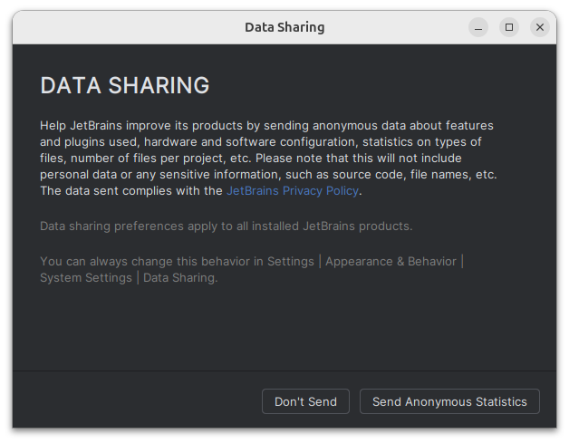


至此，完成安装。


## 启动 IDEA in Ubuntu

默认的启动方式是通过运行IDEA的解压目录下的 idea.sh文件启动。
命令：
```bash
./idea.sh
```

由于繁琐，所以设置快捷方式： 菜单栏隐藏按钮=>Tool=>Create Desktop Entry

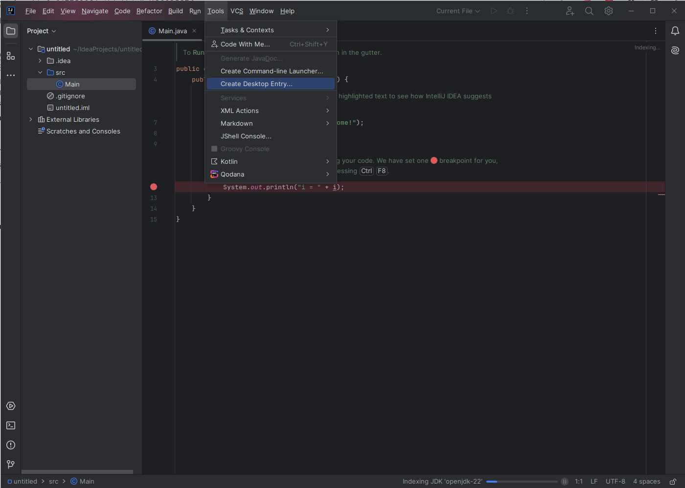

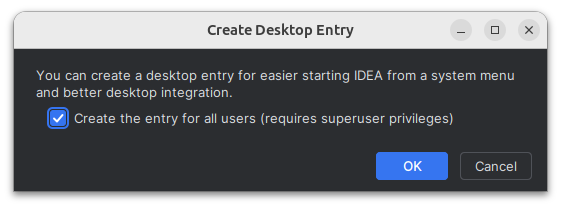

然后就可以通过图标打开 IDEA：

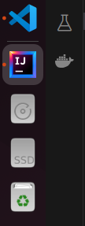


