# DockerSpringBoot003-Ubuntu使用SpringInitializr

lin-jinwei, FaQianApp

注意，未授权不得擅自以盈利方式转载本博客任何文章。

---

## 官网
# https://start.spring.io/

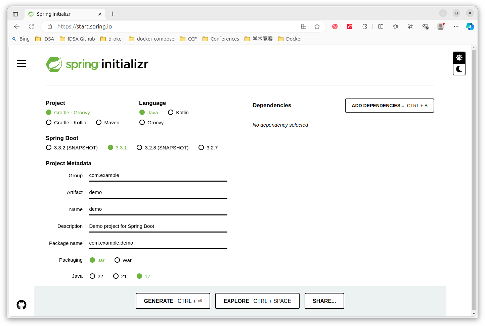

## 新建 SpringBoot-Gradle-Groovy项目

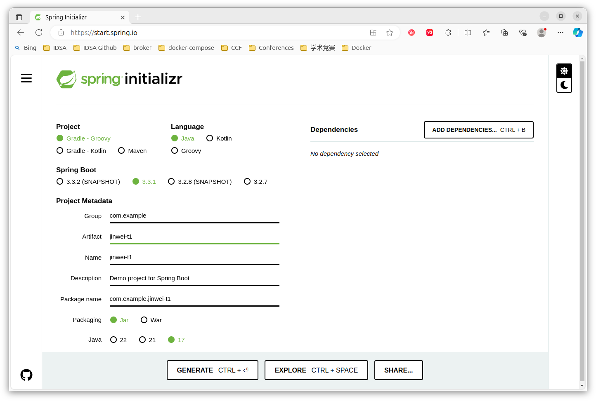

不选择依赖。

左边时钟按钮可以查看历史：
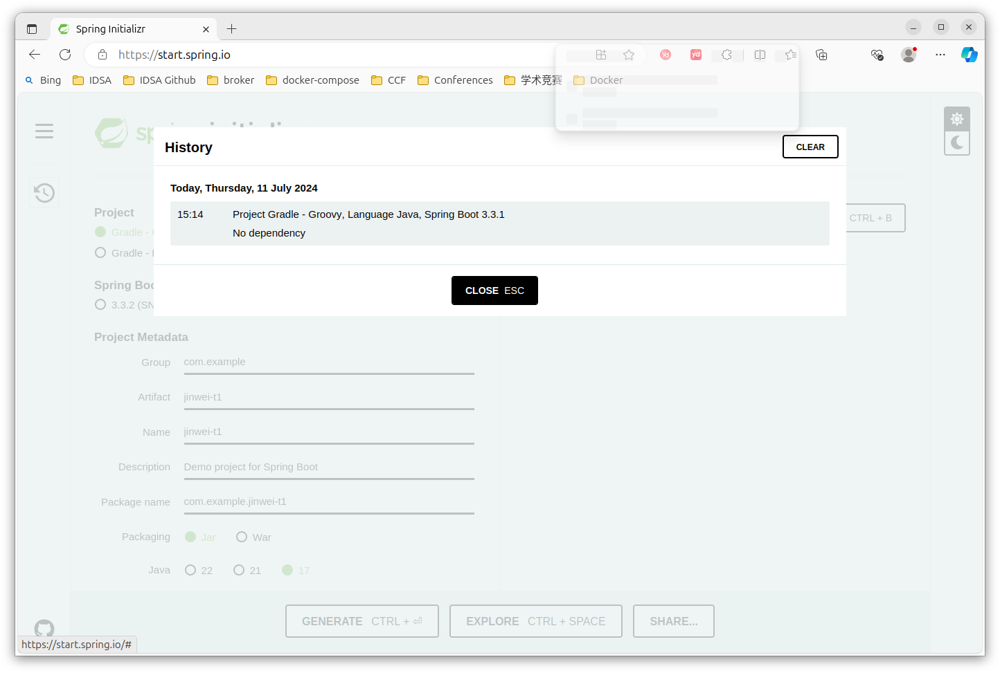

## 下载与打开
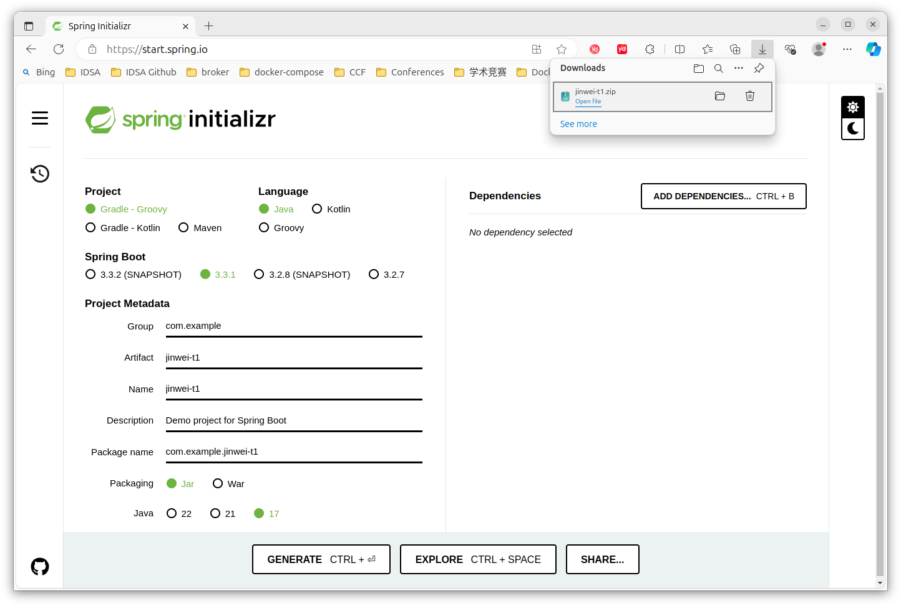

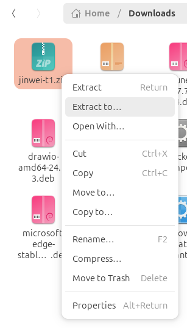

在合适的工作目录下保存与解压：
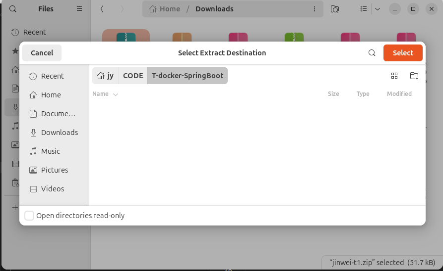

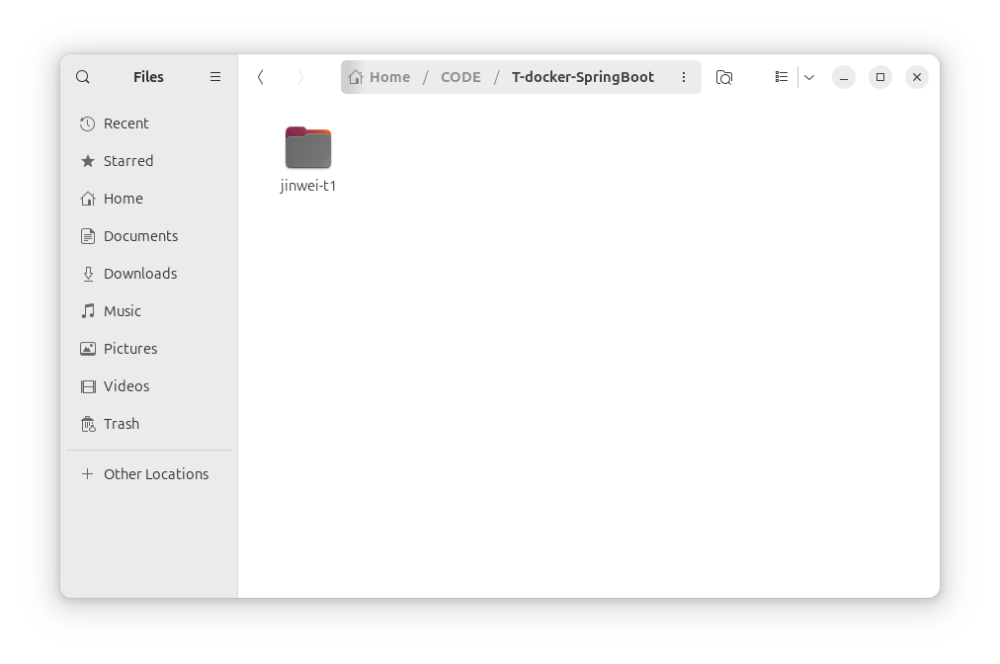

打开后目录为：
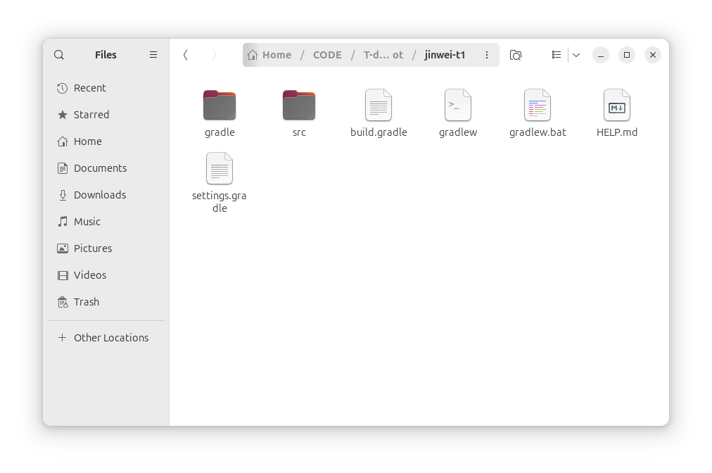

## 使用IDEA打开

根据路经打开项目

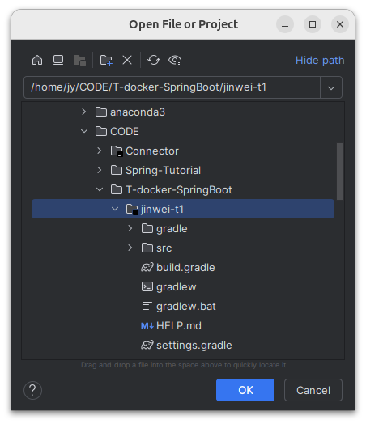

## 安装JDK

提示没有JDK：
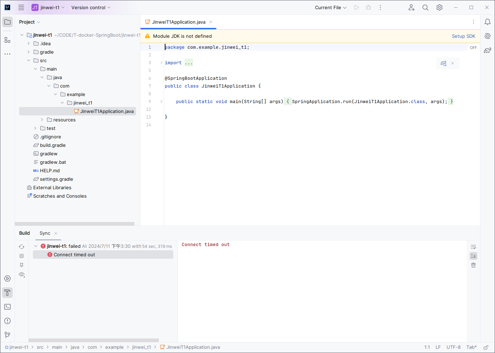

点击设置：
因为没有安装符合的JDK17,因此需要下载安装：
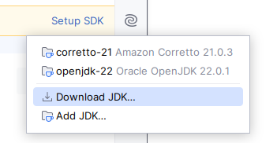

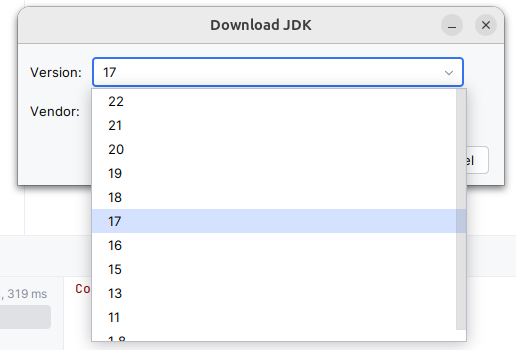

右下角提示正在下载安装：
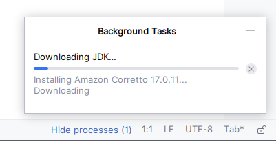

## 安装完成后-自动构建索引
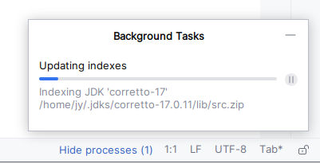

## 自动下载对应的gradle
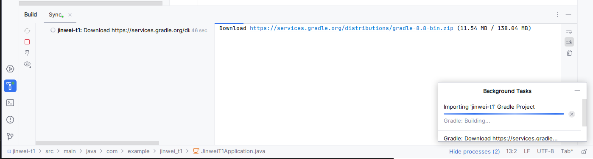

## Gradle 安装成功后提示
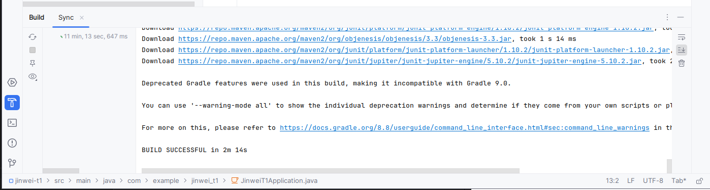

上方的运行按钮可以变得可以点击：
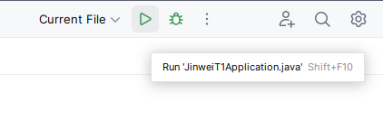

## 运行成功：
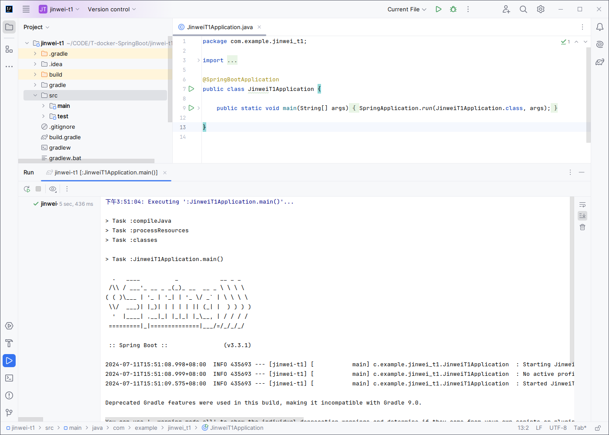

