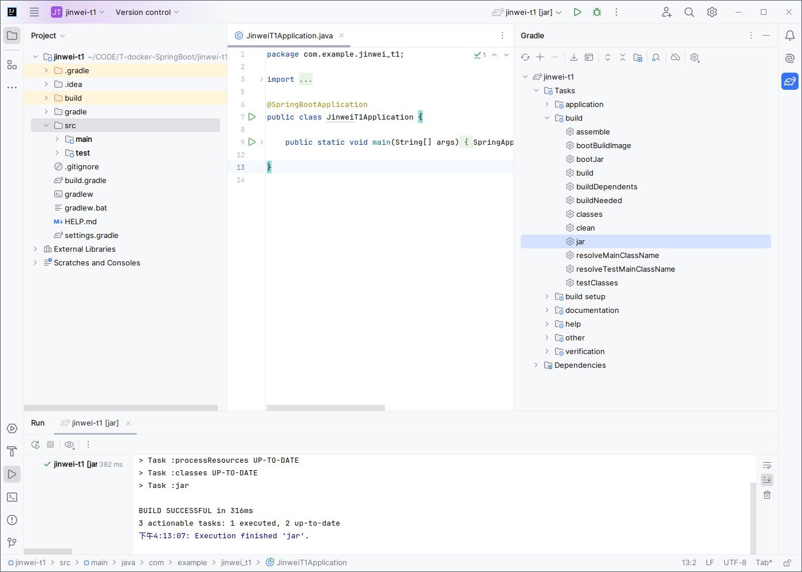
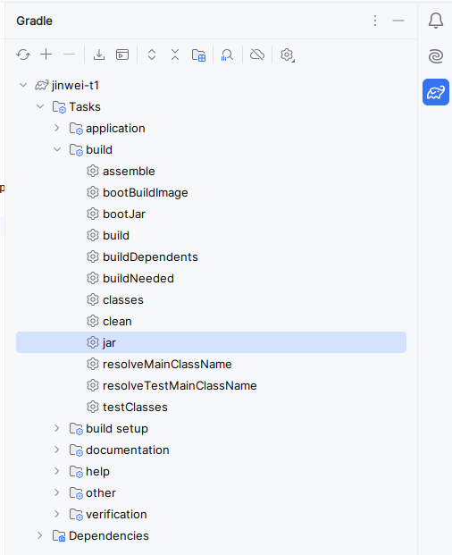
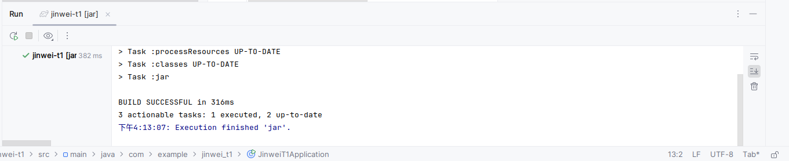
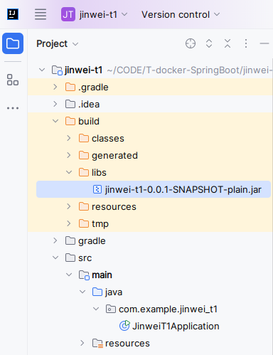
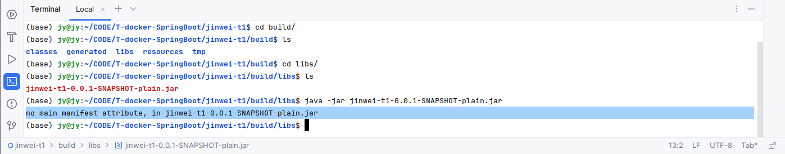

# DockerSpringBoot004-IDEA-SpringBoot项目打包

lin-jinwei, FaQianApp

注意，未授权不得擅自以盈利方式转载本博客任何文章。

---

## 打jar包
### 使用右侧的Gradle工具打jar包





### 打包成功提示


### 打包后-> jar包存放目录


## 通过java -jar 命令-启动-运行 jar包

命令：
```bash
java -jar jinwei-t1-0.0.1-SNAPSHOT-plain.jar 
```

输出：
no main manifest attribute, in jinwei-t1-0.0.1-SNAPSHOT-plain.jar

分析：
没有定义启动类，也就是主类：



在 build.gradle 文件中添加：
```gradle
jar {
	baseName = 'jinwei-jar-name'  // 打包-jar包的名称
	version = '0.0.1'  // 自定义版本
	manifest {
		attributes "Manifest-Version": 1.0,   // 主类版本
				'Main-Class': 'com.example.jinwei_t1.JinweiT1Application'  // 主类的路径 
	}
}

```

---

## 问题分析
如果添加了manifest还是提示错误，则直接重新创建一个 Springboot Initializr 项目，并采用下列教程方法测试。

[DockerSpringBoot005-IDEA-SpringBoot项目打jar包-gradle.md]
