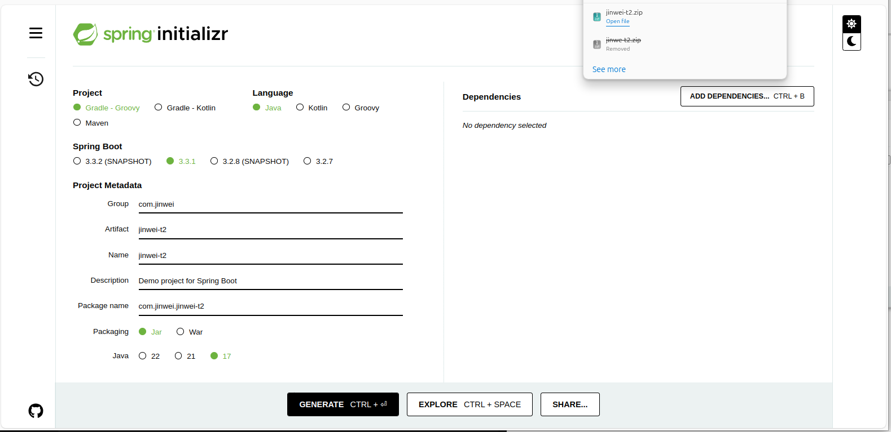
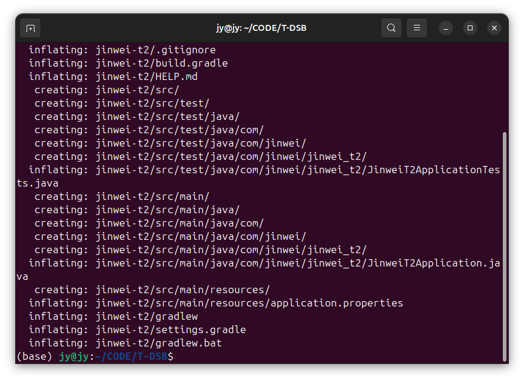
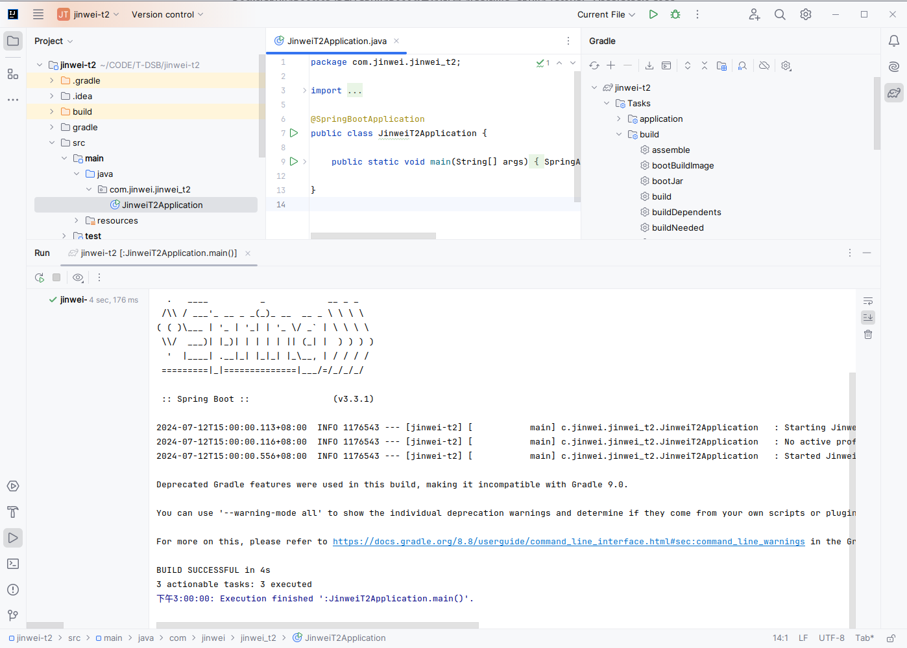

# DockerSpringBoot005-IDEA-SpringBoot项目打jar包-gradle

lin-jinwei, FaQianApp

注意，未授权不得擅自以盈利方式转载本博客任何文章。

---

## Spring Initializr 构建项目




## unzip 解压



## IDEA打开


## 找到主文件，先点击运行


运行成功：


## 双击-运行-右边gradle工具栏--build--clean

运行成功后，左边项目资源栏中：根目录build目录删除

## 双击-运行-右边gradle工具栏--build--build

运行成功后，左边项目资源栏中：根目录build目录被重新创建

## 双击-运行-右边gradle工具栏--build--jar


运行成功后，左边项目资源栏中：目录：build--libs下jar包被创建


## 终端窗口-输入命令测试 jar包


仍然出现主类缺失提示：


## IDEA-终端窗口-输入命令
项目根目录

```gradle
./gradlew clean build
```

构建成功后，此时在终端继续输入：
命令：
```bash
java -jar jinwei-t2-0.0.1-SNAPSHOT-plain.jar
```
或命令：
```bash
java -jar jinwei-t2-0.0.1-SNAPSHOT-plain.jar
```

都没有有效输出，考虑文件更新不及时的问题。


测试：在libs目录输入：ls:


发现没有输入，说明此时的bash/终端没有及时刷新工作目录下的文件-树。

## 刷新终端-重新返回上一级目录-再进入libs目录

输入：ls：发现已经检索到文件：


输入命令：
```bash
java -jar jinwei-t2-0.0.1-SNAPSHOT.jar
```
SpringBoot运行成功：


输入命令：
```bash
java -jar jinwei-t2-0.0.1-SNAPSHOT-plain.jar
```
SpringBoot仍然提示错误：


所以，jinwei-t2-0.0.1-SNAPSHOT.jar文件是可用的SpringBoot项目jar包。

---
下面部分为深入了解生成两文件原理部分，可以跳过。

## 分析-测试

### 重新运行清除-构建命令
```gradle
./gradlew clean build
```


发现文件：jinwei-t2-0.0.1-SNAPSHOT.jar与文件jinwei-t2-0.0.1-SNAPSHOT-plain.jar是同步创建的。

### 测试

输入命令：
```bash
java -jar jinwei-t2-0.0.1-SNAPSHOT.jar
```
SpringBoot运行成功：


输入命令：
```bash
java -jar jinwei-t2-0.0.1-SNAPSHOT-plain.jar
```
SpringBoot仍然提示错误：


说明通过 ./gradlew 命令可以构建jar包，但是加了后缀“-plain”的jar包不能运行。


