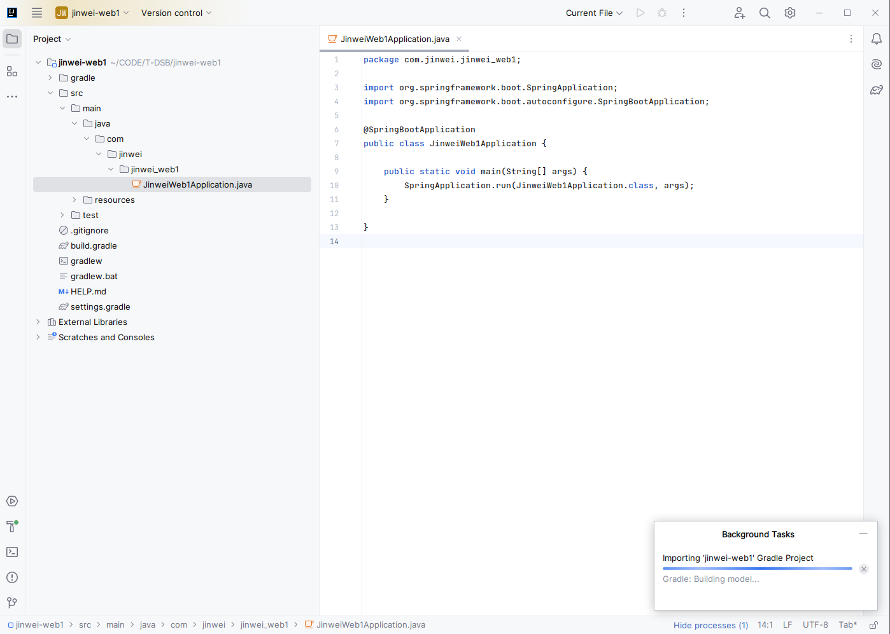
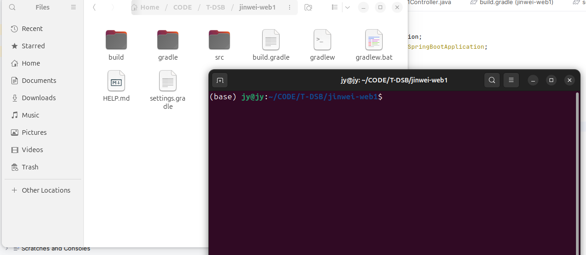

# DockerSpringBoot006-IDEA-SpringBoot-Web项目打jar包-gradle 

lin-jinwei, FaQianApp

注意，未授权不得擅自以盈利方式转载本博客任何文章。

---

Code: [../code](../code)

## Spring Initializr 构建项目


添加依赖：
**Spring Web WEB**
Build web, including RESTful, applications using Spring MVC. Uses Apache Tomcat as the default embedded container.

分析：里面有一个微型服务器框架：Tomcat, 以容器方式运行。

## 打开下载并解压


## IDEA打开

选择SDK（JDK）之后，自动启动gradle配置。




## IDEA 运行
Gradle自动构建完成后->点击IDEA界面上方的运行构建按钮


## 浏览器打开
Web应用打开,端口号为：8080


出现提示下面提示，说明没有配置好SpringBoot项目：


# 配置SpringBoot项目

## 创建请求类

类名：Greet1


添加代码


## 创建请求控制类

类名：Greet1Controller


添加代码：


成功运行：


Web接口持续监听，Web项目一直运行->整体项目运行成功。

## Gradle 打包

在项目根目录打开终端：


### 输入命令： ./gradlew -v

获取该项目的Gradle配置


## 输入命令： ./gradlew clean


## 输入命令： ./gradlw build


## 构建成功


## 运行jar包


进入jar包目录：


输入命令：
```bash
java -jar jinwei-web1-0.0.1-SNAPSHOT.jar
```
成功运行：


输入命令：
```bash
java -jar jinwei-web1-0.0.1-SNAPSHOT-plain.jar 
```

运行失败


说明： 
使用命令：
```bash
java -jar jinwei-web1-0.0.1-SNAPSHOT.jar
```
可以运行编译的jar包。


