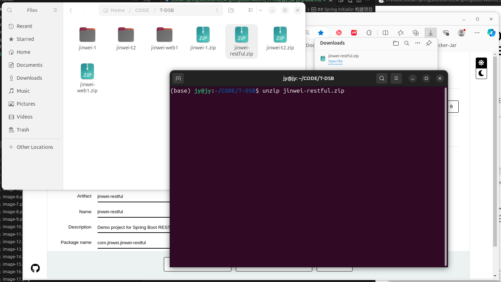
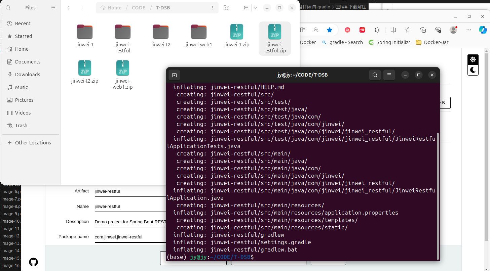
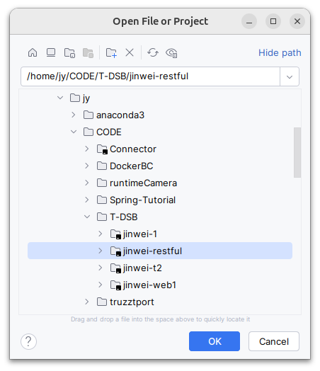
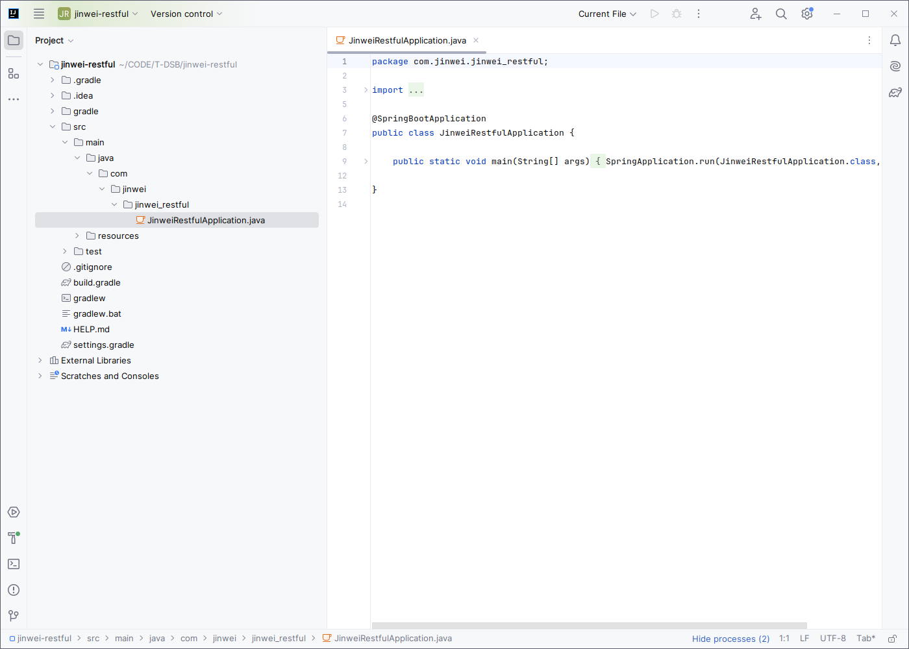
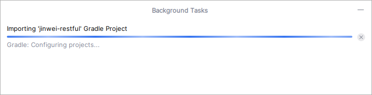
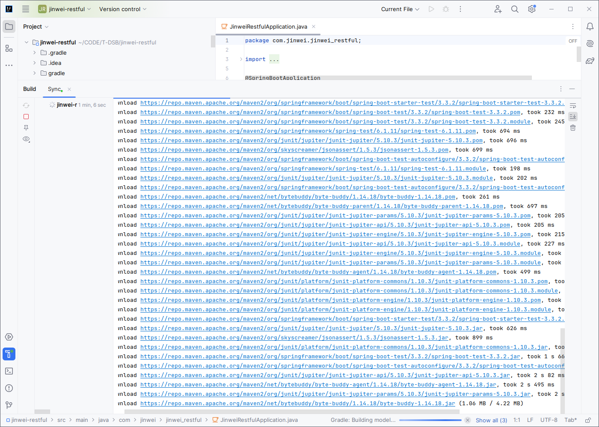
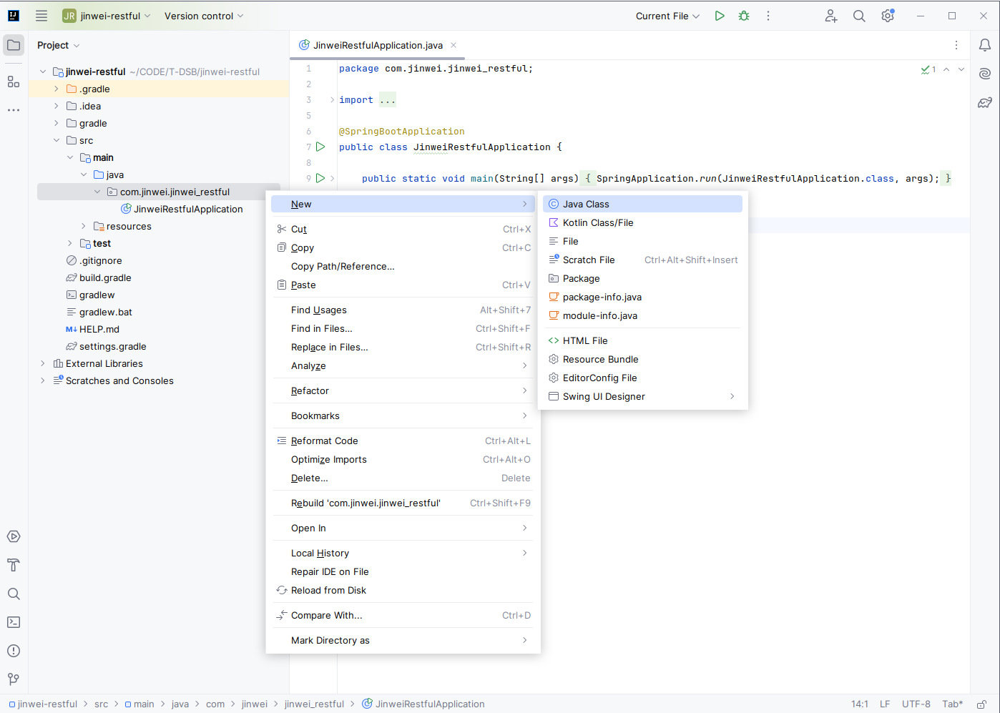

# DockerSpringBoot008-IDEA-SpringBoot-Web-RESTful项目打jar包-gradle

lin-jinwei, FaQianApp

注意，未授权不得擅自以盈利方式转载本博客任何文章。

---

Code: [../code](../code)

## Spring Initializr 构建项目

## 下载解压

## IDEA 打开

设置好SDK=JDK17：

## Gradle自动预处理并导入项目

预处理完成后导入项目：

接下来就是导入依赖包的过程，该过程主要是通过下载完成：

## Gradle导入项目完成
