# DockerSpringBoot008-IDEA-SpringBoot-Web-RESTful项目构建
lin-jinwei, FaQianApp

注意，未授权不得擅自以盈利方式转载本博客任何文章。

---

Code: [../code](../code)

## Spring Initializr 构建项目

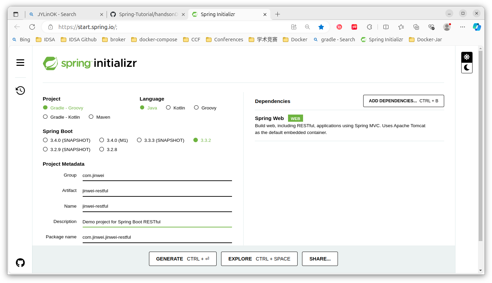

## 下载解压


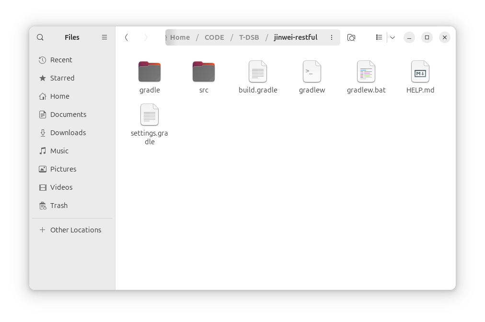

## IDEA 打开


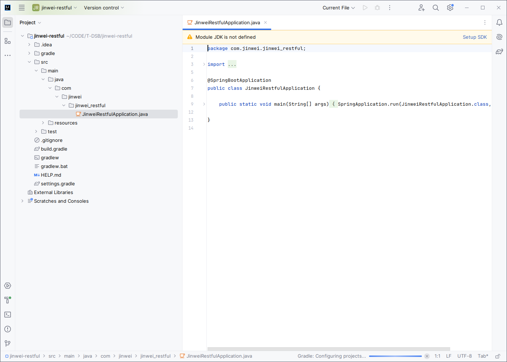

设置好SDK=JDK17：


## Gradle自动预处理并导入项目


预处理完成后导入项目：


接下来就是导入依赖包的过程，该过程主要是通过下载完成：


## Gradle导入项目完成


## 修改项目代码


### 1. 创建访问处理类： Get1.java


代码：/src/main/java/com/jinwei/jinwei_restful/Get1.java

```java
package com.jinwei.jinwei_restful;

public record Get1(String message, long id, String content) { }
```


### 2. 创建控制类: UController.java

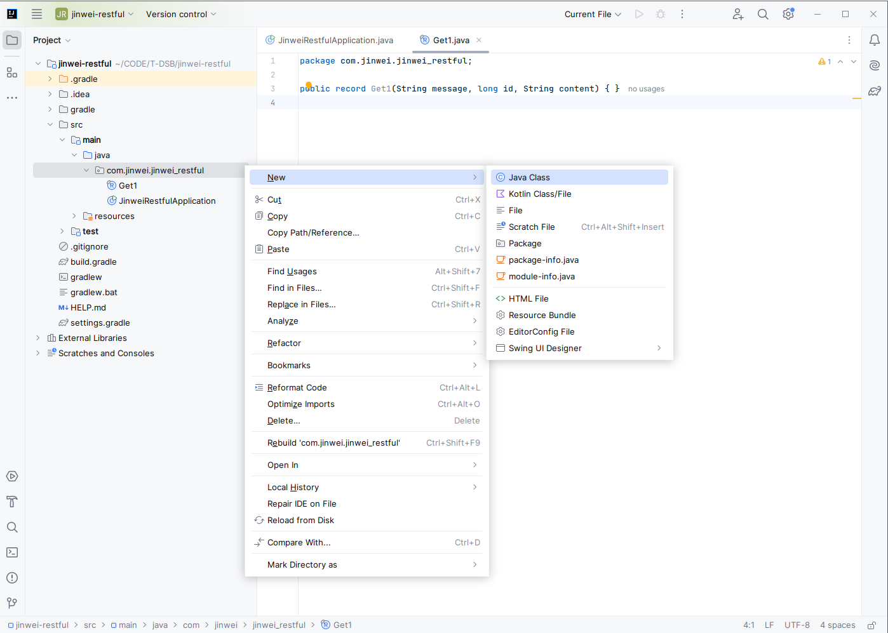

代码：/src/main/java/com/jinwei/jinwei_restful/UController.java

```java
package com.jinwei.jinwei_restful;

import java.util.concurrent.atomic.AtomicLong;
import org.springframework.web.bind.annotation.GetMapping;
import org.springframework.web.bind.annotation.RequestParam;
import org.springframework.web.bind.annotation.RestController;

@RestController
public class UController {

    private static final String template = "Hello, %s!";
    private final AtomicLong counter = new AtomicLong();

    // 通过@GetMapping定义请求接口API
    @GetMapping("/gretFun1")
    // 通过@RequestParam定义请求需要附带的参数，以及参数的默认值
    public Get1 getFun1(@RequestParam(value = "name", defaultValue = "World") String name) {
        final String str_message = "Get Return message";
        // 下面一行定义请求的返回内容
        return new Get1(str_message, counter.incrementAndGet(), String.format(template, name));
    }
}

```

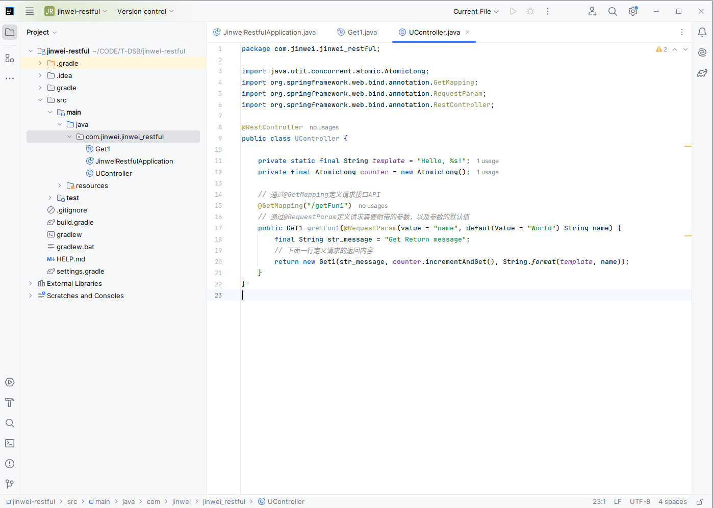

## 回到主函数，点击运行


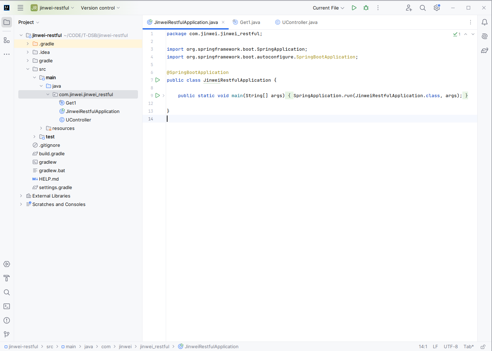

代码：/src/main/java/com/jinwei/jinwei_restful/JinweiRestfulApplication.java

该代码未修改，保持原样：

```java
package com.jinwei.jinwei_restful;

import org.springframework.boot.SpringApplication;
import org.springframework.boot.autoconfigure.SpringBootApplication;

@SpringBootApplication
public class JinweiRestfulApplication {

	public static void main(String[] args) {
		SpringApplication.run(JinweiRestfulApplication.class, args);
	}

}
```

## 编译并成功运行

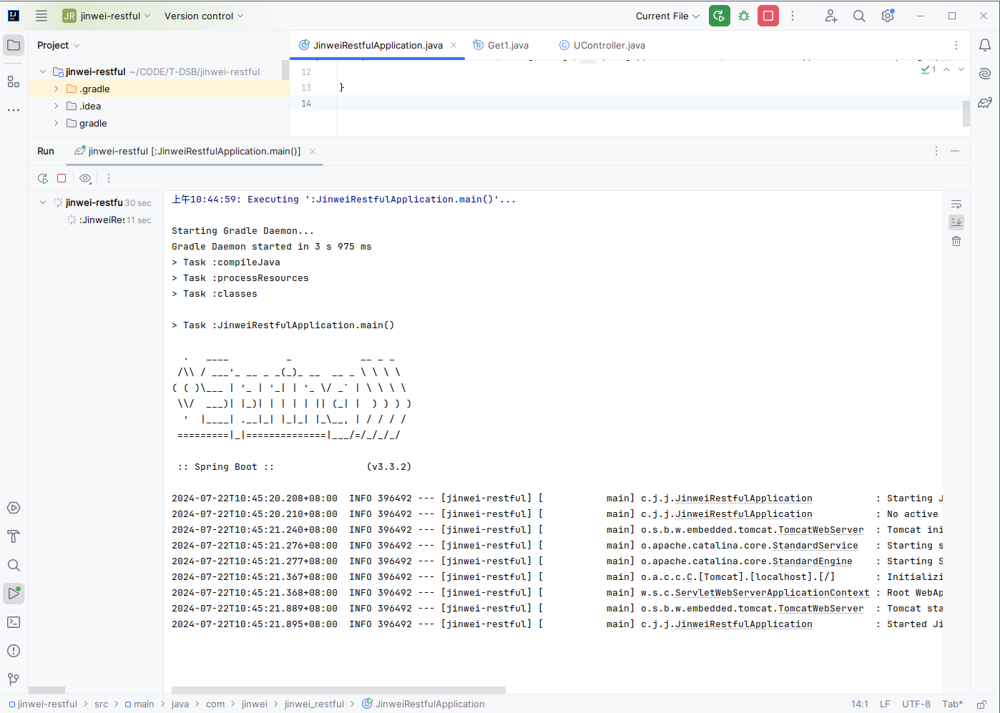

## 测试

直接访问：

```bash
http://localhost:8080/getFun1
```
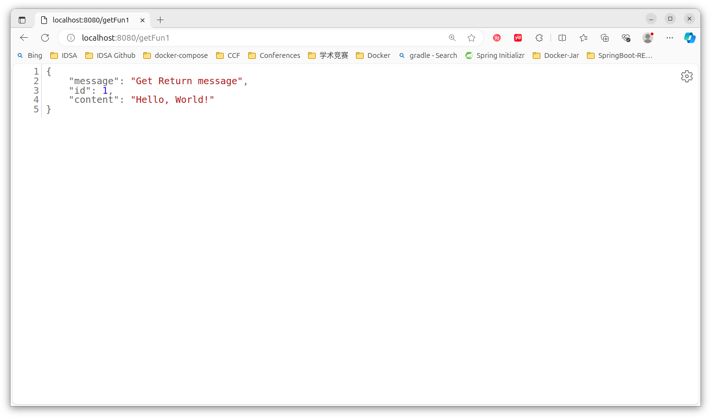

带参数访问：

```bash
http://localhost:8080/getFun1?name=jinwei
```

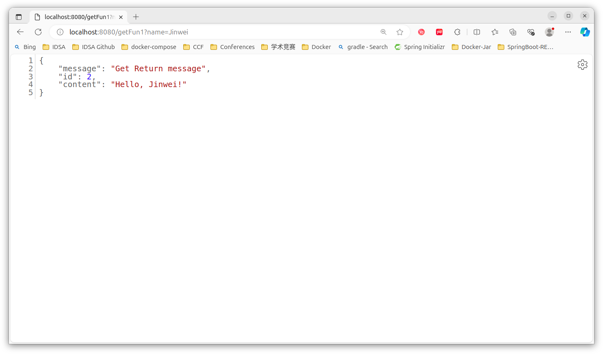

打开Postman，选择Get请求，输入请求链接：

```bash
http://localhost:8080/getFun1
```

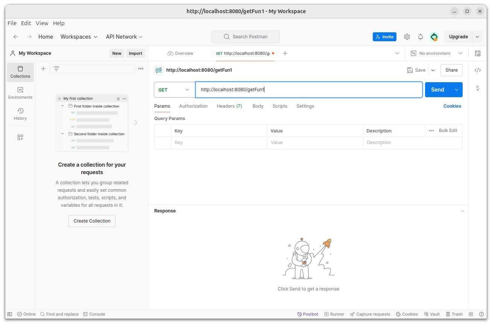

点击 Send 发动，获得下面结果：


继续输入请求链接：

```bash
http://localhost:8080/getFun1?name=jinwei
```

获得返回：

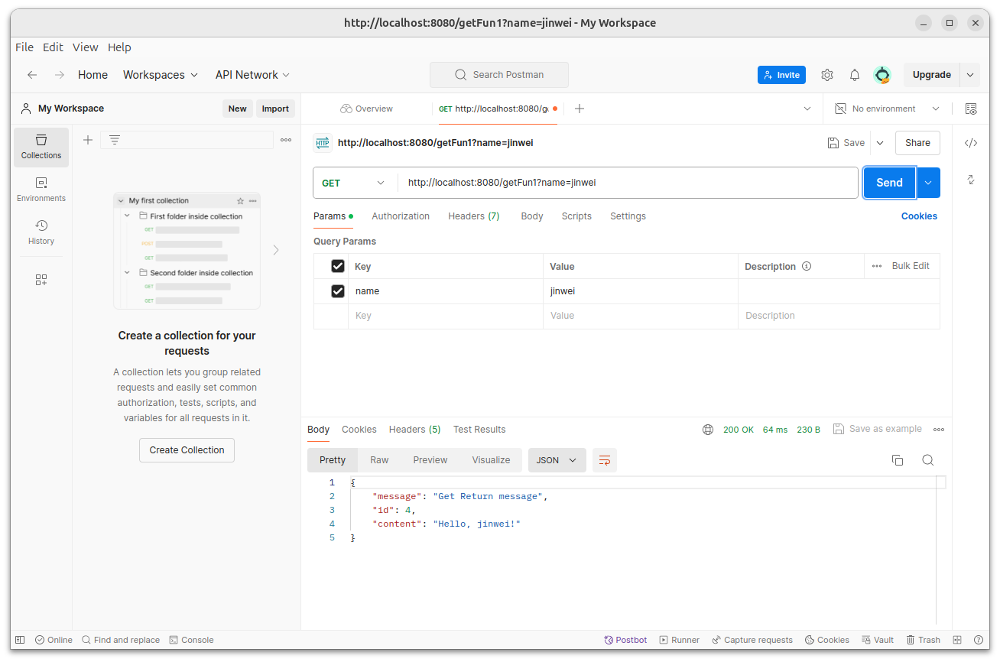

## 查看Postman历史请求

点击左边的 History可以查看历史请求：

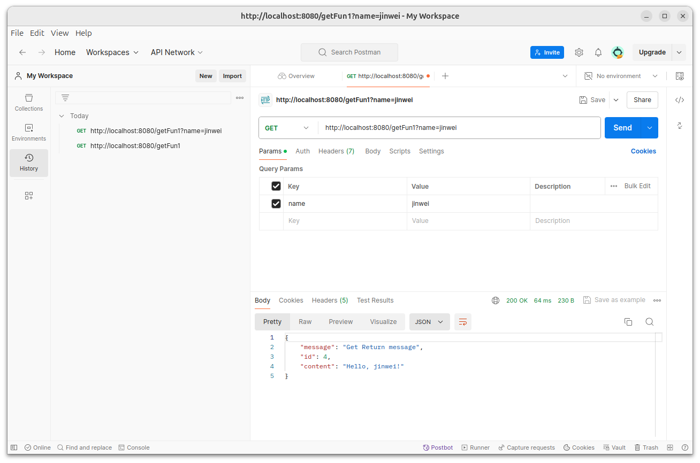
