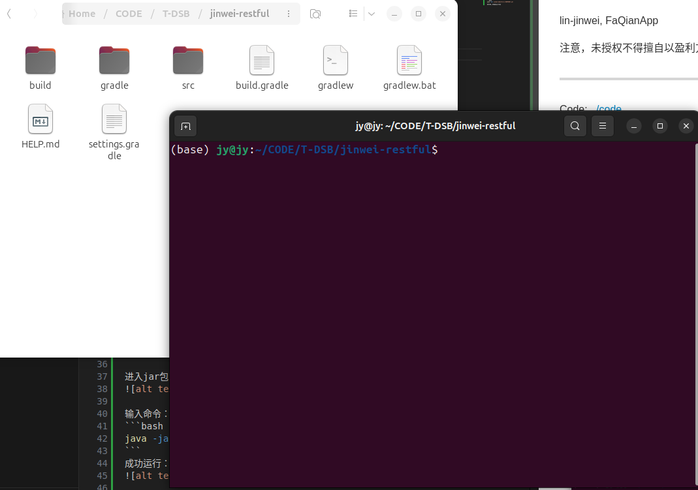
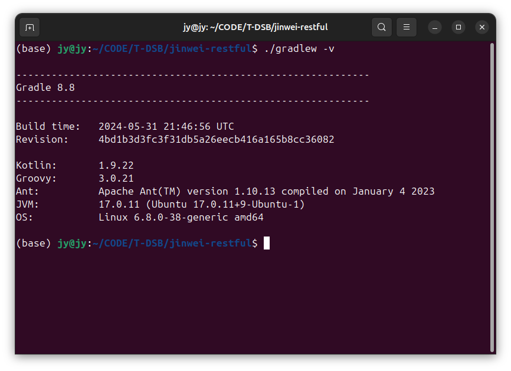
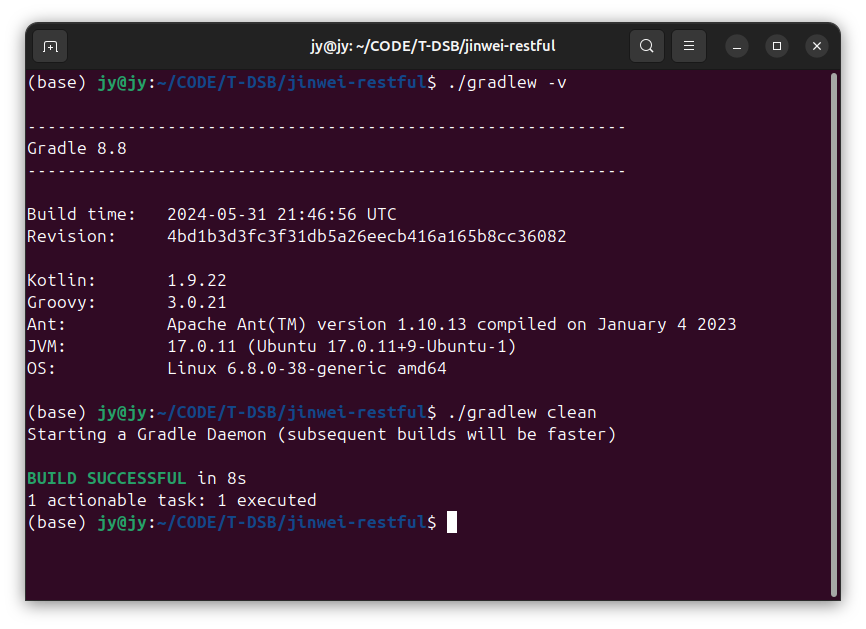
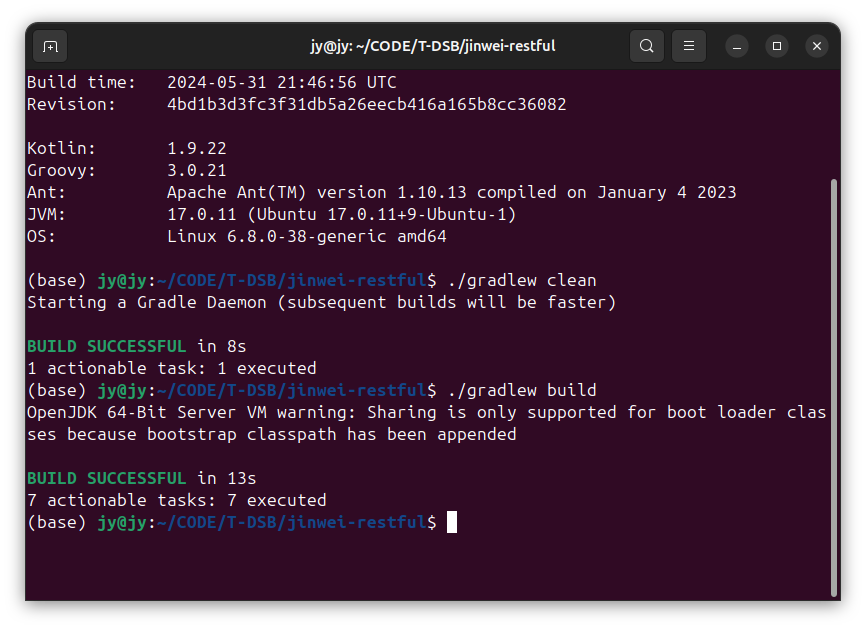
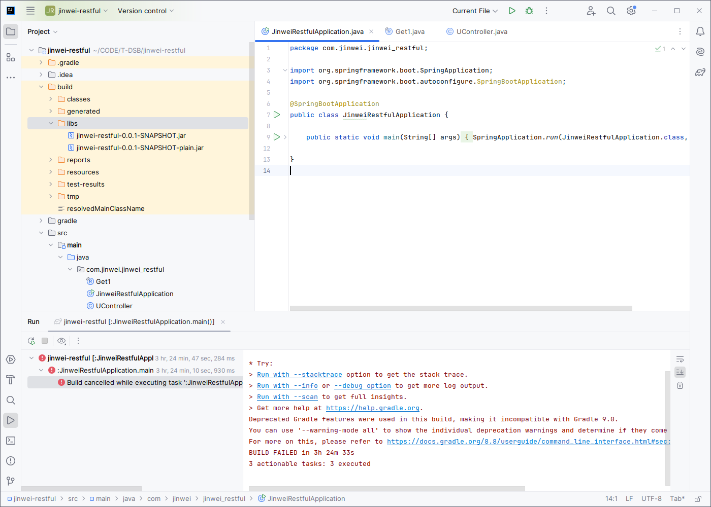
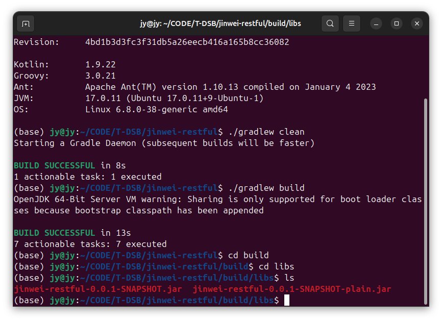
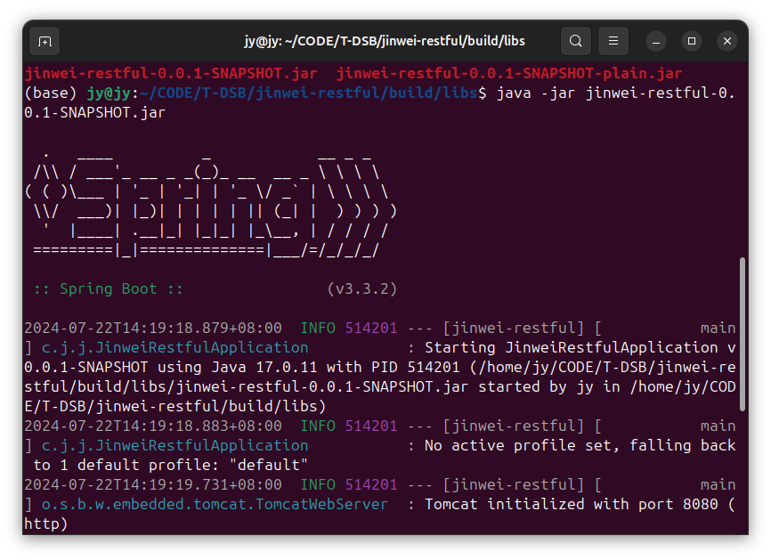
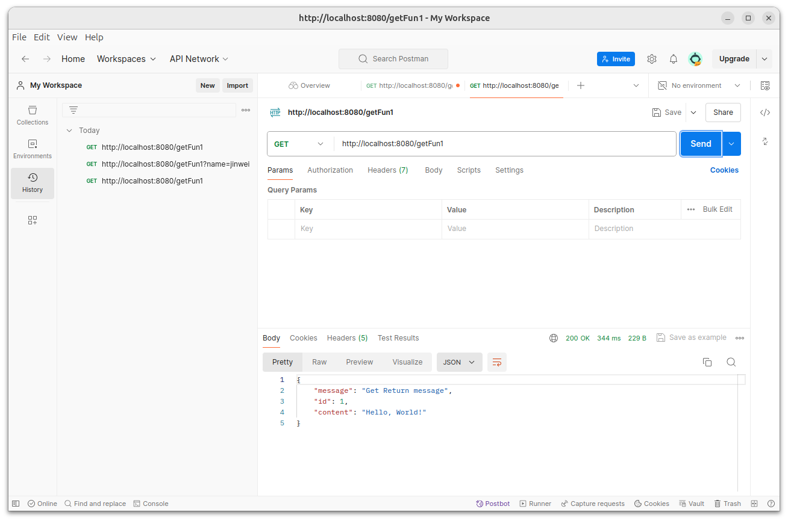
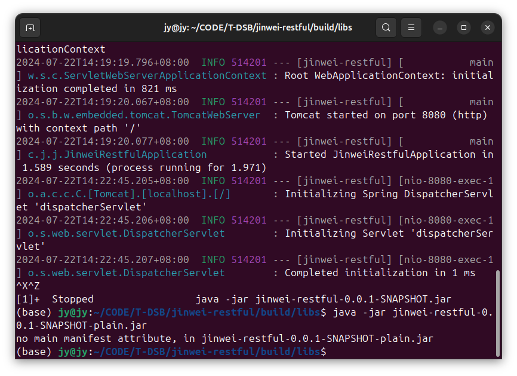

# DockerSpringBoot010-IDEA-Web-RESTful项目-打jar包并用postman测试
lin-jinwei, FaQianApp

注意，未授权不得擅自以盈利方式转载本博客任何文章。

---

Code: [../code](../code)


## Gradle 打jar包

在项目根目录打开终端：


### 输入命令： ./gradlew -v

获取该项目的Gradle配置



## 输入命令： ./gradlew clean



## 输入命令： ./gradlw build

编译构建成功：



## 运行jar包


进入jar包目录：


输入命令：
```bash
java -jar jinwei-restful-0.0.1-SNAPSHOT.jar
```
成功运行：


## 测试jar包：
postman:

测试命令：
```bash
http://localhost:8080/getFun1
```
结果：


测试命令：带请求参数的Get请求
```bash
http://localhost:8080/getFun1?name=jinwei
```


测试成功！


## 运行另一个plain-jar包

按 Ctrl+Z 退出正在运行的jar包。

输入命令：
```bash
java -jar jinwei-restful-0.0.1-SNAPSHOT-plain.jar 
```

运行失败


说明： 
应该使用命令：
```bash
java -jar jinwei-restful-0.0.1-SNAPSHOT.jar
```
运行编译的jar包。

