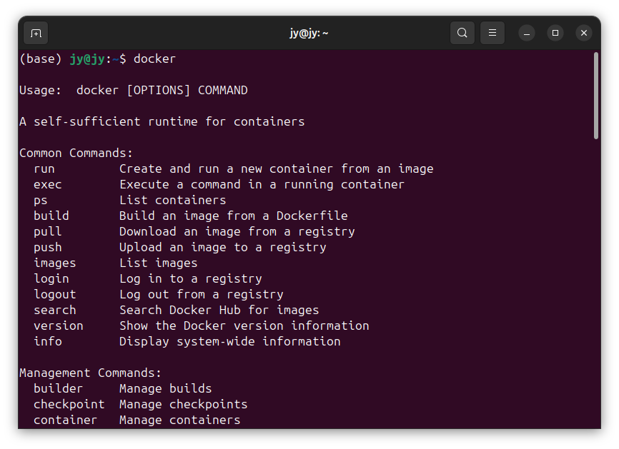
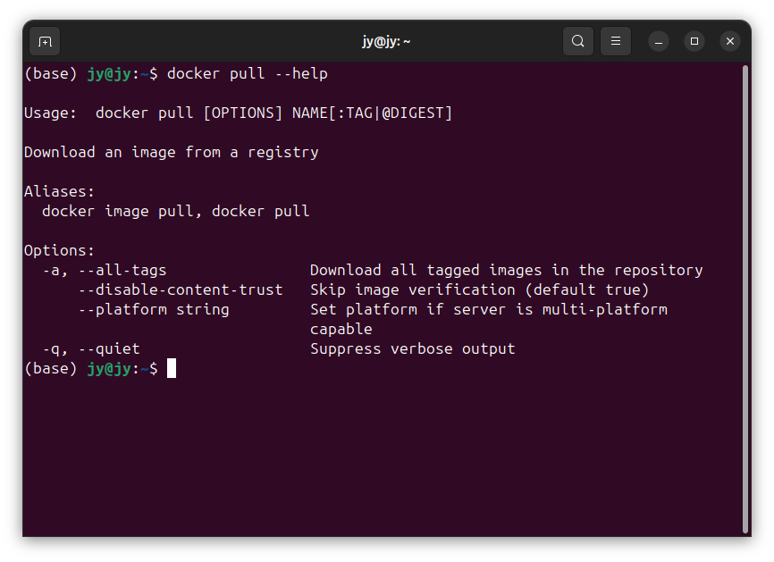
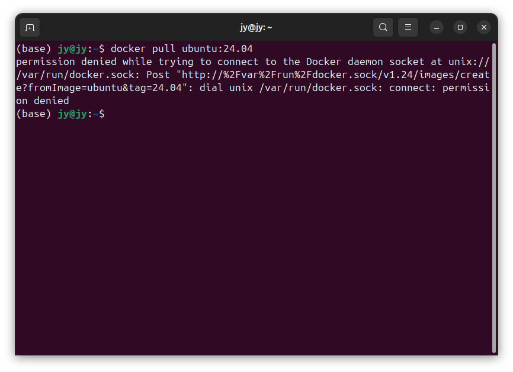
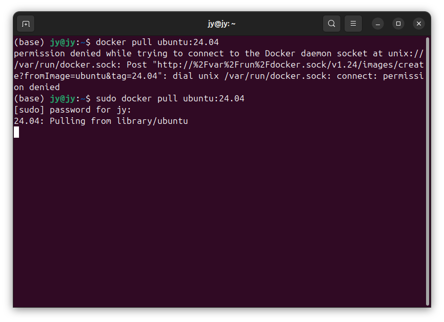
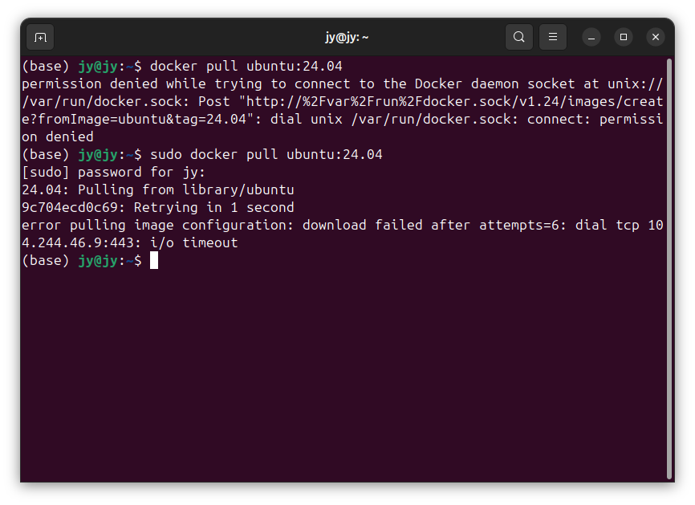
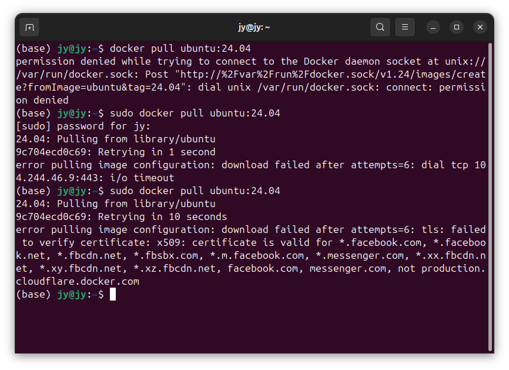

# DockerSpringLinux002-Docker新建与管理容器

lin-jinwei

注意，未授权不得擅自以盈利方式转载本博客任何文章。

---

通过这一教程可以快速了解Docker的基本使用。


## 直接查看所有的Docker命令

命令：

```docker
docker
```
输出：



详细：

```docker
Usage:  docker [OPTIONS] COMMAND

A self-sufficient runtime for containers

Common Commands:
  run         Create and run a new container from an image
  exec        Execute a command in a running container
  ps          List containers
  build       Build an image from a Dockerfile
  pull        Download an image from a registry
  push        Upload an image to a registry
  images      List images
  login       Log in to a registry
  logout      Log out from a registry
  search      Search Docker Hub for images
  version     Show the Docker version information
  info        Display system-wide information

Management Commands:
  builder     Manage builds
  checkpoint  Manage checkpoints
  container   Manage containers
  context     Manage contexts
  image       Manage images
  manifest    Manage Docker image manifests and manifest lists
  network     Manage networks
  plugin      Manage plugins
  system      Manage Docker
  trust       Manage trust on Docker images
  volume      Manage volumes

Swarm Commands:
  config      Manage Swarm configs
  node        Manage Swarm nodes
  secret      Manage Swarm secrets
  service     Manage Swarm services
  stack       Manage Swarm stacks
  swarm       Manage Swarm

Commands:
  attach      Attach local standard input, output, and error streams to a running container
  commit      Create a new image from a container's changes
  cp          Copy files/folders between a container and the local filesystem
  create      Create a new container
  diff        Inspect changes to files or directories on a container's filesystem
  events      Get real time events from the server
  export      Export a container's filesystem as a tar archive
  history     Show the history of an image
  import      Import the contents from a tarball to create a filesystem image
  inspect     Return low-level information on Docker objects
  kill        Kill one or more running containers
  load        Load an image from a tar archive or STDIN
  logs        Fetch the logs of a container
  pause       Pause all processes within one or more containers
  port        List port mappings or a specific mapping for the container
  rename      Rename a container
  restart     Restart one or more containers
  rm          Remove one or more containers
  rmi         Remove one or more images
  save        Save one or more images to a tar archive (streamed to STDOUT by default)
  start       Start one or more stopped containers
  stats       Display a live stream of container(s) resource usage statistics
  stop        Stop one or more running containers
  tag         Create a tag TARGET_IMAGE that refers to SOURCE_IMAGE
  top         Display the running processes of a container
  unpause     Unpause all processes within one or more containers
  update      Update configuration of one or more containers
  wait        Block until one or more containers stop, then print their exit codes

Global Options:
      --config string      Location of client config files (default
                           "/home/jy/.docker")
  -c, --context string     Name of the context to use to connect to the
                           daemon (overrides DOCKER_HOST env var and
                           default context set with "docker context use")
  -D, --debug              Enable debug mode
  -H, --host list          Daemon socket to connect to
  -l, --log-level string   Set the logging level ("debug", "info",
                           "warn", "error", "fatal") (default "info")
      --tls                Use TLS; implied by --tlsverify
      --tlscacert string   Trust certs signed only by this CA (default
                           "/home/jy/.docker/ca.pem")
      --tlscert string     Path to TLS certificate file (default
                           "/home/jy/.docker/cert.pem")
      --tlskey string      Path to TLS key file (default
                           "/home/jy/.docker/key.pem")
      --tlsverify          Use TLS and verify the remote
  -v, --version            Print version information and quit

Run 'docker COMMAND --help' for more information on a command.

For more help on how to use Docker, head to https://docs.docker.com/go/guides/
```

## Docker 的基本使用
Docker 基本使用流程可以分为：
1. 拉取镜像；
2. 配置镜像；
3. 上传文件到镜像；
4. 测试容器；
5. 打包容器；
6. 发布运行。

## Docker 拉取镜像的通用命令

```docker
docker pull [选项] [Docker Registry 地址[:端口号]/]仓库名[:标签]
```

具体的命令介绍：


```docker
(base) jy@jy:~$ docker pull --help

Usage:  docker pull [OPTIONS] NAME[:TAG|@DIGEST]

Download an image from a registry

Aliases:
  docker image pull, docker pull

Options:
  -a, --all-tags                Download all tagged images in the repository
      --disable-content-trust   Skip image verification (default true)
      --platform string         Set platform if server is multi-platform
                                capable
  -q, --quiet                   Suppress verbose output
```


---

# 实战篇

## 新建一个Ubuntu镜像

基本命令格式
本教程中，如无特殊说明，命令中的中括号都忽略。

```docker
docker pull ubuntu:[带小数点的版本号]
```

编写教程系统：
获取当前系统命令：
```docker
lsb_release -a
```
输出：
```docker
(base) jy@jy:~$ username -a
username: command not found
(base) jy@jy:~$ lsb_release -a
No LSB modules are available.
Distributor ID:	Ubuntu
Description:	Ubuntu 24.04 LTS
Release:	24.04
Codename:	noble
```

使用：
```docker
docker pull ubuntu:24.04
```

如果出现权限提示：


说明需要root用户：
拉取得镜像中：


如果网络信号不好，会出现中断：


再次拉取：


此时说明国内Docker拉取网络不稳定，因此使用下列方法：
参考教程003：

[DockerSpringLinux003-Docker配置镜像源与加速.md](./DockerSpringLinux003-Docker配置镜像源与加速.md)


